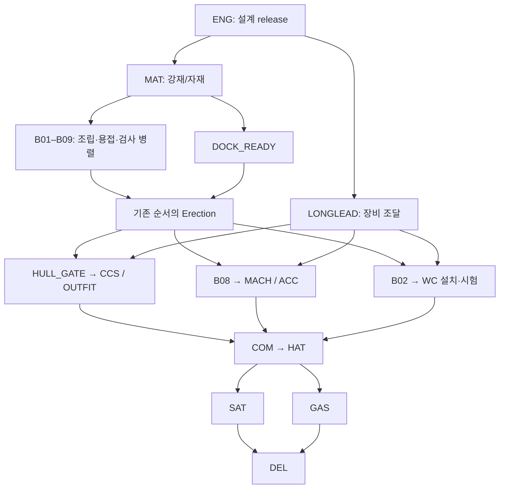

# Vessel & Shipbuilding Refinement Specification — PROMPT 11

문서 ID: LNGC-REFINE-11 · 버전 1.0 · 조사 기준일: 2026-09-20

대상: LNGC Construction Digital Twin Prototype / LNGC-EDU-01 / P10 코드.

**연구·감사·P12 구현 기준 문서. 이번 단계에서는 프로젝트 코드, JSON, schema, UI, 엔진을 변경하지 않았다.**

분류: **V = VERIFIED**, **D = DERIVED**, **A = ASSUMPTION**, **M = MOCK DATA**. V에는 반드시 실선/설계 발표/제품군/일반 기술/로컬 코드 확인 중 적용 범위를 붙인다. UNKNOWN은 다섯 번째 분류가 아니라 확인 상태다. 실제 미확인값은 null로 남기고, 시각화에 필요한 가정값만 A로 별도 관리한다. 이하 수정 지시와 제안 좌표·기간·허용오차는 별도 표시가 없어도 모두 A이다. 출처 S01–S14는 §18에 링크와 적용 한계를 기록한다.

## 1. Executive Summary

핵심은 선박 모양의 장식적 개선이 아니라 **3D 객체 → Block → Production → Quality → Schedule → What-If → Critical Path → Delivery**의 의미를 보존하는 것이다. 현재 source audit 결과, 전체 재모델링이나 CPM 재작성은 필요하지 않다. 다음을 우선 확정한다.

1. **실선 기준 유지(V·실선 발표):** FUJIN SAILOR, 294.9 m × 46.4 m, 174,000 m³ membrane LNGC, Wind Challenger 2기, ME-GA. 2026-09-10 명명 발표 당시 인도는 9월 말 예정이었다. 인도 완료로 쓰지 않는다. [MOL 최신 발표](https://www.mol.co.jp/en/pr/2026/26044.html)
2. **형상 P1(A):** 단면이 높이에 따라 변하지 않는 선수·선미를 수정하고, Funnel·창·배관·tank dome platform의 지지 관계를 복구한다. 기관은 외부에 올리는 것이 아니라 cutaway 내부에 표현한다.
3. **시공 P1(A):** 아직 설치하지 않은 시스템을 완성 위치에 희미하게 띄워 놓는 현재 ghost 표현을 기본 construction scene에서 제거한다. 구조물의 소유 블록, 독립 시스템의 설치 task, 이동 중인 물체를 분리한다.
4. **막식 화물창 P2(A):** T01–T04는 교육용 구역으로 유지하되 빈 공간·단열·barrier·검사 상태를 표현한다. 완성 탱크 통째로 인양하는 장면은 금지한다. GTT는 현장 설치·용접·품질 지원을 설명한다(V·일반 기술). [GTT construction support](https://www.gtt.fr/ensuring-safety-and-performance-lngcs-gtt-support-during-construction)
5. **일정 보존(A):** 76개 task/107개 FS edge/Day60 baseline을 유지한다. 세부 공정은 기존 task 안의 시각적 하위 단계로 정의하여 기간을 이중 가산하지 않는다.
6. **미확인값 통제:** 실선의 구상선수·추진기 수량/형상, 정확한 tank 수량·containment 제품명, WC 구동 방식·좌표는 이번 자료만으로 확정하지 않는다. 해당 부분은 조건부 구현 또는 명시적 generic assumption으로 남긴다.

감사 방식은 **소스/좌표/일정 계산 + 공식 사진 육안 비교**다. 실행 중인 WebGL 메시의 시각 검증이나 수밀성·구조강도·인양 안전성 검증이 아니다. P10의 3D visual verification은 여전히 **Not visually verified**다.

## 2. Reference Vessel Final Specification

### 2.1 자료 세대와 적용 범위

| 자료 | 구분 | 확인된 내용 | 모델에 적용할 범위 |
|---|---|---|---|
| S03 ClassNK, 2024-08-02 | 개념설계 AiP, V | hard-sail WAPS LNGC 개념 검토 | 위험평가·구조·시야 검토 필요성. 상세 GA나 준공 인증으로 해석 금지 |
| S02 MOL, 2024-09-13 | 건조계획 발표, V | 약 286 m/46 m, 2기·49 m·15 m·3-tier·FRP | 초기 제원 이력과 sail 설계 envelope |
| S04 MOL Solutions 사례 | 설계/건조 프로젝트 설명, V | enclosed bridge, foredeck lookout, GTT 영향 검토 | 기능 배치 기준. 정확한 내부 치수 근거 아님 |
| S01 MOL, 2026-09-10 | 실제 건조선 명명 발표와 사진, V | FUJIN SAILOR, 294.9/46.4, ME-GA | 최신 vessel scale·공개된 외관의 우선 근거 |
| S05 제품 소개의 4× WC LNGC | 별도 후속 설계, V·제품 페이지 | 4기 설계 소개가 함께 있음 | 현재 2기 선박에 혼합하지 않음 |

AiP는 초기 설계 검토이며 실제 선박의 모든 배치·치수·작동 방식이 확정되었다는 뜻이 아니다. [ClassNK AiP 설명](https://www.classnk.or.jp/hp/en/hp_pressrelease.aspx?id=11882)

**제공 이미지의 출처 충돌(I06):** 기존 `Wind Challenger가 적용된 174,000 m³급 Membrane LNG Carrier.png`를 직접 열어 확인했다. 돛처럼 보이는 장치에 “Norsepower OCEAN” 글자가 있으며 MOL 공식 S01 사진의 Wind Challenger 표기와 일치하지 않는다(V·이미지 내 문자 관찰). 이미지 제작 경위·실선 동일성은 UNKNOWN이다. 생성 이미지인지, 편집 이미지인지, 별도 개념도인지 단정하지 않는다. 해당 그림의 구상선수·deck 배치는 시각적 아이디어(A)로만 취급하며 실제 형상·제품·치수의 V 근거로 사용하지 않는다. 파일명보다 공식 출처가 우선한다.

### 2.2 확정·미확정 제원

| 항목 | 실선/공식값 | 분류 | P12 적용 |
|---|---|---|---|
| Reference name | FUJIN SAILOR | V·S01 | 모델 ID LNGC-EDU-01은 그대로 |
| LOA / Breadth | 294.9 m / 46.4 m | V·S01 | 기존 scale 유지 |
| Cargo capacity / type | 174,000 m³ / membrane | V·S01 | 표기 용적; mesh 부피와 분리 |
| Shipyard | Hanwha Ocean, Geoje | V·S01 | 실제 yard 재현을 의미하지 않음 |
| Main engine family | ME-GA, 저압 LNG dual-fuel | V·S01·S10 | family metadata만 확정 |
| Main engine 수량·실린더 수·출력·실장 좌표 | UNKNOWN | 실제값 미확인 | 단일 추상 equipment envelope는 A, 실제 1기라는 뜻 아님 |
| Wind Challenger | 2기 | V·S01 | WC01/WC02 유지 |
| Sail 공개 설계치 | 높이 최대49 m, 폭 약15 m, 3-tier, FRP | V·2024 설계/S02 | 준공 후 세부 datum/stroke 도면과 구분 |
| Air lubrication / shaft generator | 장착 발표 | V·S01 | DATA ONLY 우선 |
| Depth / Draft / DWT / GT | 이번 조사 근거 미확보 | UNKNOWN | displayHullHeight26.5, waterline11.5는 A 유지 |
| Tank 수량·GA·개별 용적 | 선박 특정 공식 도면 미확보 | UNKNOWN | T01–T04 및 개별 geometry는 A |
| Membrane 제품 계열 | 선박 특정 자료 미확보 | UNKNOWN | NO96/Mark III 중 하나로 단정 금지 |
| Bulb/propeller/rudder/skeg 상세 | 수중 사진·lines plan 미확보 | UNKNOWN | §4의 조건부 규칙 적용 |

동일 174K급에서도 Mark III와 NO96 적용 사례가 모두 있어 용적만으로 제품을 결정할 수 없다(V·타 발주선). [GTT 2024-09-10 발주 발표](https://www.gtt.fr/sites/default/files/PR_8%20LNGCs%2010.09.2024%20%281%29.pdf)

## 3. Current 3D Model Audit

### 3.1 실제 확인 파일

검토 root: `/workspace/sites/lngc-production-twin`.

| 범위 | 확인 파일 |
|---|---|
| 좌표·형상 | lib/three/constants.ts, geometry.ts, camera.ts |
| 선체·블록 | components/twin/HullModel.tsx, BlockModel.tsx |
| Tank·기관·상부구조 | CargoTankModel.tsx, AccommodationModel.tsx, DeckEquipmentModel.tsx |
| WC·설치 표현 | WindChallengerModel.tsx, SystemPresence.tsx, VesselModel.tsx |
| 상태·운영 | lib/twin/block-state.ts, block-operations.ts, application/TwinContext.tsx |
| 일정·CPM | data/tasks.json, dependencies.json, lib/simulation/cpm.ts, simulate.ts |
| ID·운영 기록 | data/blocks.json, cargo-tanks.json, wind-challengers.json, production.json, quality.json, types/domain.ts |
| 기존 기준 | docs/references/P02·P03·P04 문서, docs/P10_FINAL_VALIDATION.md |

아래 ‘현재’는 V·로컬 코드 확인이고, 계산한 거리·관계는 D·코드 기반이다. 실제 선박의 잘못된 설계라고 평가하는 것이 아니다.

### 3.2 A–R 감사 결과

| 문제 | 현재 상태 | 실제 기준 / 확인 범위 | 수정 필요성 | 우선순위 |
|---|---|---|---|---|
| A 선체 외형 | 7개 종방향 station, 일정26.5 높이, 8점 ring | S01 외관과 다르게 상하 형상 변화가 작음(D·사진 비교); lines plan UNKNOWN | 높이별 breadth와 keel/rake를 가진 연속 surface | P1 |
| B 선수 | u=0에서 모든 높이 폭0, 수직 knife edge | 선수 수면 위 윤곽은 사진 관찰 가능(V·S01 사진), 수중은 불가 | 위쪽 flare와 전방 rake를 구분; tip 퇴화 triangle 제거 | P1 |
| C 구상선수 | 없음 | 현재 공식 사진은 수중부 가려짐; 존재/크기 확정 불가 | ‘필수 실선 복원’으로 단정 금지; 조건부 generic bulb | P2 조건부 |
| D 선미 | u=1 전 높이 반폭10.44, 수직 transom cap | 사진은 stern underwater 판정 불가 | aft run/선저 상승 추가, 세부 추진기 별도 | P1 |
| E 선저 | 전체 길이 Y=0 flat keel, bilge는 소수 segment | 정밀 선저 UNKNOWN | 중앙 flat bottom 유지, 양단 변화와 bilge 연속성 추가 | P1 |
| F 갑판 | 평면deck26.5, 단순 forecastle, 긴 pipe box | 실제 사진에 deckhouse·cargo trunk·배관이 보임(V·사진) | deck/cover/pipe/support 분리 | P1 |
| G Bridge/Accommodation | 3단 box 접합 자체는 연속; 일부 창은 외벽에서 떨어짐 | enclosed bridge는 계획에 명시(V·S02/S04) | 계단형 envelope 유지, 창을 해당 tier 표면에 부착 | P1 |
| H Engine room | cutaway에서 30×21×28 opaque box와 상부 box; ACC opacity를 상속 | 주기관 family만 공개(V·S01); 내부 배치는 UNKNOWN | 구조 compartment와 MACH equipment 분리 | P1 |
| I Funnel | x26.541, Y43–51; 하부 uptake 없음 | 실물 photo의 aft exhaust 기능 연속성(D) | deck→uptake→funnel 지지 구조 추가 | P1 |
| J Cargo tank | T01–04 chamfered solid, cutaway에서 solid 내부 가림 | 막식 시스템과 빈 cargo space 구분 필요(D·S07/S08) | open compartment + selectable boundary로 변경 | P2 |
| K Membrane | 단열·1/2차 barrier 표현 없음; CCS opacity만 변화 | 현장 설치·품질·시험 존재(V·S08/S09) | layer patch와 installation/inspection state 추가 | P2 |
| L Wind Challenger | 평면에 가까운 open curved sheet3장, 항상 전개; 원통형 rotor는 아님 | telescopic hard sail, 3-tier 공개(V·S02) | 얇은 closed section, nested stow/deploy, datum 명시 | P2 |
| M Foundation | deck 접촉은 정상; 사각 taper pedestal만 존재 | 상세 reinforcing plan UNKNOWN | base plate·load-path hint·release marker 추가(A) | P2 |
| N Block 위치 | 최종 위치 u분할과 일치; assembly/staging에 X1.2배 간격 | B01–09는 실제 yard block 아님(A) | 최종 위치는 유지; 작업장 받침과 설치 상태 개선 | P1 |
| O Block 연결 | 동일 boundary ring 공유; 분리 상태에는 내부 cap 없음 | 정확한 접합 tolerance UNKNOWN | assembled seam 보존, 분리면 임시 cap만 추가 | P1 |
| P Floating geometry | funnel, pipe supports, 플랫폼, ghost systems에 문제 | 실제 지지 여부와 ghost 표현 혼재(D) | §3.3의 위치별 수정 | P1 |
| Q 실선과 다른 표현 | normal view ME 없음은 오류 아님; no-engine라는 오해 가능 | 기관은 내부 equipment(D·S10 일반구조) | 정상뷰 외부 casing, cutaway 장비 표시 | P1 |
| R Timeline | D0 ghost 완성배치→D6 assembly로 이동; erection first25%가 지면수평 이동 | 인양/정렬 표현 없음(V·코드) | 사전 위치·양중·안착·용접/검사 단계 분리(A) | P1 |

### 3.3 좌표로 확인한 결함과 수정 기준

단위 m, 값은 코드에서 계산한 D이다. source reference는 해당 component의 함수/인수로 재현한다.

| ID | 근거와 현재 문제 | P12 구체 수정(A) |
|---|---|---|
| G01 Funnel gap | AccommodationModel: funnel bottom43, 중단roof40.5; x footprint22.541–30.541와 중단roof26.952–51.952는 일부만 겹침. 상단bridge는 x36.452부터라 지지 불가 | uptake casing을 x26.541 중심, X폭8·Z폭9로 Y26.5부터43까지 연결. 내부 tier와 겹치는 부분은 의도된 연속 structure로 합성/가림. funnel 본체 위치는 우선 유지 |
| G02 Side windows | Y35/39 창의 inner Z15.48, 중단box outer Z15.0: 약0.48 간격 | tier별 외벽 halfWidth +0.005 표면에 얇은 decal/plane 배치. 기존 lower tier 창은 하단폭 기준으로 별도 계산 |
| G03 Pipe rack | pipe centerY33.4, thickness0.65 → bottom33.075. cover top32보다도1.075 높고 받침 없음; gap 구간은 deck26.5까지6.575 | 연속 pipe는 유지하되 support top33.075, base는 해당 위치의 deck/cover surface에서 산출. 12m 이하 간격의 가상 rack(A), 실제 routing으로 표기 금지 |
| G04 Mooring equipment | 기존 base center28 높이0.6 → bottom27.7. aft deck26.5보다1.2 높음; forward forecastle은28.5로 winch/base 일부 매몰 | u.055에는 forecastle surface, u.965에는 main deck surface를 조회. pedestal bottom=surface, drum bottom=pedestal top으로 재계산 |
| G05 Tank dome platform | drum top34.4, cap bottom34.375로0.025 겹침은 접합 허용; platform bottom34.85와 cap top34.625 사이0.225 간격 | platform 지지다리 또는 skirt 추가. dome stem은 구조roof에 고정하고 insulation 진행과 분리 |
| G06 WC height semantics | panel lengths18, offsets0/15.5/31 → panel stack49. foundation/rotation root3.5를 더해 deck 위52.5, sensor80.35 absolute | 49m를 갑판 기준 공개값으로 자동 주장하지 않음. P12 display datum을 §7 규칙으로 정의하고 stack/pedestal/sensor 치수를 분리 |
| G07 Ghost equipment | SystemPresence는 start 전 opacity0.12; host block이 yard에 있어도 tank/WC/accommodation가 final anchor에 존재 | construction default는 NOT_INSTALLED hidden. reference ghost는 독립 outline mode에만 허용, 선택/물리충돌에서 제외 |
| G08 Engine task mismatch | Engine room box가 AccommodationModel 내부이고 VesselModel에서 ACC로 감쌈. MACH에 반응하는 별도 mesh 없음 | compartment는 B08 구조 소유, equipment는 MACH 소유. ACC는 accommodation/funnel만 관리 |
| G09 Fabrication pose | t<6 finalPosition, t≥6 assemblyPosition. 실제 이동이 아닌 원점 재배치처럼 보임 | 초기에는 숨김 또는 steel stock proxy. D6부터 assembly 작업물. 이전/다음 scrub에서 같은 day는 같은 target pose |
| G10 Open interfaces | 분리 시 hull cross-section open; cover는 블록별 extruded closed solid라 assembled 내부 중복 face 가능 | 분리 상태에만 nonselectable cap; assembled에는 seam outline만. 내부 중복cap/deck-overlap은 cutaway에서 clip |
| G11 Sail resource | SailStage는 useMemo custom BufferGeometry지만 다른 custom geometry와 달리 explicit dispose 없음 | P12 cleanup 추가; 위치 수정과 별개로 unmount 반복검사 |

**블록 자체가 Y방향 공중에 떠 있다는 증거는 없다.** 현재 block position Y는0이며 grid는−0.7이다. 문제는 dock/keel block/support가 없고 독립 시스템 ghost가 final anchor에 남는 점이다. assembled hull의 u구간은 중복되지 않는다. 이 정상 부분을 임의로 재배치하지 않는다.

## 4. Hull Geometry Refinement Reference

### 4.1 좌표·소유권 고정

기존 오른손 좌표계 +X선수/+Y위/+Z우현, 선미 baseline 원점, X=L(1−u)를 유지(A·P02). 0≤X≤294.9, 최대|Z|≤23.2. Y26.5는 실선 depth가 아니라 display parameter다. 물선11.5도 display-only다.

`hullGeometry(start,end,deck)`는 유지하되 내부 생성 원리를 **height-independent extruded ring → 공통 station surface의 block clipping**으로 바꾼다(A). Block 경계마다 별도 윤곽을 추정하지 않는다. 모든 block은 동일 sampler의 동일 boundary vertex를 사용한다.

### 4.2 구현용 초기 control profile(A; 실선 lines offsets 아님)

| u | deck 반폭 /23.2 | low-body 반폭 /23.2 | keel Y | 목적 |
|---:|---:|---:|---:|---|
| 0 | 0 | 0 | 4 | 선수 상단 극점 |
| .04 | .45 | .30 | 1 | forebody flare 시작 |
| .10 | .88 | .72 | 0 | 선수 어깨 |
| .18 | 1 | .96 | 0 | 평행부 연결 |
| .80 | 1 | .96 | 0 | aft run 시작 |
| .93 | .80 | .55 | 3 | 선미하부 수렴 |
| 1 | .45 | .20 | 6 | transom 하부 상승 |

이 값은 P02 deck planform을 보존하면서 vertical variation만 추가하기 위한 **교육용 초기값**이다. source photograph에서 추출한 선형계수가 아니다. ring의 bottom→bilge→side→deck을 12–20개 vertex로 sampling하고 overshoot 없는 보간을 사용한다. u=.18–.80 중앙부는 유지한다. 선수 아래쪽 X는 상단보다 뒤로 물리도록 최대0.015L의 A rake envelope를 적용하되 monotonic X를 보장한다. cap winding/degenerate triangle을 검사한다.

Hull depth 미확인이므로 hydrostatics, displacement, stability, resistance 계산 입력으로 사용하지 않는다. 크기 미확인 파라미터는 UI의 실제 제원표에 전파하지 않는다.

### 4.3 요소별 범위

| 요소 | Scope | 형상/위치 기준 |
|---|---|---|
| Hull, bow, stern, flat bottom, bilge | MUST MODEL | 공통 surface와 B01/B09 taper, 정상뷰 식별 가능한 선수/선미 |
| Main deck/cargo trunk roof | MUST MODEL | deck26.5, existing cargo shoulder envelope 유지 후 접합 개선 |
| Forecastle | SIMPLIFIED MODEL | B01 u.04–.10, deck+2 A, mooring surface 연동 |
| Accommodation/enclosed bridge/funnel | MUST MODEL | 후방 B08; 기존3단 silhouette 보존하며 연속지지 복구 |
| Lookout / manifold / mooring / pipe rack | SIMPLIFIED MODEL | 기능 식별용, 통로·접근과 상호 간섭 확인 |
| Bulbous bow | 조건부 SIMPLIFIED MODEL | 실선 검증 전 MUST MODEL로 승격하지 않음. generic 옵션일 때만 ‘ASSUMPTION’ 표시 |
| Propeller/rudder/skeg | 조건부 SIMPLIFIED MODEL | 수량·축 위치 UNKNOWN; 기본은 data-only 또는 구역 outline |
| Air lubrication detail | DATA ONLY | 장착 발표와 기능 설명만, nozzle pattern 추정 금지 |

**구상선수 결정(A):** P12 기본 실선 비교 모드에서는 보류한다. 교육용 submerged appendage 옵션을 구현할 경우 B01 하위 `B01/BULB_PROXY`, u0–.04, Y2–8, |Z|≤3 안의 ellipsoid를 forebody와 연속 연결하고 X극점이 LOA를 넘지 않게 한다. 이 크기는 display assumption이다. 실선 사진/도면이 추가되어 존재가 확인되면 해당 envelope를 재검토한다. ‘174K라서 반드시 이런 bulb’라는 논리를 사용하지 않는다.

**추진기 결정(A):** 정확한 축계 미확인 상태에서는 mesh를 실선 장착 수량처럼 표시하지 않는다. 우선 `B09/PROPULSION_ZONE` annotation을 제공하고 cutaway에는 shaft-line 개념 경로만 표시한다. generic 옵션으로 추진기를 만들 때는 수량과 형상이 가정임을 화면에 붙이고 B09 envelope·hull clearance 검사를 수행한다. 과장된 외부 main-engine box는 추가하지 않는다.

## 5. Engine Room / Propulsion Reference

### 5.1 확인된 기술과 한계

ME-GA의 저압 gas admission/dual-fuel 계열은 제조사 project guide에 설명된다(V·제품군). 이것으로 FUJIN SAILOR의 실린더 수·기관 대수·출력·정확한 room layout을 역산할 수 없다. [Everllence/MAN ME-GA guide](https://man-es.com/applications/projectguides/2stroke/content/199145820.pdf)

### 5.2 NORMAL / CUTAWAY 설계(A)

| View | 표시 | 비표시 / 금지 |
|---|---|---|
| Normal | B08 외판·상부구조, ventilation/casing hints, 연속 uptake/funnel, Engine Room 위치 선택 outline | 내부 ME를 갑판 위 또는 선미 바깥에 노출하지 않음 |
| Cutaway | B08 shell의 선택측 및 engine room roof를 부분 clip, room boundary outline, machinery bedplate/engine envelope, 연결 기능선 | 기존 opaque solid room이 내부 장비를 가리지 않음; 모든 선박 갑판을 반드시 제거할 필요 없음 |

신규 render object는 기존 `entityId=B08`, `objectId=B08/ENGINE_ROOM` 선택으로 집계한다. `B08/MAIN_ENGINE_PROXY`, `B08/UPTAKE`, `B08/SHAFT_ROUTE`는 우선 하위 render-only name이다. 도메인 enum이나 실제 equipment count를 바꾸지 않는다.

- Room envelope: 현재 X≈22.45–52.45, Y3–24, Z±14를 A로 유지하되 box를 얇은 outline/부분벽으로 교체.
- Main machinery proxy: 중심 X37.45, Y11, Z0, envelope 약[20,12,10]의 가상 단일 장비군. Y5의 bedplate와 구조 seat를 연결. 실제 engine 한 대의 치수가 아님.
- Equipment의 설치 상태는 **MACH D32–42**에 연결. Room shell은 B08, accommodation/funnel은 ACC D32–44. 같은 opacity wrapper를 공유하지 않는다.
- 설치 시 roof/access opening을 남겨 equipment passage를 표현하고, closure는 MACH 완료 뒤 표시(A). 이미 닫힌 hull을 관통시키는 animation은 금지한다.
- 회전 crank/piston, fuel train 상세, scrubber/EGR 실장 layout은 DATA ONLY. Shaft Generator 장착 사실과 상세 위치는 분리한다.

## 6. Cargo Tank / Membrane Reference

### 6.1 T01–T04 판정

**교육용 T01–T04 유지(A), 실선4개 확정은 보류.** 4개 구역은 현재 data/selection/tank-block 관계를 보존하는 합리적인 simulation partition이다. 공식 vessel-specific GA로 확인하지 않은 수량을 V로 바꾸지 않는다. 개별 capacity는 null 유지하며 174,000÷4를 실제 tank 용적으로 쓰지 않는다.

| Tank | 현행 u / 폭(A) | 관련 simulation block | 유지/수정 |
|---|---|---|---|
| T01 | .190–.310 /34 m | B03 | boundary 유지, cavity/layer patch로 수정 |
| T02 | .335–.485 /38 m | B04, B05 | 두 block 전체 구조가 준비된 뒤 시스템 표시 |
| T03 | .505–.635 /38 m | B05, B06 | 동일; 한 블록에 통째로 parent하지 않음 |
| T04 | .655–.785 /38 m | B07 | 동일 |

NO96는 primary/secondary membrane과 insulation이 조합된 기술이라는 점은 공식 제품 설명으로 확인된다(V·제품군). 현 모델에는 제품 중립 layer concept만 적용한다. 실제 선박의 NO96 두께·재료라고 표기하지 않는다. [GTT NO96](https://www.gtt.fr/activities/gtt-energy/technologies-expertise/membranes/no96)

### 6.2 Object 교체 및 상태(A)

`CargoTankModel`의 opaque prism을 **cargo free-space boundary + cutaway surface shells**로 교체한다. `Txx/CARGO_VOLUME` ID는 유지하고 선택 proxy는 내부 공간을 가리킨다. 아래 child는 render-only concept이다.

| Child | 역할 | Scope |
|---|---|---|
| INNER_HULL_BOUNDARY | 강재 지지구조 경계 | MUST MODEL |
| INSULATION_PATCH | 단열 시공구역/설치 진척 | SIMPLIFIED MODEL |
| SECONDARY_BARRIER_PATCH | barrier 개념, 제품중립 라벨 | SIMPLIFIED MODEL |
| PRIMARY_MEMBRANE_PATCH | cargo-facing membrane surface | MUST MODEL |
| INSPECTION_ZONE | 검사 대기/보수/완료 구역 overlay | MUST MODEL |
| PUMP_TOWER_PROXY / DOME_INTERFACE | 기능 이해용 개략 equipment | SIMPLIFIED MODEL |
| 모든 joint/패널 fastener/배관 routing | 세부 구조 | DATA ONLY |

기존 tank volume Y3–30, coverY25.8–32, main deckY26.5가 겹친다(D·코드). cargo trunk는 hull 내부 공간과 연속된 구조여야 한다. tank volume 영역을 가로지르는 main-deck faces는 hole/clip하고, roof/shoulder와 interior boundary를 분리한다. 실제 cofferdam 치수는 추정하지 않고 T01–T04 사이 existing gaps를 A display separation으로 유지한다.

시공은 `STRUCTURE_READY → SURFACE_PREP → INSULATION → SECONDARY_BARRIER → PRIMARY_MEMBRANE → INSPECTION → RELEASED`로 표시한다(A). 이는 일반 개념을 교육용으로 배열한 것이며 실제 제품별 작업절차·층별 공정순서 승인본은 아니다. 실제 NO96/Mark III를 선택하면 해당 제품의 절차로 별도 검토해야 한다.

CCS D40–52를 하위 장면으로 세분화하되 날짜를 새 schedule task로 더하지 않는다. 검사·시운전은 실제 LNG 충전상태와 분리한다. Gas trial에는 cargo operation, cool-down 등 검토 항목이 존재하지만 상세 시험조건은 제조사/선급 절차 영역이다(V·일반 기술/S08). **완성 membrane tank를 crane으로 들어 넣는 animation은 허용하지 않는다.** 패널·단열재 pallet/소형 equipment만 반입 가능(A).

## 7. Wind Challenger Refinement Reference

### 7.1 사실·추론·가정 분리

| 항목 | 판정 | 구현 기준 |
|---|---|---|
| Hard sail WAPS,2기 | V·실선/S01 | Rotor sail 원통으로 대체 금지 |
| 3-tier, up to49 m, about15 m, FRP | V·공개 설계/S02 | panel scale 참고, 상세 stroke 미확인 |
| 확장·축소·회전 자동 제어 | V·제품군/S05 | deployFraction, yaw의 개념 허용 |
| 선수쪽 두 기 배치 | V·S01 공식 사진에서 관찰 | exact frame/XYZ는 A |
| Foundation / hull load path | D·S03/S04 구조검토 의미에서 도출 | 구조 seat·support 경로가 끊기지 않게 표시 |
| Hydraulic | S05 제품 소개는 pumps 언급(V·제품군), S06 Green Winds는 electric 전환 명시(V·타 선박) | FUJIN SAILOR actuation은 UNKNOWN 유지 |
| Electrical/control/sensors | V·제품군 기능, 위치는 A | existing subsystemIDs 유지, 캐비닛 배치 단순화 |
| 수납 높이, 각 stage overlap, bearing/actuator 형식 | UNKNOWN | 파라미터는 A, supplier CAD처럼 표시하지 않음 |
| 정비 접근 | V·제품군에서 base mechanical maintenance 설명/S05 | inspection zone·service clearance는 A; 주기 임의 확정 금지 |

기준선 설치 위치에 대한 위험평가와 GTT tank 구조 영향 검토는 공개되어 있다. 이를 실제 foundation 구조도를 확보한 것으로 해석하지 않는다. [MOL LNG 적용 사례](https://www.mol-service.com/en/case/wind-challenger-1st-lng-carrier)

### 7.2 현재와 목표 geometry(A)

- **좌표:** WC01/02 현재 [256.563,26.5,−11/+11]은 모두 B02 deck 내부다. 사진은 선수의 두 기 존재를 보여주지만 좌우 간격22m나 동일 X를 검증하지 못한다. P12는 이 anchor를 A로 유지하고 단일 원근 사진만으로 정밀 재배치하지 않는다.
- **형상:** SailStage의 1면 곡판을 얇은 closed curved/airfoil-like section으로 변경한다. cap/edge 두께는 A. 세 개 tier가 내부에 중첩될 공간을 확보한다. 일반 wing sail과 비슷한 단면이라는 이유로 다른 제품의 actuator/rig을 복제하지 않는다.
- **높이 datum:** 공개49m datum 도면은 미확보. P12는 비교 화면에서 **assumed deck-to-sail-top49m**를 채택하고 그 가정을 표시한다. foundation3.5m를 유지하면 stack target45.5m. 각 panel18m일 때 deployed offsets0/13.75/27.5(A), stowed offsets0/0/0(A). rootY26.5+3.5, topY75.5. sensor는 별도 높이이며 sail dimension에 합산하지 않는다. 원본의 stack49+foundation3.5=52.5가 공개49와 같은 datum인 것처럼 보이지 않게 한다.
- **수납:** deployFraction0에서 nested envelope,1에서 위 offset. 수납높이18+3.5=21.5m는 실제치가 아닌 demo parameter. rotation radius는 반폭뿐 아니라 section chord와 캐비닛/통로를 포함해 검사한다.
- **구조:** pedestal bottom=deck surface. base plate, 회전 bearing 단순 ring, 필요시 B02 내부 load-path hint만 표시한다. FRP panel은 갑판과 직접 접촉시키지 않는다.
- **생산 상태:** `FOUNDATION_READY → LIFTING_STOWED → SEATED → DRIVE_CONNECTION → ELECTRICAL_CONNECTION → CONTROL_TEST → COMMISSIONED`. lifting 중 full-deployed sail 금지. WC_TEST에서 시험 펼침 가능, 운영 전개상태와 설치 완료는 별개다.
- **Package:** WC01/02가 기존 WC_* 작업을 공유하는 계산은 그대로 유지한다. 두 mesh 설치 순서를 분리해 보여도 CPM duration을 두 번 가산하지 않는다.

### 7.3 설치·검사 가정

공식 자료는 LNGC 적용과 안전성 검토를 설명하지만, 이 실선에서 어떤 Goliath crane·rigging·인양 중량·기상 한계를 썼는지는 확인하지 못했다. 향후 화면의 WC lift는 **Educational installation assumption**으로 표시한다. 실제 lift plan이나 crane capability proof가 아니다. Maintenance는 access zone와 inspection status만 보여주고 실선 주기·부하·풍속 기준을 임의로 생성하지 않는다.

## 8. B01–B09 Block Refinement Reference

### 8.1 구역·위치·순서

모든 구역과 날짜는 A·기존 프로젝트, 좌표 및 float는 D·기존 데이터 계산. 단위m. 구간은 선미→선수 X 최소–최대이며 ID는 선수→선미다.

| ID | Zone / 의미 | X구간 / 최종중심 | Assembly(A) | Erection(A) / 순번 | 전단계 TF / Erection TF(D) |
|---|---|---|---|---|---|
| B01 | Forepeak / bow·forecastle | 265.410–294.900 /280.155 | D6–20 | D36–38 /9 | 16 /0 |
| B02 | Forward deck / WC host | 241.818–265.410 /253.614 | D6–20 | D34–36 /8 | 14 /0 |
| B03 | Forward cargo / T01 | 200.532–241.818 /221.175 | D6–20 | D26–28 /4 | 6 /0 |
| B04 | Forward-mid / T02 일부 | 176.940–200.532 /188.736 | D6–20 | D22–24 /2 | 2 /0 |
| B05 | Midship datum / T02·T03 일부 | 141.552–176.940 /159.246 | D6–20 | D20–22 /1 | 0 /0 |
| B06 | Aft-mid / T03 일부 | 106.164–141.552 /123.858 | D6–20 | D24–26 /3 | 4 /0 |
| B07 | Aft cargo / T04 | 58.980–106.164 /82.572 | D6–20 | D28–30 /5 | 8 /0 |
| B08 | Machinery / accommodation | 20.643–58.980 /39.812 | D6–20 | D30–32 /6 | 10 /0 |
| B09 | Stern / propulsion region | 0–20.643 /10.322 | D6–20 | D32–34 /7 | 12 /0 |

전단계 TF는 FAB/SUB/BA/ASM/QG 각각의 값이며 블록의 고정 속성이 아니다. 모든 E-Bxx는 고정 erection-slot 순서 때문에 TF0/critical이다(D). 이것이 모든 용접 작업이 항상 임계라는 뜻은 아니다. B04 QG TF2와 E-B04 TF0의 차이를 UI에서 유지한다.

### 8.2 Block 위치 수정 결정(A)

**9개 최종 중심과 u경계는 변경하지 않는다.** 현재 마지막 위치가 잘못됐다는 근거가 없고 데이터 조인을 보존하는 편이 맞다.

- 공통 finalPosition=(xc,0,0), local anchor는 xc를 한 번만 제거. hull transform과 child geometry에서 중복 world-offset 금지.
- Assembly lane: 현재 laneX=147.45+1.2(xc−147.45), Z140를 유지. support topsY0, dry floorY−2의 가상 cradle를 추가한다.
- Staging lane: 같은 laneX,Z70, 받침Y0. 이동하는 것이 아닌 t20 순간 teleport 대신 부모 task 내부 transfer phase를 둔다(§10).
- Erection: X정렬+인양+횡이동+하강. 최종 Y0 유지. 하중/rigging 해석은 하지 않는다.
- B01/B09: hull sampler 수정과 해당블록 visual bounding box 재계산. 새로운 실제 block ID를 만들지 않는다.
- B02: WC는 host 설치 이후에만 나타나고 독립 package로 인양된다. B02 블록 인양 시 완성 WC를 싣지 않는다.
- B03–B07: membrane layers는 hull block과 함께 yard 이동하지 않는다. WeatherCover의 구조 부분만 block 소유, membrane은 tank/system 소유.
- B08: structure와 accommodation/engine equipment를 분리한다. B08 인양시 모든 equipment가 자동 동반하지 않는다.

정적 assembled shell 구간 중첩은 없다(D). 작업 lane은 X거리1.2배라 shell footprint 간 여유가 있으나 crane/rigging/상부구조까지 포함한 충돌 검사는 별도로 필요하다. ‘모든 block overlap을 시각 검증했다’고 주장하지 않는다.

### 8.3 운영 데이터 연결

| ID | D25 recorded progress(M) | D25 quality(M) | 후속 의미 |
|---|---:|---|---|
| B01 | 65% | PASS, NCR0 | bow closure→HULL_GATE |
| B02 | 65% | PASS, NCR0 | WC foundation + bow erection |
| B03 | 65% | PASS, NCR0 | forward cargo structure |
| B04 | 85% | weld92%, NDT38/40,HOLD,NCR1,48MH | E-B04 release allowance→erection chain |
| B05 | 85% | PASS, NCR0 | initial erection datum |
| B06 | 75% | PASS, NCR0 | aft/forward sequencing |
| B07 | 65% | PASS, NCR0; material80/100 | shared OUTFIT release case |
| B08 | 65% | PASS, NCR0 | MACH/ACC start |
| B09 | 65% | PASS, NCR0 | aft closure→forward erection sequence |

Plan progress와 recorded progress는 다르다. D25 B04 plan75%는 current timeline 계산이고85%는 M 기록이다. 실제 품질 검사 단위는 현 fixture의 inspectedCount이며 weld length·용접선 개수로 재해석하지 않는다. 상세 erection predecessor/successor와 모든 task float는 §10.4 표가 authoritative하다.

## 9. Shipbuilding Process Reference

### 9.1 병렬 공정 원칙

Hanwha는 대형선이 다수 블록으로 제작되고 yard에서 여러 블록이 의장·도장·설치 단계에 동시에 존재한다고 설명한다(V·일반 건조). 이는 9개 simulation block이 실제 블록9개라는 뜻이 아니다. [Hanwha smart yard 설명](https://www.hanwha.com/newsroom/news/feature-stories/inside-the-smart-yards-modernizing-global-shipbuilding.do)

아래 process map은 그 일반 원칙과 사용자 요구를 현재 DAG에 연결한 **A·교육용 공정 분해**다. 조선소 실제 routing/작업표준이 아니다.

| 공정 | 현행 parent | 향후 표현/품질 연결 |
|---|---|---|
| 기본설계 release→생산/상세설계 | ENG | 승인 문서 상태; 실제 모든 설계가 일시에 끝났다는 의미 금지 |
| 강재 입고·증명서·추적성 | MAT | lot/entity 연결, 부적합재 hold |
| 후판 전처리→절단/가공 | FAB-Bxx | plate/edge proxy, 치수·재질 체크 |
| 소조립→용접→검사 | SUB-Bxx | fit-up/welding/NDT checkpoint |
| 중조립→용접→검사 | BA-Bxx | 같은 반복 구조, 별도 phase reference |
| 대조립→용접→검사 | ASM-Bxx | block envelope 완성, 형상/접합 검사 |
| 최종release·도장·선행의장 | QG-Bxx 내부 표현 | 검사 release와 coating/outfit 완료 상태는 별개 라벨 |
| 대기·이송 | QG 종료–E 시작 사이 | 일정 duration task로 고정하지 않음; float가 흡수하는 대기 |
| 탑재·안착·접합·검사 | E-Bxx | lift/seat/weld/reinspection 시각 phase |
| 선체 structural completion | HULL_GATE | whole-hull gate. 실제 tank별 조기착수는 여기서는 생략 |
| 화물창 준비·단열·membrane·검사 | CCS | T01–04 병렬 workfront 표시 가능; package 종료D52 유지 |
| 의장·배관·전장 | OUTFIT | 접근경로/시험 준비; 블록단위 선행의장은 QG 내부 개념 |
| 기관/주요 장비 | MACH, LONGLEAD | equipment arrival/access/lift/align/connect |
| Accommodation | ACC | B08 host ready 후 독립 package |
| WC | WC_* | foundation→stowed lift→drive/electrical/control→test |
| 시스템commissioning | COM | 여러 branch readiness 합류 |
| 계류시험 | HAT | test package |
| 해상시험/가스시험 | SAT,GAS | 기존 병렬 가정 유지, 실제 시험항차 절차로 표현 금지 |
| 인도 | DEL | 교육용 delivery gate |

### 9.2 용접·검사 반복을 DAG로 표현(A)

SUB/BA/ASM의 각 내부 상태는 fit-up→welding→inspection→release로 반복한다. 불합격이면 NCR→repair→reinspection이 필요하지만 **순환 edge를 baseline DAG에 넣지 않는다.** 향후 event/attempt 번호가 다른 유한 repair chain으로 전개하거나, 현재 엔진에서는 승인된 duration allowance로 반영한다. P12 기본 범위는 후자 보존이다.

NDT 방법·범위는 weld joint/material/두께/절차에 따라 달라진다(V·일반 규정). ‘모든 용접에 동일 UT100%’ 같은 가상 실제 규칙은 만들지 않는다. 2026년 IACS W33 Rev.2는 2028-01-01 이후 계약선 적용 예정임을 확인했으므로 현 기준선 적용판으로 단정하지 않는다. [ClassNK 게시 IACS W33](https://www.classnk.or.jp/hp/pdf/info_service/iacs_ur_and_ui/ur_w33_rev.2_july_2026_ul.pdf)

### 9.3 기존 schema 유지 방법(A)

새 시각 상태는 canonical ProductionStage enum에 추가하지 않고 presentation read model의 `constructionStage`로 관리한다. 기존 objectId/taskId/entityId를 key로 하는 표시용 mapping이다. 아직 없는 SUB/BA별 inspection 실적은 ‘not recorded’이며 D25 E-task record를 복사해 실제 과거 이력처럼 채우지 않는다. 향후 별도 mock record를 추가할 때만 M과 가상시점을 명시한다.

## 10. 60-Day Simulation Timeline Reference

**EDUCATIONAL COMPRESSED SIMULATION TIMELINE. 60일은 실제 LNGC 건조기간이 아니다.**

### 10.1 선택한 변경 방식

P12는 기존 baseline76 task/107 edge를 유지하고 시각 하위 단계만 추가(A). 날짜·duration·CPM weight를 새로 생성하지 않는다. microphase를 별도 일정 task로 승격하려면 별도 baseline version 및 회귀 검증이 필요하며 본 P12 기본 범위 밖이다.

### 10.2 Parent 내부의 장면 분해(A)

| Parent | 기존 기간 | 표시용 세부 단계(기간은 A) | 계산 영향 |
|---|---|---|---|
| ENG | D0–3 |0–1 기본release,1–3 생산설계 | 없음 |
| MAT | D3–6 | 강재입고·재질확인·release | 없음 |
| FAB-Bxx | D6–8 |6–6.75 전처리,6.75–8 절단/가공 | 없음 |
| SUB-Bxx | D8–11 |8–9 fit-up,9–10.5 weld,10.5–11 검사 | 없음 |
| BA-Bxx | D11–14 |11–12 fit-up,12–13.5 weld,13.5–14 검사 | 없음 |
| ASM-Bxx | D14–18 |14–15.5 fit-up,15.5–17.5 weld,17.5–18 검사 | 없음 |
| QG-Bxx | D18–20 |18–19 release checkpoint,19–19.75 coating/preoutfit,19.75–20 staging transfer | 없음; 실제 검사 pass를 자동 기록하지 않음 |
| E-Bxx | s–s+2 |0–.1 rig, .1–.25 lift, .25–.4 transfer, .4–.5 lower/seat, .5–.85 join, .85–1 inspect(정규화 p) | duration2 유지 |
| CCS | D40–52 |40–41 cavity prep,41–45 insulation/secondary work,45–49 primary membrane,49–52 inspection/release | parallel tank workfront; parent 하나 |
| MACH | D32–42 |32–34 access/bedplate,34–36 machinery positioning,36–40 connection,40–42 checks | ACC와 병렬 |
| ACC | D32–44 |structure/placement→outfitting/closure | MACH access 완료 전 필요한 opening 유지 |
| OUTFIT | D40–50 |piping/electrical completion→checks | CCS와 병렬 |
| WC_LIFT | D38–42 |38–40 WC01,40–42 WC02 표시 슬롯 | shared task4일, 합산추가 없음 |
| WC_TEST | D48–50 |local control→stow/deploy demonstration→release | public 실제시험 절차 아님 |
| COM/HAT/SAT/GAS/DEL | D52–60 |기존 package 단계 유지 | baseline60 |

모든 microstate는 선택 day를 직접 함수 입력으로 계산한다. 실시간 animation 경과시간을 authoritative로 쓰지 않는다. 되감기/Reset/페이지 재진입 시 같은 day에서 같은 상태를 재현한다. 시스템 opacity 증가는 공정 진행률의 진실값으로 취급하지 않는다.

### 10.3 Float와 Quality 해석

- B04 QG는 D20 종료 후 E-B04 D22까지2일 여유가 있다(D). QG에 +3일이면 전체 지연은 +1일이 될 수 있다. 현재 WELDING_REWORK preset은 QG가 아니라 **E-B04**를 연장하므로 +3.5→DEL63.5다.
- B04 mock holdD24–26/reworkD26–29와 baseline erectionD22–24는 서로 다른 evidence layer다. actual gate가 baseline pose를 자동 멈추는 것으로 표현하지 않는다. What-If를 실행한 결과만 scenario impact다.
- 모든 E-Bxx TF0, CCS TF0, OUTFIT/WC chain TF2, MACH TF10, ACC TF8(D). ‘Critical block’ 라벨에는 어떤 task를 요약했는지 표시한다.
- Staging wait를 고정 작업으로 추가하면 float 흡수가 사라진다. 현재 대기 계산을 유지한다.

### 10.4 전체 Task Register — 현행 계산 기준

아래 표는 P10 JSON을 기존 CPM으로 다시 계산한 D이다. 날짜·작업기간의 입력 자체는 A이다. PROD/QG 열의 기호는 §10.5와 연결한다. 모든 선후행은 FS0이며 `—`는 없음이다. 새 일정 제안이 아니라 P12가 보존해야 할 검산 기준이다.

| Task ID | Process | Start | Finish | Dur. | Predecessor | Successor | TF | CP | PROD/QG |
|---|---|---:|---:|---:|---|---|---:|---|---|
| ENG | ENG | 0 | 3 | 3 | — | MAT, LONGLEAD | 0 | YES | DESIGN |
| MAT | MAT | 3 | 6 | 3 | ENG | FAB-B01, FAB-B02, FAB-B03, FAB-B04, FAB-B05, FAB-B06, FAB-B07, FAB-B08, FAB-B09, DOCK_READY, WC_FND_FAB | 0 | YES | SUPPLY |
| LONGLEAD | LONGLEAD | 3 | 18 | 15 | ENG | CCS, WC_FND_INSTALL, MACH, ACC, OUTFIT | 20 | NO | SUPPLY |
| FAB-B01 | FAB · B01 | 6 | 8 | 2 | MAT | SUB-B01 | 16 | NO | BLK-PHASE |
| FAB-B02 | FAB · B02 | 6 | 8 | 2 | MAT | SUB-B02 | 14 | NO | BLK-PHASE |
| FAB-B03 | FAB · B03 | 6 | 8 | 2 | MAT | SUB-B03 | 6 | NO | BLK-PHASE |
| FAB-B04 | FAB · B04 | 6 | 8 | 2 | MAT | SUB-B04 | 2 | NO | BLK-PHASE |
| FAB-B05 | FAB · B05 | 6 | 8 | 2 | MAT | SUB-B05 | 0 | YES | BLK-PHASE |
| FAB-B06 | FAB · B06 | 6 | 8 | 2 | MAT | SUB-B06 | 4 | NO | BLK-PHASE |
| FAB-B07 | FAB · B07 | 6 | 8 | 2 | MAT | SUB-B07 | 8 | NO | BLK-PHASE |
| FAB-B08 | FAB · B08 | 6 | 8 | 2 | MAT | SUB-B08 | 10 | NO | BLK-PHASE |
| FAB-B09 | FAB · B09 | 6 | 8 | 2 | MAT | SUB-B09 | 12 | NO | BLK-PHASE |
| DOCK_READY | DOCK READY | 6 | 20 | 14 | MAT | E-B05 | 0 | YES | DOCK |
| WC_FND_FAB | WC FND FAB | 6 | 16 | 10 | MAT | WC_FND_QG | 20 | NO | WC |
| SUB-B01 | SUB · B01 | 8 | 11 | 3 | FAB-B01 | BA-B01 | 16 | NO | BLK-PHASE |
| SUB-B02 | SUB · B02 | 8 | 11 | 3 | FAB-B02 | BA-B02 | 14 | NO | BLK-PHASE |
| SUB-B03 | SUB · B03 | 8 | 11 | 3 | FAB-B03 | BA-B03 | 6 | NO | BLK-PHASE |
| SUB-B04 | SUB · B04 | 8 | 11 | 3 | FAB-B04 | BA-B04 | 2 | NO | BLK-PHASE |
| SUB-B05 | SUB · B05 | 8 | 11 | 3 | FAB-B05 | BA-B05 | 0 | YES | BLK-PHASE |
| SUB-B06 | SUB · B06 | 8 | 11 | 3 | FAB-B06 | BA-B06 | 4 | NO | BLK-PHASE |
| SUB-B07 | SUB · B07 | 8 | 11 | 3 | FAB-B07 | BA-B07 | 8 | NO | BLK-PHASE |
| SUB-B08 | SUB · B08 | 8 | 11 | 3 | FAB-B08 | BA-B08 | 10 | NO | BLK-PHASE |
| SUB-B09 | SUB · B09 | 8 | 11 | 3 | FAB-B09 | BA-B09 | 12 | NO | BLK-PHASE |
| WC_FND_QG | WC FND QG | 16 | 18 | 2 | WC_FND_FAB | WC_FND_INSTALL | 20 | NO | WC |
| BA-B01 | BA · B01 | 11 | 14 | 3 | SUB-B01 | ASM-B01 | 16 | NO | BLK-PHASE |
| BA-B02 | BA · B02 | 11 | 14 | 3 | SUB-B02 | ASM-B02 | 14 | NO | BLK-PHASE |
| BA-B03 | BA · B03 | 11 | 14 | 3 | SUB-B03 | ASM-B03 | 6 | NO | BLK-PHASE |
| BA-B04 | BA · B04 | 11 | 14 | 3 | SUB-B04 | ASM-B04 | 2 | NO | BLK-PHASE |
| BA-B05 | BA · B05 | 11 | 14 | 3 | SUB-B05 | ASM-B05 | 0 | YES | BLK-PHASE |
| BA-B06 | BA · B06 | 11 | 14 | 3 | SUB-B06 | ASM-B06 | 4 | NO | BLK-PHASE |
| BA-B07 | BA · B07 | 11 | 14 | 3 | SUB-B07 | ASM-B07 | 8 | NO | BLK-PHASE |
| BA-B08 | BA · B08 | 11 | 14 | 3 | SUB-B08 | ASM-B08 | 10 | NO | BLK-PHASE |
| BA-B09 | BA · B09 | 11 | 14 | 3 | SUB-B09 | ASM-B09 | 12 | NO | BLK-PHASE |
| ASM-B01 | ASM · B01 | 14 | 18 | 4 | BA-B01 | QG-B01 | 16 | NO | BLK-PHASE |
| ASM-B02 | ASM · B02 | 14 | 18 | 4 | BA-B02 | QG-B02 | 14 | NO | BLK-PHASE |
| ASM-B03 | ASM · B03 | 14 | 18 | 4 | BA-B03 | QG-B03 | 6 | NO | BLK-PHASE |
| ASM-B04 | ASM · B04 | 14 | 18 | 4 | BA-B04 | QG-B04 | 2 | NO | BLK-PHASE |
| ASM-B05 | ASM · B05 | 14 | 18 | 4 | BA-B05 | QG-B05 | 0 | YES | BLK-PHASE |
| ASM-B06 | ASM · B06 | 14 | 18 | 4 | BA-B06 | QG-B06 | 4 | NO | BLK-PHASE |
| ASM-B07 | ASM · B07 | 14 | 18 | 4 | BA-B07 | QG-B07 | 8 | NO | BLK-PHASE |
| ASM-B08 | ASM · B08 | 14 | 18 | 4 | BA-B08 | QG-B08 | 10 | NO | BLK-PHASE |
| ASM-B09 | ASM · B09 | 14 | 18 | 4 | BA-B09 | QG-B09 | 12 | NO | BLK-PHASE |
| QG-B01 | QG · B01 | 18 | 20 | 2 | ASM-B01 | E-B01 | 16 | NO | BLK-PHASE |
| QG-B02 | QG · B02 | 18 | 20 | 2 | ASM-B02 | E-B02 | 14 | NO | BLK-PHASE |
| QG-B03 | QG · B03 | 18 | 20 | 2 | ASM-B03 | E-B03 | 6 | NO | BLK-PHASE |
| QG-B04 | QG · B04 | 18 | 20 | 2 | ASM-B04 | E-B04 | 2 | NO | BLK-PHASE |
| QG-B05 | QG · B05 | 18 | 20 | 2 | ASM-B05 | E-B05 | 0 | YES | BLK-PHASE |
| QG-B06 | QG · B06 | 18 | 20 | 2 | ASM-B06 | E-B06 | 4 | NO | BLK-PHASE |
| QG-B07 | QG · B07 | 18 | 20 | 2 | ASM-B07 | E-B07 | 8 | NO | BLK-PHASE |
| QG-B08 | QG · B08 | 18 | 20 | 2 | ASM-B08 | E-B08 | 10 | NO | BLK-PHASE |
| QG-B09 | QG · B09 | 18 | 20 | 2 | ASM-B09 | E-B09 | 12 | NO | BLK-PHASE |
| E-B05 | E · B05 | 20 | 22 | 2 | QG-B05, DOCK_READY | E-B04, E-B06, HULL_GATE | 0 | YES | BLK-E |
| E-B04 | E · B04 | 22 | 24 | 2 | QG-B04, E-B05 | E-B06, E-B03, HULL_GATE | 0 | YES | BLK-E |
| E-B06 | E · B06 | 24 | 26 | 2 | QG-B06, E-B05, E-B04 | E-B03, E-B07, HULL_GATE | 0 | YES | BLK-E |
| E-B03 | E · B03 | 26 | 28 | 2 | QG-B03, E-B04, E-B06 | E-B07, E-B02, HULL_GATE | 0 | YES | BLK-E |
| E-B07 | E · B07 | 28 | 30 | 2 | QG-B07, E-B06, E-B03 | E-B08, HULL_GATE | 0 | YES | BLK-E |
| E-B08 | E · B08 | 30 | 32 | 2 | QG-B08, E-B07 | E-B09, HULL_GATE, MACH, ACC | 0 | YES | BLK-E |
| E-B09 | E · B09 | 32 | 34 | 2 | QG-B09, E-B08 | E-B02, HULL_GATE | 0 | YES | BLK-E |
| MACH | MACH | 32 | 42 | 10 | E-B08, LONGLEAD | COM | 10 | NO | MACH |
| ACC | ACC | 32 | 44 | 12 | E-B08, LONGLEAD | COM | 8 | NO | ACC |
| E-B02 | E · B02 | 34 | 36 | 2 | QG-B02, E-B03, E-B09 | E-B01, HULL_GATE, WC_FND_INSTALL | 0 | YES | BLK-E |
| E-B01 | E · B01 | 36 | 38 | 2 | QG-B01, E-B02 | HULL_GATE | 0 | YES | BLK-E |
| WC_FND_INSTALL | WC FND INSTALL | 36 | 38 | 2 | E-B02, WC_FND_QG, LONGLEAD | WC_LIFT | 2 | NO | WC |
| HULL_GATE | HULL GATE | 38 | 40 | 2 | E-B01, E-B02, E-B03, E-B04, E-B05, E-B06, E-B07, E-B08, E-B09 | CCS, OUTFIT | 0 | YES | HULL |
| WC_LIFT | WC LIFT | 38 | 42 | 4 | WC_FND_INSTALL | WC_DRIVE | 2 | NO | WC |
| CCS | CCS | 40 | 52 | 12 | HULL_GATE, LONGLEAD | COM | 0 | YES | CCS |
| OUTFIT | OUTFIT | 40 | 50 | 10 | HULL_GATE, LONGLEAD | COM | 2 | NO | OUTFIT |
| WC_DRIVE | WC DRIVE | 42 | 44 | 2 | WC_LIFT | WC_ELECTRICAL | 2 | NO | WC |
| WC_ELECTRICAL | WC ELECTRICAL | 44 | 46 | 2 | WC_DRIVE | WC_CONTROL | 2 | NO | WC |
| WC_CONTROL | WC CONTROL | 46 | 48 | 2 | WC_ELECTRICAL | WC_TEST | 2 | NO | WC |
| WC_TEST | WC TEST | 48 | 50 | 2 | WC_CONTROL | COM | 2 | NO | WC |
| COM | COM | 52 | 55 | 3 | CCS, WC_TEST, MACH, ACC, OUTFIT | HAT | 0 | YES | TEST |
| HAT | HAT | 55 | 57 | 2 | COM | SAT, GAS | 0 | YES | TEST |
| SAT | SAT | 57 | 59 | 2 | HAT | DEL | 0 | YES | TEST |
| GAS | GAS | 57 | 59 | 2 | HAT | DEL | 0 | YES | TEST |
| DEL | DEL | 59 | 60 | 1 | SAT, GAS | — | 0 | YES | TEST |

### 10.5 Production Data / Quality Gate 연결 사전(A; 기존 기록은 M)

| 코드 | Production Data | Quality Gate |
|---|---|---|
| BLK-PHASE | entityId=Bxx, parentTaskId 유지; 해당 단계의 실제/목업 이력은 현재 없음 | 단계별 fit-up/weld/NDT planned checkpoint; 현 D25 E-task record를 과거로 복사 금지 |
| BLK-E | PROD-Bxx 및 INSP-E-Bxx-01, object=Bxx/SHELL, D25 M | 현재 품질 gate와 별도 scenario allowance 표시 |
| DESIGN | 문서 release 표시만(A) | 승인상태 실제값 unknown |
| SUPPLY | MAT/requirements와 LONGLEAD package 개념 | lot release/arrival mock 또는 미기록 |
| DOCK | dock readiness A | equipment readiness placeholder, 승인 미검증 |
| HULL | 모든 block parent status의 계산 표시(D) | whole-hull educational gate |
| CCS | T01–T04/CCS planned fraction(D), 실제 설치수량 없음 | membrane stage checkpoints(A), 실측 leak test 없음 |
| WC | WC01/WC02 shared task progress(D) | foundation/connection/control/release planned gates(A) |
| MACH | B08/MACH planned fraction(D) | placement/alignment/connection planned checks(A) |
| ACC | B08/ACC planned fraction(D) | structural/outfitting completion planned checks(A) |
| OUTFIT | material readiness M 및 parent planned fraction D | piping/electrical checks(A), actual unknown |
| TEST | COM/HAT/SAT/GAS/DEL planned state(D) | 시험·인도 교육용 gate(A), 실제 성적서 없음 |

## 11. 3D Construction Scene Reference

### 11.1 최소 장면과 공정 진실성(A)

| 장면 | 향후 Object | 근거·범위 |
|---|---|---|
| Dock | floor, sidewall, keel blocks, lane labels | 교육용환경 A; Geoje 실제 dock 치수/번호 아님 |
| Goliath crane | gantry legs/beam/trolley/hook/rigging proxy | shipbuilding에서 사용은 V·타 yard/S13; 본선 실제 설치방법은 미확인 |
| Block erection | 각 block+spreaders+temporary cut caps | 대표블록 인양 A; 하나의 거대한 zone을 실제 lift unit이라고 주장하지 않음 |
| Cargo containment | fixed compartment + surface patches/pallet | 제조사 현장 설치 개념 V·S08/S09, 시각 단계는 A |
| Major equipment | B08 bedplate/machinery proxy/access opening | 일반 내부장비 개념 D, exact arrangement A |
| Wind Challenger | foundation + stowed module + connection zones |2기 V, 인양 path/rigging A |
| Commissioning | 검사표시·energized state·test badges | 항해/풍속/기관 열역학 해석은 하지 않음 |

Dock 최소 view envelope(A): X−35..330, Z−35..170, floorY−2, keel support topY0. 기존 MODEL_BOUNDS는 X−30..325/Y0..81/Z−23.2..165이므로 dock/crane이 추가되면 bounds를 실제 visible objects의 union으로 갱신한다. 현재 bounds가 기존 assembly lane을 누락한다는 주장은 하지 않는다. 기존은 이를 포함하도록 이미 확장돼 있다.

### 11.2 표시용 Object State 계약(A; domain schema 변경 아님)

| 필드 | 의미 | 좌표/제약 |
|---|---|---|
| objectId / entityId | 기존 선택·데이터 identity | 모든 child는 canonical ID로 resolve |
| parentTaskId | 상태를 결정하는 기존 task | 정적 display라도 schedule duration 생성 안 함 |
| hostBlockIds | 설치구역 readiness | cross-block tank는 복수 host |
| sourcePosition | staging/assembly 또는 공급 위치 | vessel/world 좌표계 하나로 표준화 |
| targetPosition | 정해진 최종 anchor | baseline geometry parameter |
| liftPoint | 물체 로컬 rigging attachment | 실제 CG·인양점 아님, A 표기 |
| installationPoint | 받침/host에 접촉할 로컬 interface | target transform으로 세계좌표 변환 |
| objectState | HIDDEN/STOCK/ASSEMBLING/STAGED/RIGGED/LIFTING/TRANSFERRING/LOWERING/SEATED/CONNECTED/TESTING/RELEASED | render 상태; ProductionStage와 별도 |
| constructionStage | §10 parent 안의 subphase | data stage를 덮어쓰지 않음 |
| visibilityMode | construction/referenceGhost/cutaway | ghost는 비물리·비선택 outline |
| qualityVisual | NONE/CHECK_PENDING/HOLD/REWORK/RELEASED | 계획checkpoint와 M 검사 결과 구분 |
| poseBasis / sourceType | PLANNED_PREVIEW, A geometry + D projection | 실제생산 replay를 가장하지 않음 |

### 11.3 위치·경로의 구체 규칙(A)

Block B04 예: xc188.736, laneX196.9932. assembly=(196.9932,0,140), staging=(196.9932,0,70), target=(188.736,0,0). liftPoint는 local(0,32,0)인 시각 proxy이고 실제 padeye/CG가 아니다. 단순 단일점 rigging을 실제 인양안전 설계로 제시하지 않는다.

Erection 중 p=(day−ES)/(EF−ES):

1. p0–.1: staging 지지 상태, rigging 연결.
2. .1–.25: baseY0→35로 vertical lift(A). 일반 clearance는 경로상 설치물 최고점+2 이상이 되도록 산출하며35는 초기 min proxy다.
3. .25–.4: 같은 높이에서 X를 targetX로, Z70→0으로 이동.
4. .4–.5: targetY0으로 하강, installationPoint와 support contact 일치.
5. .5–.85: SEATED, joint 작업 표시. hook은 해제되어 다른 작업물에 중복 연결되지 않음.
6. .85–1: 계획검사/완료. 실제 gate HOLD이면 M 경고를 덧붙이되 baseline 날짜를 바꾸지 않음.

Crane collision envelope는 actual mesh bounding box와 clearance로 검증한다. path clearance가 불충분하면 crane/경로를 조정하거나 교육용 exploded mode로 명시하며 mesh 관통을 허용하지 않는다. 이 검사는 산업용 collision/lift engineering 인증이 아니다.

WC sourcePosition은 B02 옆 staging pad에 두되 완성 모듈의 수납 envelope가 deck 장비와 충돌하지 않게 한다. target은 기존 anchor. hook height는 모듈 top+rigging clearance, crane span은 path 포함 bounding box로 결정한다. 49m sail 때문에 기존 block crane의 높이가 충분하다고 자동 가정하지 않는다.

### 11.4 품질·scenario 모드

기본 construction pose는 baseline. 계산된 시나리오는 기존 colored impact overlay와 schedule 결과를 유지한다. ‘scenario pose replay’를 P12에 포함하려면 별도 선택 모드에서 **동일 scenarioSchedule**의 ES/EF를 projector에 공급하고 day domain도63.5 이상을 허용해야 한다. baseline D0–60 slider를 몰래 연장하거나 baseline production 값을 변경하지 않는다. 이 확장은 P3 선택 항목이다.

## 12. Data Classification

| 정보 | 분류 | 전달 규칙 |
|---|---|---|
| S01 명명선 제원 | V·실선 발표 | 발표일·인도 예정 상태 함께 유지 |
| 49m/15m/3-tier/FRP | V·2024 설계 | completed-vessel supplier drawing으로 표기 금지 |
| 일반 membrane 구조·ME-GA·WAPS 제어 | V·제품군 | 실선 detailed arrangement와 분리 |
| code에서 읽은 존재·인수·ID | V·로컬 확인 | 산업 사실이 아닌 구현 사실 |
| gap, final XYZ, float, CPM | D | 기준 파일/공식 입력과 계산식 표시 |
| hull offsets, layer exaggeration, anchor, lift path, task subphase | A | actualField에 쓰지 않음 |
| D25 progress/weld/NCR/material, 가상 사건 | M | actual yard provenance 부여 금지 |
| UNKNOWN 값 | sourceType null + availability UNKNOWN | A 대체값과 병렬로 관리 |

A는 근거가 빈약한 실선 사실의 우회 표현이 아니라 의도적으로 선택한 교육용 값이다. D 역시 아무 근거 없는 추정을 정당화하지 않는다. 단일 원근 사진에서 추출하지 않은 좌표는 D가 아니라 A다.

## 13. Current vs Target Model

| 영역 | 현재 모델 | 목표 모델 | 수정 방법 | 우선순위 |
|---|---|---|---|---|
| Hull | 높이독립 station ring | vertical-varying continuous surface | geometry.ts sampler 교체, block clipping 보존 | P1 |
| Bow | 수직knife tip | flare/rake 구분 | B01 공통profile, degenerate face 제거 | P1 |
| Bulbous bow | 없음 | 조건부 generic appendage | 사실확인 전 default off | P2 조건부 |
| Stern | flat-bottom transom | aft run/keel rise | B09 profile 개선, 축계 unknown 분리 | P1 |
| Accommodation | box tiers+일부 detached windows | 지지·접합 일관된 silhouette | tier별 창 부착, uptake 연결 | P1 |
| Engine Room | opaque room under ACC | room boundary + MACH equipment | wrapper 분리, local cutaway | P1 |
| Cargo tank | solid prism | empty compartment+boundary | layer와 cargo volume 분리 | P2 |
| Membrane | 단일 opacity | 설치구역/검사구역 표현 | CCS 내부 child states | P2 |
| Blocks | full shape가 순간 lane 변경 | plate→assembly→staged→lift→seat | 최종anchor 보존, 시각 projector 개선 | P1 |
| Wind Challenger | open sheet,항상전개 | closed nested panels,수납인양 | stage offsets/datum/step 연결 | P2 |
| Pipe/dome/mooring | 떠 있는 부품 일부 | support/surface contact | support sampler와 joint식 | P1 |
| Crane | 없음 | 대표 gantry/hook | A construction prop; resource mapping | P3 |
| Dock | grid만 존재 | dock/keel supports/lane | A환경; vessel root 좌표 유지 | P3; 최소 지지면은 P1 |
| Schedule | 검증된76-task DAG | 동일계산+공정설명 | package microstate overlay | P1–P2 |

## 14. MUST MODEL / SIMPLIFIED / DO NOT MODEL

### MUST MODEL(A·범위 결정)

- B01–09 identity, 최종 seam·선체 연결, 선수/선미/선저의 구분.
- 각 구조물의 지지·설치 상태와 block/task 소유권.
- 후방 enclosed bridge, uptake/funnel, engine-room cutaway 식별.
- T01–04 cavity/boundary와 membrane이 내부 시공임을 보여주는 최소 layer/검사 표현.
- Wind Challenger2기, telescopic3단, stowed/deployed/installation 구분.
- 품질 이슈→task→float/critical→delivery의 기존 연결.

### SIMPLIFIED MODEL(A)

대표main machinery envelope, footing/rack/dome/pump tower/lookout/mooring, membrane patch, crane/dock, base reinforcement hint, inspection markers. 구상선수/propulsion appendix는 explicit assumption 옵션 또는 추후 공식근거 확보 후 진행. 상세 치수는 unknown으로 유지한다.

### DATA ONLY / DO NOT MODEL(A)

- Data only: actual machinery count/ratings 미확인 상태, 승인절차·점검기록 placeholder, Air lubrication/shaft-generator 장착 metadata.
- Do not model: 모든 배관·전장 cable·내부 stiffener, 실제 Geoje 전체 생산시설, 공개되지 않은 panel joint/FRP laminate/actuator 제작도.
- Do not implement: 실제 ERP/MES/IoT 연결처럼 보이는 가짜 live feed, 검증되지 않은 crane load capacity·풍속 제한·collision safety 인증, 항해 CFD/복잡한 선박운동, 비용 최적화.
- Do not animate: 완성 membrane tank의 통째 인양, fully-deployed WC의 임의 양중, 지지부 없는 float, 기존 mesh를 관통하는 주요장비 반입.

## 15. P12 Implementation Backlog

모든 항목은 A·후속 구현 작업. 본 P11에서는 미구현이다.

| ID | 작업 | 기존 파일 / 신규 render-only object | 선행조건 | 완료 기준 |
|---|---|---|---|---|
| P1-01 | P10 기준 고정·회귀 기준 보관 | data/*, simulation tests | 없음 |76/107/D60 및 B04+3.5→63.5 유지 |
| P1-02 | 지지/부착 결함 수정 | AccommodationModel, DeckEquipmentModel, CargoTankModel |01 |G01–05 contact 검사 통과 |
| P1-03 | Engine room와 장비 분리 | AccommodationModel,VesselModel; MAIN_ENGINE_PROXY/UPTAKE |02 |Normal 내부엔진 비노출, cutaway 가시, MACH 연결 |
| P1-04 | 구조/시스템 설치 ownership 정리 | SystemPresence,HullModel,VesselModel |01 |host 미설치시 시스템 solid 없음, tank는 block에 중복parent 금지 |
| P1-05 | hull sampler / bow / stern | geometry.ts,HullModel |01 |scale·seam·winding 보존, 높이별형상 변화 |
| P1-06 | block pose/microphase + 최소받침 | block-state의 별도 presentation adapter, BlockModel |04,05 |D0/6/20/erection boundaries/reverse scrub 결정적 |
| P1-07 | 실제 WebGL acceptance | Viewer/camera/selection/disposal |02–06 |camera/cutaway/raycast/반복navigation 시각확인 |
| P2-01 | membrane cavity/layer/quality | CargoTankModel, CCS render children |04,05 |solid tank lift 없음, layer와roof 접합 |
| P2-02 | WC closed sections/stow/height datum | WindChallengerModel |04 |2기,3단,공개값과A구분,인양중수납 |
| P2-03 | 반복 weld/NDT 설명 | 기존Production/Quality read models |01 |SUB/BA/ASM 미기록값 위조 없음 |
| P2-04 | profile 재조정·optional underwater proxy | B01/B09 children |05 및근거 검토 |unknown 상세 V승격 없음 |
| P2-05 | custom geometry lifecycle 점검 | SailStage 포함 |02–04 |전환시 dispose, scene당canvas1개 |
| P3-01 | 대표 crane/dock scene | GANTRY/HOOK/KEEL_SUPPORT/LANES |P1-06,P2-02 |A표시,높이·swept envelope 검사 |
| P3-02 | equipment/WC lift 시각화 | task-based transform projector |P3-01 |host/access 준비 후 인양·안착 |
| P3-03 | 선택적 scenario pose mode | 기존 simulationResult→view adapter |회귀확인 |baseline/Scenario day·pose 명확 분리 |

P12의 최소 완료 범위는 P1 전체 + 막식/WC 오해를 막는 P2-01/02이다. P3 crane의 사실적 표현 때문에 핵심 생산·품질·CPM 완성도를 미루지 않는다. domain schema/route/backend/CPM 알고리즘 교체는 backlog에 넣지 않는다.

## 16. Acceptance Criteria

모든 tolerance는 A·그래픽 QA 기준이며 조선소 제작 허용오차가 아니다.

| ID | 검증 | 합격 기준 |
|---|---|---|
| AC01 | identity | B01–09/T01–04/WC01–02의 기존선택·데이터join 유지 |
| AC02 | dimension | LOA294.9, 최대beam46.4 envelope; 미확인depth를actual로 표시하지 않음 |
| AC03 | hull seam | 최종 인접 boundary 좌표 차≤0.001m; 열린틈/중복외판 없음 |
| AC04 | mesh quality | NaN/degenerate tip triangle/inverted face 없음; 분리cap assembled에서 제거 |
| AC05 | contact | foundation/pedestal/pipe support/funnel uptake 접촉gap≤0.02m; 의도된clearance는 기록 |
| AC06 | normal/cutaway | 정상뷰 main-engine 외부노출 없음; cutaway room 내부장비보임, selectionID 유지 |
| AC07 | host readiness | B02/B08/관련cargo blocks 미설치 상태에 final solid system floating 없음 |
| AC08 | block timing | day0/6/18/20와 각E 시작/중간/종료 및 reverse scrub에서 pose결정적 |
| AC09 | membrane | Txx 전체 인양 없음, 내부 patch progression, roof/inner space를 deck가 잘못 가로막지 않음 |
| AC10 | WC |2기/3단,stowed/deployed,rotation+footprint,datum badge;hydraulic unknown 유지 |
| AC11 | production/quality | D25 B04 plan75/record85/weld92/NCR1/48MH 유지, phase과거실적 위조 없음 |
| AC12 | baseline |76tasks/107edges/finish60/4paths, 모든parentstartfinish 유지 |
| AC13 | what-if | B04+3.5→63.5; B07+5→63; WC+3→61; WC+2→60; Reset기준복귀 |
| AC14 | 3Dinteraction | Orbit/zoom/pan/reset/fit/side/front/top/cutaway, block/tank/WC 클릭·selector 확인 |
| AC15 | resources | 반복Twin↔Production20회(A test 횟수), 중복canvas없음·타이머/listener증가없음·GPU사용 추세확인 |
| AC16 | environment | crane/dock추가시fit clipping없음;지원안되는WebGL fallback 유지 |
| AC17 | build | TypeScript/Lint/Build 및 기존tests 통과; 기존6page 유지 |

P11에서 수행한 검증은 소스 감사, 코드좌표 산술, 기존CPM read-only 재계산, 공식문헌·사진 확인이다. AC01–17은 **P12 완료 판정표**이며 이번 단계에서 모두 수행한 것으로 표시하지 않는다.

## 17. Remaining Uncertainties

| 미확정 | 영향 | 현재 결정 | 향후 필요한 근거 |
|---|---|---|---|
| 실선 lines plan/underwater profile | bulb/stern/propulsion | 교육용profile, optional proxy | 공식drydock사진/GA/lines plan |
| 실제 tank개수·제품계열 | membrane layer·용적 | T01–04 A/genericlayers | 선박특정GTT/yard자료 |
| ME 수량·출력·장비배치 | cutaway 장비 모양 | 추상 machinerygroup | maker/yard equipment list |
| WC 높이datum·stroke·actuation | stow/height/구동부 | 공개설계치와A치수분리 | supplier arrangement/manual |
| WC precise anchors/foundation | deck 간섭·강도 | currentB02anchors A유지 | approved arrangement/structuraldetail |
| 실제 lift·crane·weatherlimit | installation animation | educationalA,안전계산아님 | yard approvedliftplan |
| 실제 공정 병렬성·품질gate | timeline 의사결정 | 기존 compressed DAG 보존 | 실제 schedule/ITP, 허가된 데이터 |
| 실제납기/인도완료 | vessel상태 |9/10발표상9월말예정 | 이후공식delivery공지 |
| WebGL 실제현재모델 | 시각결함전체검증 | 소스감사범위명시 | P12웹GL기반acceptance |

‘모든 실제 geometry 오류를 발견했다’고 주장하지 않는다. 확인 가능한 code-level 결함과 공개자료로 판별할 수 없는 실선 상세를 구분했다. Hanwha Ocean 직접 웹의 일부 기술 페이지는 열람 제한 응답이어서 회사그룹공식 Hanwha.com과MOL자료를 사용했다. 그 실패를 근거로 정보가 공개되지 않았다고 단정하지 않는다.

## 18. Source Table

아래는 이번에 내용 또는 이미지를 확인한 일차 출처다. 접근일2026-09-20. 페이지 검색기의 crawl/date를 발행일로 오인하지 않고 본문에 명시된 날짜만 적었다. 원문 전체나 사진을 문서에 복제하지 않았다.

| ID | 출처 / 날짜 | 확인 범위 | 사용 한계 |
|---|---|---|---|
| S01 | [MOL: FUJIN SAILOR naming /2026-09-10](https://www.mol.co.jp/en/pr/2026/26044.html) 및 [공식선박사진](https://www.mol.co.jp/en/pr/2026/img/260910b.jpg?v=260910) | 실선제원,2기,ME-GA,외관사진,인도예정 | 수중형상·정확한내부배치 불가 |
| S02 | [MOL/Chevron installation announcement /2024-09-13](https://www.mol.co.jp/en/pr/2024/24104.html) | 초기약286/46,49m/15m/3tier/FRP | 초기설계치; 최신LOA를대체하지않음 |
| S03 | [ClassNK WAPS LNGC AiP /2024-08-02](https://www.classnk.or.jp/hp/en/hp_pressrelease.aspx?id=11882) | 개념검토와위험평가 | AiP≠상세도/준공실적 |
| S04 | [MOL Solutions: Two Wind Challenger LNGC case](https://www.mol-service.com/en/case/wind-challenger-1st-lng-carrier) | enclosedbridge/lookout,GTT검토 | 배치도치수·actuation확정불가 |
| S05 | [MOL Solutions: Wind Challenger technology](https://www.mol-service.com/en/services/energy-saving-technologies/wind-challenger) | 자동제어,정비,제품군hydraulic설명 | 개별선박구동방식으로외삽금지;4기설계혼재 |
| S06 | [MOL Solutions: GREEN WINDS case /본문2024-07](https://www.mol-service.com/en/case/wind-challenger-greenwinds) | 소형electric전환사례 | 타선박38m/11m를기준선에적용금지 |
| S07 | [GTT NO96 technology](https://www.gtt.fr/activities/gtt-energy/technologies-expertise/membranes/no96) | 이중membrane/insulation제품개념 | FUJIN제품계열확정아님 |
| S08 | [GTT construction support](https://www.gtt.fr/ensuring-safety-and-performance-lngcs-gtt-support-during-construction) | onsiteinstallation/품질/commissioning | 실제yard상세routing·기간아님 |
| S09 | [GTT OTOSEAM](https://www.gtt.fr/otoseam-high-speed-seam-welding-machine) | membrane용접/기밀성연결 | 용접시간을본선일정으로환산안함 |
| S10 | [Everllence/MAN ME-GA project guide /2025-07-30](https://man-es.com/applications/projectguides/2stroke/content/199145820.pdf) | dual-fuel/low-pressure계열 | 특정선engineconfiguration확정아님 |
| S11 | [Hanwha smart yards /2026-07-21](https://www.hanwha.com/newsroom/news/feature-stories/inside-the-smart-yards-modernizing-global-shipbuilding.do) | 다수블록·병렬yard·용접/의장/도장 | 실제ERP연동을본prototype에주장하지않음 |
| S12 | [IACS W33 Rev.2,ClassNK 게시 /2026-07](https://www.classnk.or.jp/hp/pdf/info_service/iacs_ur_and_ui/ur_w33_rev.2_july_2026_ul.pdf) | hullweldNDT개념/판적용일 |2028계약선적용;현선박적용판단아님 |
| S13 | [HD Hyundai Heavy Industries shipbuilding](https://hd-hhi.com/en/business/shipbuilding) | drydock/Goliath사용의타yard공식사례 | Geoje/본선실제crane모델근거아님 |
| S14 | [GTT 8 LNGC tank orders /2024-09-10](https://www.gtt.fr/sites/default/files/PR_8%20LNGCs%2010.09.2024%20%281%29.pdf) |174K에서도MarkIII/NO96선택다름 |8척/4척은발주선박수;탱크개수아님 |

내부 출처 I01=P02 Final Modeling Reference, I02=P03 Data Contract, I03=P04 UI Architecture, I04=P10 소스/JSON, I05=P10_FINAL_VALIDATION, I06=사용자 제공 선박 이미지(원출처 미확인). 공개자료의 사실성과 내부 A/M 기록의 사실성을 혼동하지 않는다.

문서 검수: 요청한18개 절과 전체76개 task register를 확인했다. 조사 종료 시 app/application/components/lib/data/types의131개 파일을 P10 ZIP과 바이트 비교하여 코드·데이터 미변경을 확인했다. 이번 문서 작성 중 프로젝트 build나 source mutation은 수행하지 않았다.

**P12 실제 코드 수정 순서: P1 지지·기관실·ownership·선형·블록 이동·WebGL 확인 → P2 막식 화물창·WC·반복 품질 표현 → P3 dock/crane·설치 장면·선택적 scenario pose.**
