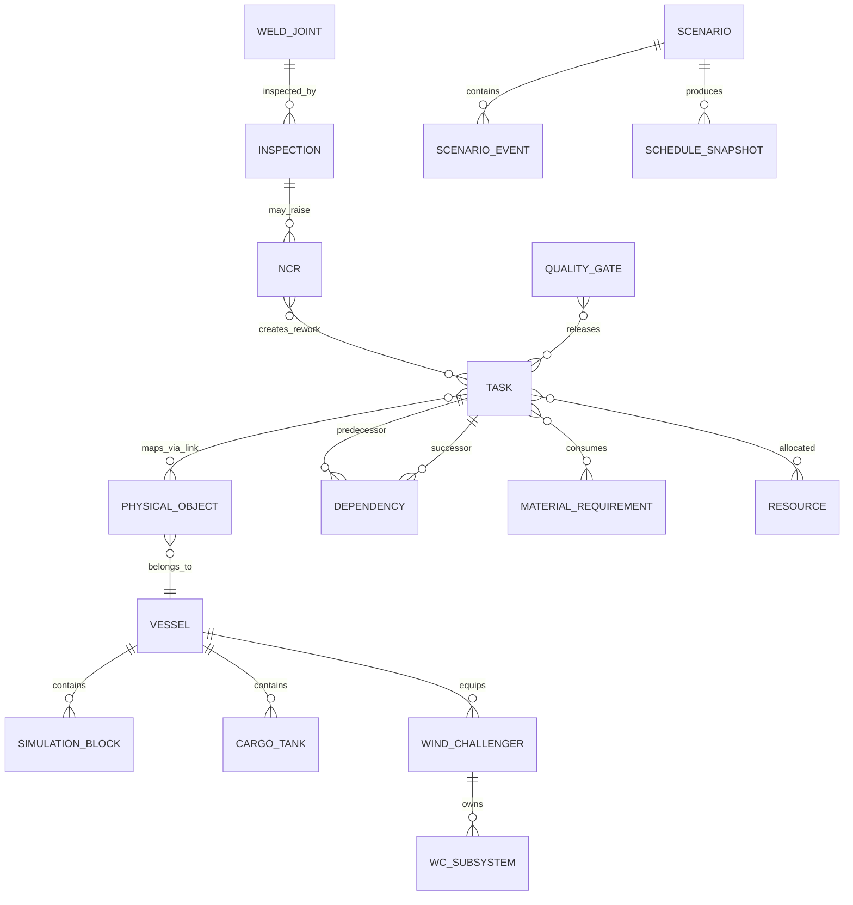
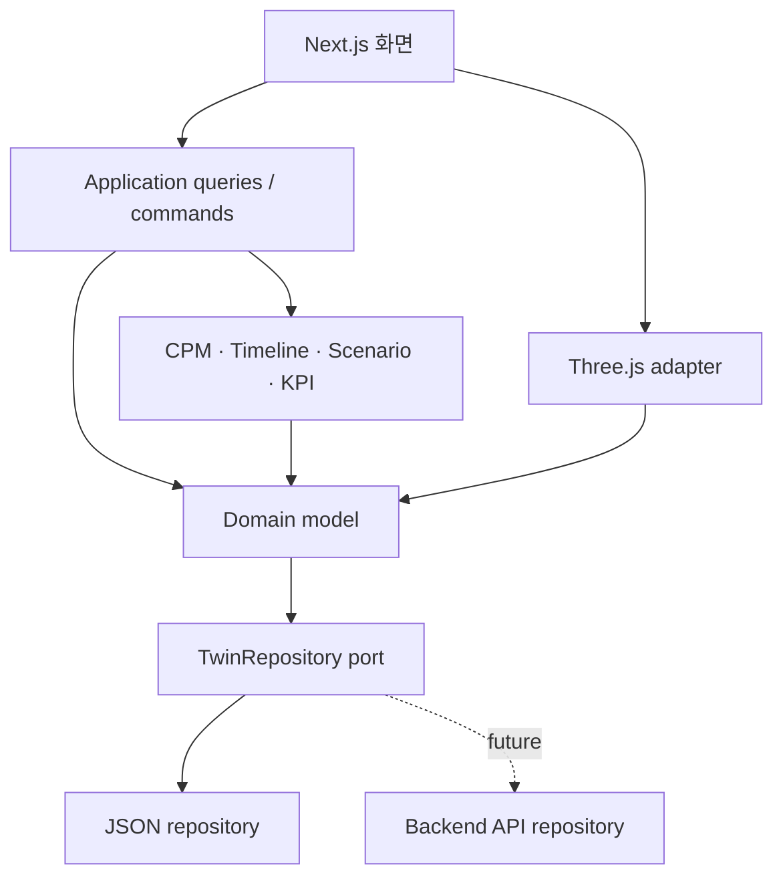
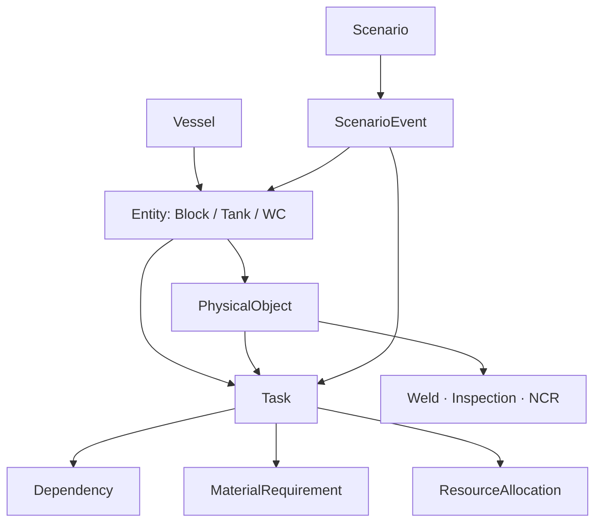
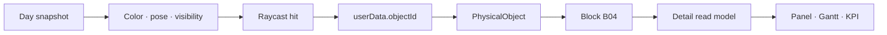
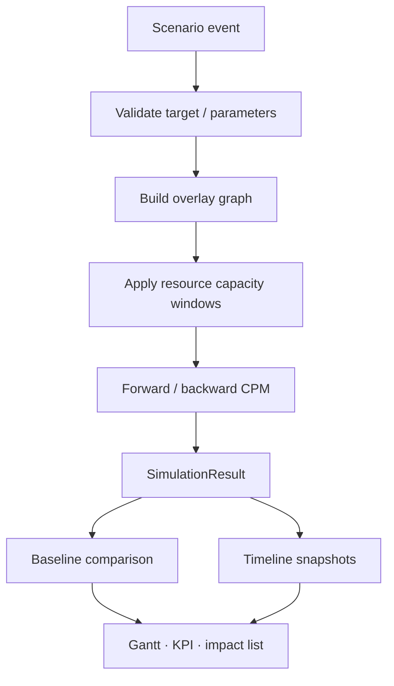

# 174K LNGC Construction Digital Twin Prototype
# System Architecture + Data Contract — PROMPT 03

문서 ID: LNGC-ARCH-03 · 버전: 1.0 · 기준일: 2026-09-18

상위 기준: `LNGC-MR-02` v2.0, **174K Membrane LNGC + 2× Wind Challenger Final Modeling Reference**. 이 문서는 상위 문서의 선박·객체·9개 Simulation Block·Day 0–60 일정·품질 gate를 변경하지 않고 소프트웨어 아키텍처와 데이터 계약으로 옮긴다.

범위: Next.js + TypeScript 기반의 frontend-only 교육용 prototype 설계. 실행 코드, React component, Three.js 구현, CSS, backend, database 및 실제 ERP/MES/PLM 연동은 포함하지 않는다. 본문의 TypeScript와 JSON은 계약 예시이며 실행 산출물이 아니다.

데이터 표기: VERIFIED / DERIVED / ASSUMPTION / MOCK. `UNKNOWN`은 증거 분류가 아니라 availability 상태다. 실제값이 공개되지 않은 경우 `null + UNKNOWN`을 유지하며 모델용 ASSUMPTION 값과 분리한다.

## 1. Architecture Executive Summary

이 시스템의 중심은 3D scene이 아니라 **정규화된 Domain Dataset과 Task Dependency Graph**다. 3D object는 stable `entityId`로 domain entity를 조회하는 presentation adapter다. 생산·자재·품질·자원 사건은 task 또는 gate의 제약으로 변환되고, CPM 기반 Simulation Engine이 ES/EF/LS/LF/TF/FF와 delivery impact를 다시 계산한다.

Single Source of Truth는 다음처럼 나눈다.

| 데이터 | 쓰기 기준 원본 | 파생 결과 |
|---|---|---|
| 선박·블록·탱크·WC·객체 관계 | normalized reference dataset | 3D scene index, 상세 panel read model |
| baseline task·dependency·resource allocation | baseline schedule dataset | baseline schedule snapshot |
| 생산·자재·품질·자원 기록 | 각 domain dataset | block summary, KPI |
| What-If 입력 | scenario event와 override | scenario schedule snapshot, changed tasks, impact |
| Timeline 상태 | task·snapshot·data date | object state와 pose |
| evidence | 각 값 또는 레코드의 DataMeta | 화면 badge·감사 정보 |

`blocks.json` 안에 schedule·quality·material 값을 복사해 저장하지 않는다. Block 상세 화면에 필요한 집계값은 selector/read model이 관련 ID를 따라 계산한다. Baseline은 변경하지 않고 scenario에는 차이만 저장한다. 계산 결과는 snapshot으로 구분한다.

### 1.1 Architecture Issues

**[Architecture Issue 01]**

- 기존 결정: PROMPT 02는 entity ID `B04`, object path `B04/SHELL`, task ID `E-B04`를 사용한다.
- 충돌 내용: PROMPT 03 예시는 `WC01-FND`처럼 entity와 render object ID를 하나의 형식으로 제안한다.
- 권장 수정: `entityId`와 `objectId`를 분리한다. Foundation entity는 `WC01-FND`, render object는 `WC01/FOUNDATION`을 사용하고 mapping으로 연결한다.
- 수정 여부: **Architecture에서 채택. PROMPT 02의 기존 ID는 보존한다.**

**[Architecture Issue 02]**

- 기존 결정: PROMPT 02는 FUJIN SAILOR의 실제 hydraulic/electric 구동방식을 미확인으로 두고 `HYDRAULIC_OPTION`을 조건부 data-only 항목으로 정의했다.
- 충돌 내용: PROMPT 03의 예시 hierarchy는 Hydraulic을 필수 하위 entity처럼 보인다.
- 권장 수정: `DriveSystem`을 필수 추상 entity로 두고 `HydraulicSystem`은 optional capability로 관리한다.
- 수정 여부: **채택. baseline에 hydraulic 설치 task나 mesh를 생성하지 않는다.**

**[Architecture Issue 03]**

- 기존 결정: PROMPT 02에서 B03은 Day20–26 staging, Day26–28 erection이다.
- 충돌 내용: PROMPT 03의 Day10/30/50 상태 예시는 PROMPT 02 일정과 일치하지 않는다.
- 권장 수정: PROMPT 03 예시는 설명용으로만 보고, timeline state는 PROMPT 02 task dates에서 계산한다.
- 수정 여부: **채택. 상위 일정 유지.**

**[Architecture Issue 04]**

- 기존 결정: PROMPT 02의 Block schema에는 predecessor/successor 요약값이 있지만 task graph가 authoritative하다.
- 충돌 내용: block과 task 양쪽에 관계를 쓰면 불일치가 생길 수 있다.
- 권장 수정: dependency dataset만 쓰기 원본으로 두고 Block predecessor/successor는 read-only selector 결과로 만든다.
- 수정 여부: **채택.**

**[Architecture Issue 05]**

- 기존 결정: PROMPT 02는 B04 기준선 작업을 `FAB-B04 → SUB-B04 → BA-B04 → ASM-B04 → QG-B04 → E-B04`로 정의하며 독립적인 `B04 Welding` 일정 작업은 두지 않는다.
- 충돌 내용: PROMPT 03의 예시 전파 체인은 `B04 Welding → B04 Assembly → B04 Erection`을 요구한다.
- 권장 수정: 용접은 `B04/SHELL`의 품질 레코드로 `QG-B04` 또는 `E-B04` release에 연결하고, 재작업이 발생할 때만 repair·reinspection 작업을 생성한다.
- 수정 여부: **채택. 존재하지 않는 baseline 작업을 만들지 않고도 Quality → Schedule 추적성을 보존한다.**

## 2. System Architecture

### 2.1 Layer 책임

| Layer | 책임 | 포함 모듈 | 금지되는 책임 |
|---|---|---|---|
| Presentation | 화면 구성, 선택, 필터, slider, 3D pose/색 적용, 결과 설명 | Overview, Twin, Production, Quality, Simulation, Insight | CPM 계산, 원본 데이터 수정 |
| Application | use case orchestration, query/read model, scenario 실행, state coordination | SelectionController, TimelineController, TwinStateService, ScenarioService, KPIService | 선박 domain 규칙을 UI에 종속시킴 |
| Domain | entity·value object·상태 전이·검증 규칙 | Vessel, PhysicalObject, Block, Task, Dependency, Material, Quality, Resource, Scenario | 파일 경로, React/Three.js type 참조 |
| Engine | domain 계산의 순수 서비스 | ScheduleEngine, ResourceConstraintResolver, ScenarioProjector, TimelineStateResolver, KPI Calculator | UI state·파일 I/O |
| Data / Repository | JSON load, schema validation, ID index, repository interface 구현 | StaticJsonRepository, DatasetValidator, IndexBuilder | 업무 계산, 화면 포맷팅 |

Engine은 Application Layer에서 호출하는 domain service로 취급한다. 별도 microservice가 아니다. 초기 prototype은 브라우저 내에서 동작한다. 향후 backend가 생겨도 Application은 repository interface만 사용하므로 JSON adapter를 API adapter로 바꿀 수 있다.

### 2.2 데이터 흐름

1. Bootstrap이 JSON dataset을 읽고 schema·ID·reference·DAG를 검증한다.
2. Repository가 canonical entity와 indices를 제공한다.
3. ScheduleEngine이 baseline snapshot을 계산한다.
4. TimelineController가 `scenarioId + day`를 입력으로 object state read model을 만든다.
5. 3D adapter가 `objectId → entityId` mapping으로 pose와 visual flags를 적용한다.
6. 사용자가 B04를 선택하면 SelectionController가 block, task, production, material, quality, resource를 ID reference로 조회한다.
7. ScenarioService는 baseline을 복사하지 않고 event를 constraint/override로 project한다.
8. Engine이 scenario snapshot과 KPI delta를 계산하며 Presentation은 baseline과 병렬로 비교한다.

### 2.3 구현 모듈 경계

| Module | 입력 | 출력 |
|---|---|---|
| `dataset-loader` | static JSON | RawDataset |
| `dataset-validator` | RawDataset | ValidatedDataset 또는 오류목록 |
| `domain-index` | ValidatedDataset | entity/task/object 역색인 |
| `schedule-engine` | tasks, dependencies, constraints | ScheduleSnapshot |
| `resource-resolver` | tasks, allocations, outages, fixed priority | earliest resource constraints |
| `scenario-projector` | baseline refs, events | TaskOverrides, generated tasks/dependencies, constraints |
| `timeline-resolver` | snapshot, production, quality, day | ObjectTimelineState[] |
| `read-model` | repository, selection, snapshot | BlockDetailVM, KPIViewModel 등 |
| `three-adapter` | ObjectTimelineState, mapping | renderer-neutral pose/visual command |

## 3. Information Architecture

| 사용자 영역 | 핵심 질문 | 주요 읽기 모델 | 주요 action |
|---|---|---|---|
| Overview | 현재 계획·리스크·인도 영향은? | KPI summary, critical path, alerts | scenario 선택, 주요 object 이동 |
| 3D/4D Twin | Day t에 어디서 무엇이 진행되는가? | ObjectTimelineState, selection detail | slider, select, isolate, cutaway |
| Production | 어떤 block/task가 어느 단계인가? | BlockProductionSummary, task table | block/task 필터 |
| Quality | 어느 검사·NCR이 후속을 막는가? | QualityChain, gate status | NCR→repair→schedule 추적 |
| Simulation | 사건이 어떤 task와 납기에 영향을 주는가? | ScenarioEditorModel, SimulationResult | event 입력, 실행, baseline 비교 |
| Insight | 원인·전파·대안을 어떻게 설명할까? | impact chain, changed critical path, bottleneck | 관련 object/task 강조 |

URL이나 component 내부 상태가 domain 원본이 되지 않는다. 선택상태는 `{entityId, objectId?, taskId?}`, 시간상태는 `{scenarioId, snapshotId, day}`로 표현한다. Overview 숫자와 Twin 상세값은 같은 snapshot을 참조해야 한다.

## 4. Domain Model

### 4.1 핵심 Entity 계약

| Entity | Purpose | PK | 주요 FK | Required Fields | Optional Fields | Relationships | Source Type | Used By |
|---|---|---|---|---|---|---|---|---|
| Vessel | 기준 선박과 모델 identity | `LNGC-EDU-01` | 없음 | name, type, specs, meta | actual depth/draft 등 | 1:N physical entities | V/A 혼합, 값별 meta | 전체 |
| PhysicalObject | 3D 선택 가능한 논리/물리 객체 | objectId | entityId, parentObjectId | objectType, geometryRef | hostBlockIds | hierarchy + entity mapping | A/D | Twin |
| SimulationBlock | 9개 생산관리 구역 | B01…B09 | vesselId | zone, geometry, tankIds | yardBlockIds | N:M Task/Object/Tank | A | Twin/Production |
| CargoTank | generic membrane 논리탱크 | T01…T04 | vesselId | geometryRef, layer IDs | actualCapacity | N:M Block, Task | A | Twin/CCS |
| WindChallenger | WC 장비 identity | WC01/WC02 | vesselId, hostBlockId | geometryRef, subsystemIds | actuationType | 1:N subsystem, N:M Task | V/A | Twin/Simulation |
| WcSubsystem | foundation/drive/electrical/control/sensor | WCxx-* | wcId | subtype, availability | hydraulic detail | N:M Task/Object | A/UNKNOWN | Twin/Production |
| Task | 계산 가능한 일정 작업 | taskId | entity/task/resource refs | duration, calendarId | actual dates | N:M Object/Dependency | A/M/D | Schedule |
| Dependency | DAG edge | dependencyId | predecessor/successor | type, lag, reasonTypes | note | Task→Task | A | Schedule |
| ProductionRecord | task/단계 진척 관측 | productionRecordId | taskId, entityId | stage, status, progressBasis | measured qty | Task·Entity | M, future actual | Production |
| MaterialRequirement | task를 여는 자재 요구 | requirementId | materialId, taskId | requiredDate, requiredQty | criticality | N:M Task/Material | M/A | Material/Simulation |
| MaterialLot | 가용·검수 상태 | materialId | 없음 | type, quantity, status | availableDate | N:M Requirement | M | Material |
| WeldJoint | 용접 대상과 위치 | weldId | objectIds, blockIds | locationRef, revision | procedureRef | 1:N Inspection | M/A | Quality |
| Inspection | 검사 사건 | inspectionId | target IDs | method, scope, result | reportRef | N:1 target, 1:N defect | M | Quality |
| NCR | 부적합 처리 | ncrId | target IDs, gate IDs | status, disposition | owner | N:M RepairTask/Gate | M | Quality/Simulation |
| QualityGate | 후속 release | gateId | task/inspection/NCR IDs | status, requirements | releasedBy/At | blocks Tasks | A/M | Quality/Schedule |
| Resource | prototype 자원 pool | resourceId | calendarId | type, capacity, unit | physical capacity | N:M Task | A/M | Resource/Simulation |
| Allocation | task의 자원 수요 | allocationId | taskId, resourceId | demand, intervalBasis | priority | N:M | A | Schedule |
| Scenario | baseline에 대한 변경집합 | scenarioId | baselineId | name, type, events | description | 1:N Event/Result | M | Simulation |
| ScenarioEvent | 원인 입력 | eventId | scenarioId, targets | type, effect | time window | projects constraints | M | Simulation |
| ScheduleSnapshot | 한 계산 실행의 결과 | snapshotId | scenarioId/baselineId | task states, delivery | target finish | 1:N CalculatedTaskState | D | 전체 |
| SimulationResult | baseline-scenario 비교 | resultId | snapshot IDs | deltas, changed tasks | warnings | 1:1 Scenario run | D | Simulation/Insight |
| DataMeta | 값의 증거·가용성 | metaId 또는 inline | source IDs | sourceType, availability | note/formula | 모든 주요 값 | V/D/A/M | 감사/UI |

### 4.2 Value Object

`Vector3`, `Transform`, `SimulationDay`, `DateTime`, `Quantity`, `Percentage`, `EvidenceValue<T>`, `TaskConstraint`, `TimeWindow`, `ProgressMeasure`, `EntityRef`는 identity가 없는 immutable value object다. 단위 없는 number를 피한다. `SimulationDay`와 timestamp를 같은 값으로 비교하지 않는다.

## 5. Entity Relationship



`TaskObjectLink`, `ResourceAllocation`, `GateTaskLink` 같은 연결 entity는 N:M 관계의 scope·role·weight를 보존한다. Block이 Production/Quality/Schedule을 직접 소유한다고 구현하지 않는다. 해당 레코드들이 `entityId` 또는 task/object reference로 Block에 연결된다.

## 6. Stable ID Strategy

### 6.1 ID 종류

| ID 종류 | 규칙 | 예 | 변경 가능성 |
|---|---|---|---|
| datasetId | 대문자 영숫자·hyphen | LNGC-DEMO-01 | dataset 교체 시 변경 |
| vesselId | 상위 문서 보존 | LNGC-EDU-01 | 불변 |
| entityId | 짧은 canonical ID | B04, T02, WC01 | 불변 |
| subsystemId | 부모 prefix + 역할 | WC01-FND, WC01-DRV, WC01-ELE, WC01-CTL, WC01-SEN | 불변 |
| objectId | scene 소유 경로 `/` | B04/SHELL, WC01/FOUNDATION | geometry revision에도 가능한 유지 |
| taskId | 의미 있는 대문자 token | FAB-B04, E-B04, WC-LIFT | baseline에서 불변 |
| recordId | 종류 prefix + sequence/target | NCR-004, INSP-001, MATREQ-B04-STEEL | 불변 |
| scenarioId | SCN + 의미/번호 | SCN-B04-REWORK-01 | 불변 |
| snapshotId | SNAP + scenario + run version | SNAP-SCN-B04-REWORK-01-R01 | 계산 실행마다 새 ID |

ID는 표시명이나 배열 index가 아니다. entity가 rename되어도 ID는 유지한다. 대소문자를 구분하는 string으로 저장하되 모든 canonical ID는 uppercase 규칙을 따른다. 내부 UUID를 추가할 수 있으나 frontend contract의 stable ID를 대체하지 않는다.

### 6.2 전역 유일성과 reference 규칙

- `entityId`는 dataset 내 전체 entity type에서 유일해야 한다. B04·T04처럼 prefix가 달라 충돌하지 않는다.
- `objectId`는 전체 scene에서 유일하며 반드시 하나의 `entityId`에 연결된다.
- task가 여러 entity에 연결되면 task를 복제하지 않고 `TaskObjectLink`를 여러 개 둔다.
- Block의 `predecessorIds` 같은 조회값은 dependency index에서 생성한다.
- 외래참조는 파일명이나 object name을 사용하지 않는다.
- 삭제 대신 `lifecycleStatus=RETIRED`와 replacement ID를 사용해 저장된 scenario가 깨지지 않게 한다.

### 6.3 B04 선택 해석

`B04/SHELL` raycast → metadata의 `entityId=B04` → entity index의 B04 → task-object index의 FAB-B04…E-B04/HULL-GATE/OUTFIT → quality target index의 weld·inspection·NCR → dependency graph의 upstream/downstream → 선택 snapshot의 TF/critical 상태로 이동한다.

## 7. Vessel Data Schema

| Field | Type | Required | Source classification | 규칙 |
|---|---|---|---|---|
| entityId | string | Y | A identity | LNGC-EDU-01 |
| referenceName | string | Y | V | FUJIN SAILOR |
| modelPurpose | enum | Y | A | EDUCATIONAL_PRODUCTION_TWIN |
| vesselType | EvidenceValue<string> | Y | V | LNG_CARRIER |
| cargoCapacityM3 | EvidenceValue<number> | Y | V | 174000 |
| containmentType | EvidenceValue<string> | Y | V | MEMBRANE |
| containmentTechnology | EvidenceValue<string|null> | Y | UNKNOWN | null |
| loaM / breadthM | EvidenceValue<number> | Y | V | 294.9 / 46.4 |
| depthM / draftM | EvidenceValue<number|null> | Y | UNKNOWN | null |
| mainEngineFamily | EvidenceValue<string> | Y | V | ME-GA |
| windChallengerIds | string[] | Y | V identity mapping | WC01, WC02 |
| blockIds / tankIds | string[] | Y | A | B01…B09 / T01…T04 |
| modelingParameters | reference | Y | A | 별도 geometry config ID |
| referenceStatus | enum | Y | V at source date | NAMED_DELIVERY_SCHEDULED |
| meta | DataMeta | Y | 혼합값은 field-level 우선 | record 설명 |

`cargoCapacityM3`를 탱크별로 4등분해 저장하지 않는다. `modelingParameters.displayHullHeightM=26.5`는 Vessel actual spec가 아니라 geometry config에 둔다.

## 8. Block Data Schema

Block record는 identity·geometry reference·관계만 소유한다. 생산·일정·품질 집계는 read model이다.

| Field group | Field | Type | Source | 규칙 |
|---|---|---|---|---|
| Identity | entityId, vesselId, name, blockKind | string/enum | A | PROJECT_SIMULATION_BLOCK |
| Zone | uStart, uEnd, shipZone, mainRole | number/string | A | P02 경계 유지 |
| Geometry | objectIds, finalTransform, assemblyTransform, stagingTransform, dimensions | refs/value | A/D(A) | object mesh와 분리 |
| Relations | relatedTankIds, hostSystemIds, taskIds | string[] | A | taskIds는 link index로 조회 가능 |
| Mapping | yardBlockIds | string[] | UNKNOWN | 기본 [] |
| Lifecycle | lifecycleStatus, geometryRevision | enum/string | A | ACTIVE, MR02-2.0 |
| Evidence | meta | DataMeta | A | 실제 공식 block 아님 명시 |

`BlockDetailReadModel`은 별도 계산 결과로 다음을 제공한다: productionStage, status, progress, progressBasis, erectionStatus, planned/forecast/actual finish, TF/FF, criticalTasks, materialReadiness, shortageCount, weldingProgress, NDT summary, open/total NCR, rework mh, gate status, allocated resources. 이 값을 `blocks.json`에 다시 쓰지 않는다.

## 9. Cargo Tank Data Schema

| Field | Type | Required | Source | 설명 |
|---|---|---|---|---|
| entityId / vesselId | string | Y | A identity | T01…T04 |
| tankKind | enum | Y | A | GENERIC_MEMBRANE_LOGICAL_TANK |
| actualCapacityM3 | number|null | Y | UNKNOWN | 개별 실제용적 null |
| uRange / displayEnvelope | values | Y | A | P02 형상값 |
| layerObjectIds | string[] | Y | A | volume/barrier/insulation |
| relatedBlockIds | string[] | Y | A | T02·T03 복수 block 허용 |
| cargoDomeObjectId | string | Y | A | 대표물, 실제 대수 아님 |
| containmentTechnology | string|null | Y | UNKNOWN | NO96/Mark III 미확정 |
| installationTaskIds | string[] | Y | A | baseline에서는 CCS package |
| meta | DataMeta | Y | A + V 일반원리 link | 실선 상세와 구분 |

## 10. Wind Challenger Data Schema

| Field | Type | Required | Source | 설명 |
|---|---|---|---|---|
| entityId / vesselId | string | Y | V identity | WC01/WC02 |
| hostBlockId | string | Y | A | B02 |
| rootObjectId | string | Y | A | WC01 등 |
| anchor / geometryConfigId | Transform/ref | Y | A | P02 좌표·3단 config |
| publicDesignEnvelope | EvidenceValue | Y | V·2024 | max49m, width≈15m, 3-tier, FRP |
| displayDeploymentRatio | number 0..1 | Y | A runtime | 설치된 장비의 전개 표시 |
| displayAzimuthDeg | number | Y | A runtime | 실제 구동각 아님 |
| installationStatus | enum | Y | A/M | NOT_STARTED…COMMISSIONED |
| commissioningStatus | enum | Y | A/M | NOT_READY/IN_PROGRESS/PASSED/HOLD |
| subsystemIds | string[] | Y | A | FND/DRV/ELE/CTL/SEN |
| actuationType | enum | Y | UNKNOWN | UNKNOWN/HYDRAULIC/ELECTRIC/OTHER |
| hydraulicSystemId | string|null | Y | UNKNOWN | baseline null |
| installationTaskIds | string[] | Y | A | package task IDs |
| meta | DataMeta | Y | field-level | 제품군 사실과 모델 가정 분리 |

Foundation entity는 object와 별도로 `WC01-FND`를 사용한다. `WC01/FOUNDATION` metadata가 이 entity를 가리킨다. Drive는 `WC01-DRV`; hydraulic 확정 전에도 존재하지만 구체 방식은 UNKNOWN이다.

## 11. Production Data Schema

### 11.1 Stage와 record

`ProductionStage`는 NOT_STARTED, FABRICATION, SUB_ASSEMBLY, BLOCK_ASSEMBLY, GRAND_ASSEMBLY, INSPECTION, STAGING, ERECTION, ERECTED, INTEGRATION, OUTFITTING, COMPLETED로 고정한다. DELAYED와 QUALITY_HOLD는 stage가 아니라 별도 flag다.

| Field | Type | Required | 규칙 |
|---|---|---|---|
| productionRecordId | string | Y | PRODREC-* |
| entityId / taskId | string | Y | 어느 객체의 어떤 작업인지 명시 |
| stage | ProductionStage | Y | task stage와 일치 |
| status | NOT_STARTED/IN_PROGRESS/COMPLETED/HOLD | Y | 관측상태 |
| progressPct | number|null | Y | 0–100, 미수집 null |
| progressBasis | PLANNED_PREVIEW/MOCK/MEASURED | Y | 해석 근거 |
| measuredQuantity / totalQuantity / unit | values|null | 조건부 | MEASURED이면 분모·단위 필수 |
| dataDate | sim day 또는 timestamp | Y | dataset timeDomain과 일치 |
| actualStart / actualFinish | time|null | Y | 미래 planned 값으로 채우지 않음 |
| note / meta | values | Y | M 또는 future actual 분리 |

### 11.2 Block progress

단순 평균을 사용하지 않는다. PROMPT 02의 교육용 가중치를 그대로 적용한다.

| Scope | Weight |
|---|---:|
| FABRICATION | 10% |
| SUB_ASSEMBLY | 15% |
| BLOCK_ASSEMBLY | 20% |
| GRAND_ASSEMBLY | 15% |
| INSPECTION/QG | 5% |
| ERECTION | 20% |
| HULL_GATE contribution | 5% |
| OUTFITTING contribution | 10% |

`blockProgress = Σ(stageProgress × weight)`. 이 가중치는 ASSUMPTION이다. 실제 공수·승인물량을 확보하면 dataset version을 올려 교체한다. HULL_GATE·OUTFIT 같은 공유 task는 block read model에는 allocation weight로 기여할 수 있지만 vessel progress에서는 taskId별 한 번만 집계해 중복을 막는다. 실제 진척이 없는 PLANNED_PREVIEW는 ‘계획 애니메이션 진척’으로 표시한다.

## 12. Schedule / Task Data Schema

### 12.1 Task

| Field | Type | Required | 설명 |
|---|---|---|---|
| taskId / name | string | Y | FAB-B04, E-B04 등 |
| stage / taskType | enums | Y | 생산단계와 작업종류 |
| durationDays | number | Y | baseline A 또는 scenario override |
| calendarId | string | Y | prototype 기본 CAL-24X7 |
| baselineStart/Finish | SimulationDay | Y | P02 값; 검증용 cached 값 |
| actualStart/Finish | time|null | Y | M/actual snapshot에만 |
| remainingDurationDays | number|null | 조건부 | data date 이후 예측 |
| entityLinks | TaskObjectLink refs | Y | 1개 이상 |
| requiredGateIds | string[] | Y | 없으면 [] |
| allocationIds | string[] | Y | 없으면 [] |
| priority | integer | Y | resource tie-break; 작은 수 우선 |
| meta | DataMeta | Y | 기간·값 출처 |

Baseline start/finish는 편집 원본이 아니다. duration + dependencies + constraints로 재계산한 결과와 일치하는지 validator가 확인한다. schedule snapshot이 authoritative 계산 결과다.

### 12.2 Dependency

| Field | Type | Required | 설명 |
|---|---|---|---|
| dependencyId | string | Y | DEP-{pred}-{succ} |
| predecessorTaskId / successorTaskId | string | Y | self-loop 금지 |
| type | `FS` | Y | v1은 Finish-to-Start만 지원 |
| lagDays | number | Y | 기본0, 음수 금지 |
| reasonTypes | array | Y | STRUCTURAL/RESOURCE_ORDER/QUALITY/MANAGEMENT/LOGISTICS |
| scenarioScope | BASELINE 또는 scenarioId | Y | scenario edge 식별 |
| meta | DataMeta | Y | A/M |

SS·FF·SF는 개념상 가능한 dependency type이지만 prototype v1에서는 지원하지 않는다. 입력되면 변환하지 않고 validation error로 거부한다. 이 선택은 PROMPT 02의 FS0 일정 계약을 보존한다. 향후 type을 추가할 때 forward/backward pass 공식을 확장한다.

### 12.3 계산 상태

`CalculatedTaskState`는 taskId, ES, EF, LS, LF, totalFloat, freeFloat, isCritical, isLateAgainstTarget, targetFloat, appliedConstraintIds, changedFromBaseline을 가진다. 이 필드는 schedule JSON 원본에 수기로 저장하지 않고 snapshot에 생성한다.

Staging은 task가 아니다. `stagingWindow = [QG.EF, E.ES)`로 계산한다. QG가 늦으면 staging 대기가 줄어들며 별도 transport task가 추가되지 않은 현재 계약을 따른다.

## 13. Material Data Schema

### 13.1 Material과 requirement

| Entity / Field | Type | 규칙 |
|---|---|---|
| MaterialLot.materialLotId | string | MAT-* |
| materialType | enum | STEEL/OUTFITTING/WC_EQUIPMENT/CCS_COMPONENT/MACHINERY/OTHER |
| quantity / unit | number/string | unit 일치 없이 합산 금지 |
| availableDate | sim day|null | 아직 없으면 null |
| status | enum | NOT_ORDERED/ORDERED/IN_TRANSIT/RECEIVED/RELEASED/HOLD/SHORTAGE |
| inspectionHold | boolean | true이면 사용 불가 |
| meta | DataMeta | prototype 상태임을 표시 |
| Requirement.requirementId | string | MATREQ-* |
| taskId / materialLotId | refs | 소비 task와 lot |
| requiredDate | sim day | task가 필요로 하는 시점 |
| requiredQty / unit | values | material과 동일 unit |
| critical | boolean | 미충족 시 task 차단 |
| substitutionGroupId | string|null | 대체 가능 lot 그룹 |

### 13.2 Readiness

Requirement readiness는 `min(availableReleasedQty / requiredQty, 1)`이다. Material summary는 requirement별 가중 평균을 사용할 수 있지만 `critical=true` requirement가 부족하거나 HOLD이면 consuming task에 `MATERIAL_NOT_READY` constraint를 준다. 퍼센트가 높더라도 critical item이 없으면 gate가 열리지 않는다.

MATERIAL_DELAY event는 material lot의 availableDate 또는 releaseDate를 바꾸며, affectedTaskIds를 사람이 임의로 나열하는 대신 Requirement index로 소비 task를 찾는다. task earliest constraint는 모든 critical requirement release의 최댓값이다.

## 14. Quality Data Schema

### 14.1 Chain과 entity

`Block → WeldJoint → Inspection → Defect/NCR → RepairTask → ReInspection → QualityGate → Schedule successor`를 보존한다. Block에 `ncrCount`만 저장해 원인을 잃지 않는다.

| Entity | Required Fields | Optional Fields |
|---|---|---|
| WeldJoint | id, objectIds, blockIds, locationRef, drawingRevision | procedureRef |
| Inspection | id, targetIds, method, requiredScope, completedScope, result, dataDate | reportRef |
| Defect | id, inspectionId, type, severity, location, acceptanceRef | photoRef |
| NCR | id, targetIds, defectIds, status, disposition, blockingGateIds | owner, dueDate |
| RepairTaskDefinition | taskId, ncrIds, durationDays, requiredResourceTypes | plannedManHours |
| ReInspection | inspectionId, previousInspectionId, repairTaskId, result | reportRef |
| QualityGate | id, requiredInspectionIds, blockingNcrIds, status | releasedBy/At |

Prototype enum은 InspectionResult=NOT_STARTED/PLANNED/IN_PROGRESS/PASS/FAIL/HOLD, NCRStatus=OPEN/UNDER_REVIEW/REWORK/REINSPECTION/CLOSED, GateStatus=NOT_READY/BLOCKED/RELEASED다. 실제 선급 코드라고 주장하지 않는다.

### 14.2 Schedule impact contract

Quality event가 발생하면 기존 task duration 숫자를 덮어쓰는 방법과 generated repair chain을 추가하는 방법을 구분한다. traceability가 필요한 WELDING_REWORK는 후자를 사용한다.

1. 원래 release point를 찾는다. 예: E-B04 종료 release.
2. `RW-B04-SCN01`과 `RI-B04-SCN01`을 scenario-only task로 생성한다.
3. E-B04 → repair → reinspection → 기존 후행 tasks로 edge를 대체한다.
4. NCR이 열린 동안 해당 quality gate에 BLOCKED constraint를 둔다.
5. scenario snapshot에서 후행 ES/EF와 delivery를 재계산한다.

Defect count, NCR count, repair task count는 서로 같을 필요가 없다. 48mh는 duration 3일로 자동 환산하지 않는다. 인원·shift·대기시간을 포함한 별도 MOCK 입력이 필요하다.

## 15. Resource Data Schema

Prototype 자원은 다섯 종류로 제한한다.

| Resource Type | 기본 예 | What-If 사용 |
|---|---|---|
| ERECTION_SLOT | RES-ERECTION-SLOT-01, capacity1 | block 탑재 순서·crane breakdown 대리변수 |
| WC_INSTALL_SLOT | RES-WC-SLOT-01, capacity1 | WC 설치 지연 |
| WELDING_TEAM | RES-WELD-01, capacity1 team | repair duration/availability |
| INSPECTION_TEAM | RES-INSP-01, capacity1 team | QG·재검사 |
| TRANSPORT_SLOT | RES-TRANS-01, capacity1 | 향후 transport task 도입 시; baseline 미사용 |

실제 crane t capacity, 실제 인원수와 장비 대수는 UNKNOWN이다. `ERECTION_SLOT`은 교육용 공유 작업능력이다.

| Field | Type | 설명 |
|---|---|---|
| resourceId / type / name | values | stable identity |
| capacity / capacityUnit | number/string | team 또는 slot |
| calendarId | string | 가용시간 규칙 |
| status | AVAILABLE/OUTAGE/RESTRICTED | snapshot 상태 |
| availabilityWindows | TimeWindow[] | baseline 또는 scenario |
| meta | DataMeta | A/M/UNKNOWN |

Allocation은 taskId, resourceId, demand, priority, allocationMode=FIXED_ORDER를 가진다. Prototype은 범용 resource-leveling optimizer가 아니다. `CRANE_BREAKDOWN`은 resource capacity=0 outage window를 만들고, fixed order에서 outage와 겹치는 배정 task를 가능한 첫 시점으로 민다. 그 결과를 `RESOURCE_AVAILABILITY` constraint로 task forward pass에 전달한다. 뒤 작업은 dependency와 같은 resource order를 따라 이동한다.

## 16. Timeline State Model

### 16.1 세 개의 직교 상태축

| 축 | 값 | 목적 |
|---|---|---|
| productionStage | P02의 12단계 | 무엇을 하고 있는가 |
| scheduleStatus | ON_PLAN/AT_RISK/DELAYED/CRITICAL/LATE_TO_TARGET | 일정 상태 |
| qualityStatus | CLEAR/PENDING/HOLD/NCR_OPEN/RELEASED | 품질 상태 |

DELAYED나 QUALITY_HOLD를 productionStage에 섞지 않는다. 예: B04는 ERECTION이면서 DELAYED이고 NCR_OPEN일 수 있다.

### 16.2 Day t 계산

반개구간 `[start, finish)`을 사용한다. t가 task interval 안이면 해당 stage IN_PROGRESS, 이전 필수 block-scope tasks가 끝나지 않았으면 해당 단계, QG.EF≤t<E.ES이면 STAGING, E.EF≤t<HULL_GATE.ES이면 ERECTED, HULL_GATE interval이면 INTEGRATION, OUTFIT interval이면 OUTFITTING, 범위 task와 gate가 모두 완료되면 COMPLETED다.

Timeline resolver 입력은 `snapshotId, entityId, day, mode`다. mode는 PLANNED_PREVIEW / SCENARIO_PREVIEW / ACTUAL_REPLAY다. ACTUAL_REPLAY에서 실제관측이 없으면 planned 상태로 채우지 않고 UNKNOWN flag를 준다.

`ObjectTimelineState` 출력은 entityId, objectIds, stage, status, progress, progressBasis, scheduleStatus, qualityStatus, pose, visibility, visualTokens, activeTaskIds, blockingIssueIds다. renderer는 이 결과만 소비하며 일정 계산을 하지 않는다.

### 16.3 Pose

Block pose는 P02의 assembly/staging/final anchors를 사용한다. ERECTION 처음25%에 staging→final 보간, 이후 final에서 접합상태로 둔다. WC와 Tank는 host block transform을 자동 상속하지 않는다. 각자의 installation task에서 visibility/pose를 계산한다. slider를 역방향으로 움직여도 동일 day는 동일 state를 반환해야 한다.

## 17. What-If Scenario Schema

### 17.1 Scenario와 Event

| Field | Type | Required | 설명 |
|---|---|---|---|
| scenarioId / name | string | Y | stable ID·표시명 |
| baselineId | string | Y | BASELINE-P02 |
| type | enum | Y | 주된 scenario 분류 |
| events | ScenarioEvent[] refs | Y | 1개 이상 |
| description | string | Y | 가정과 목적 |
| status | DRAFT/VALIDATED/RUN/FAILED | Y | lifecycle |
| meta | DataMeta | Y | 기본 MOCK |

ScenarioEvent는 `eventId`, `type`, `target: ScenarioTarget`, `triggerDay`, `parameters`, `dataMeta`를 가진다. `ScenarioTarget`은 entity/object/task/release task/resource/material ID 중 사건 유형에 필요한 키만 담는다. validator는 type별 필수 target과 parameter를 확인하고, index로 실제 affected task를 확장한다.

### 17.2 지원 type과 projection

| Type | 입력 | Domain projection |
|---|---|---|
| WEATHER_SHUTDOWN | time window, affected task/resource scope | calendar exception 또는 resource outage |
| CRANE_BREAKDOWN | erection resource, outage window | capacity0 + fixed-order resource delay |
| MATERIAL_DELAY | materialId, new available/release day | material constraint 갱신 |
| WELDING_REWORK | weld/NCR/gate, repair & reinspection duration | scenario-only task chain 삽입 |
| WIND_CHALLENGER_DELAY | WC task/material/resource, delay 또는 new duration | WC 경로 task override/constraint |

직접 `deliveryDelayDays`를 입력하지 않는다. 이는 SimulationResult에서 계산된다. Event가 여러 개인 scenario도 지원하고 각 constraint의 originEventId를 보존한다.

## 18. Delay Propagation Model

이 엔진은 **Prototype CPM-based simulation**이다. 실제 조선소 APS, stochastic risk model, multi-project optimizer가 아니다.

### 18.1 실행 순서

1. baseline tasks/dependencies를 immutable input으로 불러온다.
2. scenario event를 duration override, generated task/edge, material constraint, resource outage, calendar exception으로 변환한다.
3. reference, DAG, duration, calendar, resource capacity를 검증한다.
4. fixed resource order에 따라 resource earliest constraints를 계산한다.
5. topological order로 forward pass를 수행한다.
6. scenario project finish에서 backward pass를 수행한다.
7. TF/FF와 scenario critical tasks를 계산한다.
8. Day60 target에 대한 targetFloat/late days를 별도 계산한다.
9. baseline과 scenario snapshot을 diff하고 impact chain/KPI를 만든다.

### 18.2 v1 수식

모든 dependency는 FS이다.

`ES(i) = max(dataDateConstraint, materialConstraint, resourceConstraint, gateConstraint, max(EF(p)+lag(p,i)))`

`EF(i) = ES(i) + effectiveDuration(i)`

terminal project finish `PF = EF(DEL)`. 역산은 terminal LF=PF로 시작한다.

`LF(i) = min(LS(s)-lag(i,s))`, `LS(i)=LF(i)-duration(i)`

`TF(i)=LS(i)-ES(i)`

`FF(i)=min(ES(s)-lag(i,s))-EF(i)`; terminal task는0.

`isCritical = abs(TF) < epsilon`이며 simulation day 정수 모델에서 epsilon=0이다. Day60 target 기준 `targetFloat`은 별도 역산 또는 `targetFinish-PF` 영향으로 표시한다. scenario finish를 기준으로 TF를 계산하면 늦은 일정의 음수 float가 사라질 수 있으므로 `lateAgainstTargetDays=max(0, PF-60)`를 반드시 함께 낸다.

### 18.3 Resource outage 처리

고정 순서 resource만 지원한다. 각 allocation을 dependency-ready ES 순서와 priority로 훑어 capacity가 있는 첫 interval을 찾는다. outage와 겹치면 뒤로 민다. 동시에 가능한 복수 resource 조합은 지원하지 않으며 validation warning을 낸다. resource resolver가 만든 시작제약과 dependency forward pass를 변경이 없을 때까지 반복하되 최대 반복횟수를 둔다. 수렴하지 않으면 run=FAILED다.

### 18.4 변경 추적

각 CalculatedTaskState는 baseline 대비 startDelta, finishDelta, durationDelta, criticalityChanged, appliedConstraintIds, originEventIds를 가진다. 영향을 받은 task는 단순히 downstream 전체가 아니라 start/finish/duration/criticality 중 하나가 바뀐 task다. propagation path는 event→constraint/generated task→changed task edge→DEL의 경로로 저장한다.

## 19. Critical Path / CPM Model

Baseline에는 두 개의 Day20 합류 분기와 SAT/GAS 병렬 분기가 있어 단일 문자열이 아닌 critical task set과 critical path list를 저장한다. `criticalPathBefore`와 `criticalPathAfter`는 각기 여러 경로를 가질 수 있다.

| Output | Type | 설명 |
|---|---|---|
| criticalTaskIds | string[] | TF=0 task 집합 |
| criticalPaths | string[][] | START→DEL의 대표 완전 경로들 |
| nearCriticalTaskIds | string[] | 0<TF≤threshold, 기본2일 |
| criticalityChanges | records | ENTERED/LEFT/UNCHANGED |
| convergenceNodeIds | string[] | 여러 경로 합류 지점 |
| projectFinishDay | number | EF(DEL) |

경로 수가 폭증하면 모든 조합을 UI에 보내지 않고 critical task DAG와 상위 N개의 설명 경로를 제공한다. 분석 계산에는 전체 critical subgraph를 유지한다. block의 `criticalPath=true`는 연결 task 중 임계가 있다는 요약이며 task별 TF가 원본이다.

## 20. KPI Model

| Domain | KPI | 계산/단위 | 주의 |
|---|---|---|---|
| Schedule | baselineDeliveryDay | baseline DEL EF | 60 |
| Schedule | scenarioDeliveryDay | scenario DEL EF | 계산값 |
| Schedule | deliveryDelayDays | scenario−baseline | 음수 가능 여부 정책상0 이하도 표시 |
| Schedule | lateAgainstTargetDays | max(0, scenario−60) | target 기준 |
| Schedule | criticalTaskCount | TF=0 task 수 | 경로 수와 다름 |
| Schedule | minPositiveFloatDays | min(TF>0) | near-critical 지표 |
| Production | overallProgressPct | task unique weighted progress | PLANNED/MOCK/MEASURED label |
| Production | blockProgressPct | §11 가중치 | 단순 평균 아님 |
| Material | materialReadinessPct | requirement weighted | critical hold 별도 |
| Quality | openNcrCount | OPEN 계열 NCR | total과 구분 |
| Quality | ndtPassRate | PASS/(PASS+FAIL) | 미검사 제외, 분모 표시 |
| Quality | reworkManHours | repair actual/planned 합 | basis 구분 |
| Resource | erectionSlotUtilization | busy time/available time | 분석 window 필수 |
| Resource | resourceAvailabilityPct | available time/window | 실제 장비 가동률 아님 |

PV/EV/AC/SPI/CPI는 포함하지 않는다. 승인 baseline budget, 실제비용, 객관적 earned value 측정기준이 없기 때문이다. 향후 도입 시 별도 cost/EVMS domain과 MOCK 또는 실제 출처를 명시한다.

## 21. Baseline vs Scenario Model

### 21.1 불변 기준선과 오버레이

`BASELINE-P02`는 PROMPT 02의 계획을 표현하는 읽기 전용 데이터셋이다. 시나리오는 기준선 레코드를 복제하거나 덮어쓰지 않고, 이벤트와 파생 태스크를 오버레이한다. 따라서 동일한 `taskId`를 기준으로 계획과 시나리오 결과를 직접 비교할 수 있다.

| 계층 | 저장 내용 | 변경 정책 |
|---|---|---|
| Baseline | 기준 태스크, 의존성, 자원 할당, 계획 품질 게이트 | 불변 |
| Scenario input | 이벤트, 대상, 시작일, 지연·복구 파라미터 | 사용자 편집 가능 |
| Scenario overlay | 파생 태스크·의존성·자원 불능 구간 | 엔진이 생성 |
| Snapshot | 특정 일자의 상태·진척·품질·자원 계산값 | 재계산 가능 캐시 |
| Simulation result | 완료일, 증분 지연, 영향 태스크, 임계경로 | 입력 해시로 재현 |

### 21.2 비교 규칙

- Baseline 완료일은 `Day 60`이다.
- B04 용접 재작업 `+3일`은 `E-B04`의 완료 승인 직전에 수리 2일과 재검사 1일을 삽입한다.
- 시나리오 완료일은 `Day 63`, 증분 지연은 `3일`이다.
- 비교 키는 `taskId`, `entityId`, `objectId`이며 화면상의 행 순서나 3D 객체 이름은 키로 쓰지 않는다.
- `changedTaskIds`는 일정 값이 실제로 달라진 태스크만 포함한다. 단순히 같은 블록에 속한다는 이유로 포함하지 않는다.
- 기준선에 없는 파생 태스크는 `baseline: null`, `scenario: {…}`로 비교한다.

### 21.3 결과 재현성

각 결과는 `datasetVersion`, `engineVersion`, `scenarioId`, 정규화된 입력의 `inputHash`, 계산 시각을 기록한다. 같은 버전과 입력 해시는 같은 일정 결과를 내야 한다. 사용자 현재 시각이나 브라우저 로케일은 계산 입력에 포함하지 않는다.

## 22. Data Classification Model

모든 값은 가용성, 출처, 신뢰도, 갱신 시각을 함께 가진다. 값이 없는 경우 `0`, 빈 문자열, 임의 날짜로 대체하지 않는다.

| 축 | 코드 | 정의 | UI 표시 | 시뮬레이션 사용 |
|---|---|---|---|---|
| 출처 분류 | `VERIFIED` | 공개 자료 또는 승인된 기준 문서로 확인 | 출처 배지 | 가능 |
| 출처 분류 | `DERIVED` | 검증값과 명시된 규칙으로 계산 | 산식·엔진 버전 | 가능 |
| 출처 분류 | `ASSUMPTION` | 교육·프로토타입 목적의 명시적 가정 | 가정 배지 | 가능 |
| 출처 분류 | `MOCK` | UX 검증용 운영 예시 | 목업 배지 | 기준 의사결정 금지 |
| 가용성 | `UNKNOWN` | 값이 없거나 확정되지 않음 | `미확인` | 필수 입력이면 계산 중단 |

```ts
type DataSourceType = "VERIFIED" | "DERIVED" | "ASSUMPTION" | "MOCK";
type ValueAvailability = "AVAILABLE" | "UNKNOWN" | "NOT_APPLICABLE";

interface EvidenceValue<T> {
  value: T | null;
  sourceType: DataSourceType | null;
  availability: ValueAvailability;
  sourceIds: string[];
  asOf: string | null;
  confidence: "HIGH" | "MEDIUM" | "LOW" | null;
  note?: string;
}
```

`sourceIds`는 별도 `SourceReference` 레코드를 가리킨다. `availability=UNKNOWN`이면 `value`는 반드시 `null`이고 `sourceType`도 `null`일 수 있다. `sourceType=VERIFIED`이면 `sourceIds`가 하나 이상이어야 한다. `DERIVED`는 `derivationRuleId`를 추가로 요구한다. 이 제약은 JSON 로딩 시 검증한다.

## 23. JSON / Mock Data Architecture

### 23.1 권장 파일 구조

```text
data/
├── manifest.json
├── reference/
│   ├── vessel.json
│   ├── physical-objects.json
│   ├── blocks.json
│   ├── cargo-tanks.json
│   ├── wind-challengers.json
│   ├── object-relations.json
│   └── sources.json
├── baseline/
│   ├── tasks.json
│   ├── dependencies.json
│   ├── material-requirements.json
│   └── resource-allocations.json
├── mock-operations/
│   ├── production-records.json
│   ├── material-lots.json
│   ├── welds.json
│   ├── inspections.json
│   ├── ncrs.json
│   └── resources.json
└── scenarios/
    ├── b04-welding-rework-3d.json
    └── wc-lift-delay-3d.json
```

`manifest.json`은 스키마 버전, 데이터셋 버전, 파일별 체크섬, 로딩 순서를 정의한다. 엔티티 파일은 정규화된 원본 레코드만 저장하고, 블록 상세 화면용 조인 결과나 KPI는 저장하지 않는다.

### 23.2 로딩 순서와 검증

1. manifest와 schema version을 확인한다.
2. 참조 엔티티를 적재하고 전역 ID 인덱스를 만든다.
3. 기준 태스크와 의존성을 적재한 뒤 참조 무결성과 DAG 여부를 검증한다.
4. 운영 목업 데이터를 적재하고 `MOCK` 분류를 강제한다.
5. 선택한 시나리오를 검증한 뒤 오버레이와 스냅샷을 계산한다.

권장 인덱스는 `entityById`, `objectById`, `taskById`, `tasksByEntityId`, `tasksByObjectId`, `requirementsByTaskId`, `qualityByObjectId`, `allocationsByTaskId`, `successorsByTaskId`이다. 배열 전체 스캔을 화면 이벤트마다 반복하지 않는다.

### 23.3 API 전환 경계

프론트엔드는 파일 경로를 직접 알지 않고 `TwinRepository` 계약에 의존한다. 현재는 `JsonTwinRepository`, 향후에는 동일한 반환 타입을 갖는 `ApiTwinRepository`로 교체한다. 계산 엔진은 저장소 구현과 분리되어 같은 입력 객체만 받는다.

## 24. 3D Object ↔ Data Mapping

### 24.1 매핑 계약

3D 객체의 `userData`에는 최소 메타데이터만 둔다. 도메인 전체 레코드를 씬 그래프에 복제하지 않는다.

```json
{
  "objectId": "B04/SHELL",
  "entityId": "B04",
  "vesselId": "LNGC-EDU-01",
  "objectType": "BLOCK_COMPONENT",
  "selectable": true,
  "geometryVersion": "p02-v1"
}
```

선택 처리 순서는 `raycast hit → objectId → PhysicalObject → entityId → Block → 관련 taskIds/품질/자재`이다. 부모 객체 선택이 필요하면 `parentObjectId`를 따라 올라간다. 색상과 가시성은 스냅샷에서 계산한 `ViewState`를 어댑터가 적용한다.

### 24.2 매핑 불변조건

- 선택 가능한 mesh는 정확히 하나의 `objectId`를 가진다.
- 하나의 `objectId`는 하나의 도메인 객체만 가리킨다.
- 하나의 엔티티는 여러 3D 객체를 가질 수 있다.
- LOD나 mesh 분할이 바뀌어도 `objectId`의 의미는 유지한다.
- `mesh.name`은 디버깅 라벨이며 외래 키가 아니다.
- 장면에 없는 논리 엔티티도 허용한다. 예: `HULL_GATE` 태스크.

## 25. 권장 Next.js / TypeScript 폴더 구조

아래 구조는 후속 구현을 위한 경계 정의이며, 이번 산출물은 코드를 생성하지 않는다.

```text
src/
├── app/
│   ├── overview/
│   ├── twin/
│   ├── production/
│   ├── quality/
│   ├── simulation/
│   └── insight/
├── domain/
│   ├── entities/
│   ├── value-objects/
│   ├── policies/
│   └── ports/TwinRepository.ts
├── application/
│   ├── queries/
│   ├── commands/
│   └── view-models/
├── engines/
│   ├── cpm/
│   ├── scenario/
│   ├── timeline/
│   └── kpi/
├── infrastructure/
│   ├── json/JsonTwinRepository.ts
│   ├── api/ApiTwinRepository.ts
│   └── validation/
├── adapters/
│   └── three/
├── components/
│   ├── three/
│   ├── gantt/
│   ├── quality/
│   └── shared/
└── contracts/
    ├── schema/
    └── generated/
```

도메인 타입과 계산 엔진은 React, Three.js, Next.js에 의존하지 않는다. `adapters/three`만 좌표·재질·raycast를 해석한다. UI는 application query가 반환한 read model만 소비한다.

## 26. Architecture Diagrams

### 26.1 시스템 아키텍처



### 26.2 핵심 도메인 관계



### 26.3 3D 객체와 데이터 연결



### 26.4 What-if 계산 흐름



## 27. Sample JSON Objects

### 27.1 B04 엔티티, 객체, 생산 레코드

```json
{
  "block": {
    "entityId": "B04",
    "vesselId": "LNGC-EDU-01",
    "name": "Cargo Block 4",
    "kind": "CARGO_BLOCK",
    "zone": "CARGO",
    "objectIds": ["B04/SHELL"],
    "dataMeta": {
      "sourceType": "ASSUMPTION",
      "availability": "AVAILABLE",
      "sourceIds": ["SRC-P02"],
      "asOf": "2026-09-18"
    }
  },
  "physicalObject": {
    "objectId": "B04/SHELL",
    "entityId": "B04",
    "parentObjectId": null,
    "objectType": "BLOCK_COMPONENT",
    "geometryRef": "geo://p02/blocks/B04/shell",
    "selectable": true
  },
  "productionRecord": {
    "productionRecordId": "PR-B04-D27",
    "entityId": "B04",
    "snapshotDay": 27,
    "stage": "ERECTED",
    "weightedProgressPct": 85,
    "dataMeta": {
      "sourceType": "MOCK",
      "availability": "AVAILABLE",
      "sourceIds": ["SRC-P02-WEIGHTS"],
      "asOf": "2026-09-18"
    }
  }
}
```

### 27.2 B04 일정·자재·품질 연결

```json
{
  "tasks": [
    {
      "taskId": "E-B04",
      "name": "B04 Erection",
      "entityIds": ["B04"],
      "objectIds": ["B04/SHELL"],
      "baselineStartDay": 25,
      "baselineFinishDay": 27,
      "durationDays": 2,
      "stage": "ERECTION",
      "calendarId": "CAL-24X7",
      "resourceRequirementIds": ["ALLOC-E-B04-ERECTION"]
    }
  ],
  "dependencies": [
    {
      "dependencyId": "DEP-E-B04-E-B06",
      "predecessorTaskId": "E-B04",
      "successorTaskId": "E-B06",
      "type": "FS",
      "lagDays": 0
    }
  ],
  "materialRequirement": {
    "requirementId": "MR-E-B04-STEEL",
    "taskId": "E-B04",
    "entityId": "B04",
    "materialLotId": "LOT-B04-STEEL-01",
    "needByDay": 25,
    "critical": true
  },
  "materialLot": {
    "materialLotId": "LOT-B04-STEEL-01",
    "materialCode": "PLATE-AH36",
    "quantity": 1,
    "unit": "LOT",
    "status": "RELEASED",
    "availableDay": 20,
    "dataMeta": {
      "sourceType": "MOCK",
      "availability": "AVAILABLE",
      "sourceIds": ["SRC-MOCK-OPS"],
      "asOf": "2026-09-18"
    }
  },
  "inspection": {
    "inspectionId": "INSP-E-B04-01",
    "objectId": "B04/SHELL",
    "taskId": "E-B04",
    "inspectionType": "WELD_VISUAL",
    "result": "PASS",
    "completedDay": 27,
    "dataMeta": {
      "sourceType": "MOCK",
      "availability": "AVAILABLE",
      "sourceIds": ["SRC-MOCK-OPS"],
      "asOf": "2026-09-18"
    }
  },
  "resourceAllocation": {
    "allocationId": "ALLOC-E-B04-ERECTION",
    "taskId": "E-B04",
    "resourceId": "RES-ERECTION-SLOT-01",
    "demand": 1,
    "priority": 1,
    "allocationMode": "FIXED_ORDER",
    "dataMeta": {
      "sourceType": "ASSUMPTION",
      "availability": "AVAILABLE",
      "sourceIds": ["SRC-P02-RESOURCE-RULE"],
      "asOf": "2026-09-18"
    }
  }
}
```

### 27.3 B04 Welding Rework +3 Days 시나리오

PROMPT 02에는 독립적인 B04 용접 baseline task가 없다. 따라서 용접 검사 레코드를 `B04/SHELL`과 `E-B04` release에 연결하고, 사건이 발생한 경우에만 repair 2일과 reinspection 1일을 scenario task로 삽입한다. 이는 상위 일정을 바꾸지 않으면서 `Quality Issue → Rework → Schedule Impact`를 표현한다.

```json
{
  "scenarioId": "SCN-B04-WELD-REWORK-3D",
  "name": "B04 Welding Rework +3 Days",
  "baselineId": "BASELINE-P02",
  "status": "VALIDATED",
  "events": [
    {
      "eventId": "EVT-B04-WELD-REWORK-01",
      "type": "WELDING_REWORK",
      "target": {
        "entityId": "B04",
        "objectId": "B04/SHELL",
        "releaseTaskId": "E-B04"
      },
      "triggerDay": 27,
      "parameters": {
        "repairDurationDays": 2,
        "reinspectionDurationDays": 1,
        "weldingTeamResourceId": "RES-WELD-01",
        "inspectionTeamResourceId": "RES-INSP-01"
      },
      "dataMeta": {
        "sourceType": "MOCK",
        "availability": "AVAILABLE",
        "sourceIds": ["SRC-P02-SCENARIO-RULE"],
        "asOf": "2026-09-18"
      }
    }
  ]
}
```

### 27.4 B04 재작업 시뮬레이션 결과

```json
{
  "resultId": "SIM-SCN-B04-WELD-REWORK-3D-R1",
  "scenarioId": "SCN-B04-WELD-REWORK-3D",
  "baselineSnapshotId": "SNAP-BASELINE-P02-R1",
  "scenarioSnapshotId": "SNAP-SCN-B04-WELD-REWORK-3D-R1",
  "baselineFinishDay": 60,
  "scenarioFinishDay": 63,
  "incrementalDelayDays": 3,
  "generatedTasks": [
    {
      "taskId": "RW-E-B04-SCN-B04-01",
      "name": "B04 Weld Repair",
      "startDay": 27,
      "finishDay": 29,
      "durationDays": 2,
      "entityIds": ["B04"],
      "objectIds": ["B04/SHELL"],
      "originEventId": "EVT-B04-WELD-REWORK-01",
      "stage": "INSPECTION",
      "resourceRequirementIds": ["RES-WELD-01"]
    },
    {
      "taskId": "RI-E-B04-SCN-B04-01",
      "name": "B04 Reinspection",
      "startDay": 29,
      "finishDay": 30,
      "durationDays": 1,
      "entityIds": ["B04"],
      "objectIds": ["B04/SHELL"],
      "originEventId": "EVT-B04-WELD-REWORK-01",
      "stage": "INSPECTION",
      "resourceRequirementIds": ["RES-INSP-01"]
    }
  ],
  "changedTaskIds": [
    "E-B06", "E-B03", "E-B07", "E-B08", "E-B09", "E-B02", "E-B01",
    "HULL_GATE", "CCS", "COM", "HAT", "SAT", "GAS", "DEL"
  ],
  "affectedEntityIds": ["B04", "B06", "B03", "B07", "B08", "B09", "B02", "B01"],
  "criticalPathsBefore": [
    [
      "E-B04", "E-B06", "E-B03", "E-B07", "E-B08", "E-B09", "E-B02", "E-B01",
      "HULL_GATE", "CCS", "COM", "HAT", "SAT", "DEL"
    ],
    [
      "E-B04", "E-B06", "E-B03", "E-B07", "E-B08", "E-B09", "E-B02", "E-B01",
      "HULL_GATE", "CCS", "COM", "HAT", "GAS", "DEL"
    ]
  ],
  "criticalPathsAfter": [
    [
      "E-B04", "RW-E-B04-SCN-B04-01", "RI-E-B04-SCN-B04-01",
      "E-B06", "E-B03", "E-B07", "E-B08", "E-B09", "E-B02", "E-B01",
      "HULL_GATE", "CCS", "COM", "HAT", "SAT", "DEL"
    ],
    [
      "E-B04", "RW-E-B04-SCN-B04-01", "RI-E-B04-SCN-B04-01",
      "E-B06", "E-B03", "E-B07", "E-B08", "E-B09", "E-B02", "E-B01",
      "HULL_GATE", "CCS", "COM", "HAT", "GAS", "DEL"
    ]
  ],
  "datasetVersion": "p02-v1",
  "engineVersion": "cpm-prototype-1",
  "inputHash": "sha256:example-normalized-input-hash"
}
```

위 결과의 `startDay`/`finishDay`는 반개구간 `[startDay, finishDay)`이다. 따라서 수리 2일과 재검사 1일이 정확히 3일을 차지한다. `inputHash` 값은 형식을 보여주는 예시이며 실제 구현에서 정규화 입력으로 생성한다.

## 28. Sample TypeScript Interfaces

```ts
type Id = string;
type Day = number;
type DataSourceType = "VERIFIED" | "DERIVED" | "ASSUMPTION" | "MOCK";
type ValueAvailability = "AVAILABLE" | "UNKNOWN" | "NOT_APPLICABLE";

interface DataMeta {
  sourceType: DataSourceType | null;
  availability: ValueAvailability;
  sourceIds: Id[];
  asOf: string | null;
  derivationRuleId?: Id;
  note?: string;
}

interface Vector3Value {
  x: number;
  y: number;
  z: number;
  unit: "m";
}

interface PhysicalObject {
  objectId: Id;
  entityId: Id;
  parentObjectId: Id | null;
  objectType: "VESSEL" | "BLOCK_COMPONENT" | "TANK" | "WC_COMPONENT";
  geometryRef: string;
  selectable: boolean;
  localPosition?: Vector3Value;
}

interface Block {
  entityId: Id;
  vesselId: Id;
  name: string;
  kind: "FORE_BLOCK" | "CARGO_BLOCK" | "ENGINE_BLOCK" | "AFT_BLOCK";
  zone: string;
  objectIds: Id[];
  dataMeta: DataMeta;
}

interface Task {
  taskId: Id;
  name: string;
  entityIds: Id[];
  objectIds: Id[];
  baselineStartDay: Day;
  baselineFinishDay: Day;
  durationDays: number;
  stage: string;
  calendarId: Id;
  resourceRequirementIds: Id[];
}

interface Dependency {
  dependencyId: Id;
  predecessorTaskId: Id;
  successorTaskId: Id;
  type: "FS";
  lagDays: number;
}

interface ScenarioTarget {
  entityId?: Id;
  objectId?: Id;
  taskId?: Id;
  releaseTaskId?: Id;
  resourceId?: Id;
}

type ScenarioEvent =
  | { eventId: Id; type: "WELDING_REWORK"; target: ScenarioTarget;
      triggerDay: Day; parameters: { repairDurationDays: number;
      reinspectionDurationDays: number; weldingTeamResourceId: Id;
      inspectionTeamResourceId: Id }; dataMeta: DataMeta }
  | { eventId: Id; type: "MATERIAL_DELAY"; target: ScenarioTarget;
      triggerDay: Day; parameters: { delayDays: number; materialLotId: Id };
      dataMeta: DataMeta }
  | { eventId: Id; type: "CRANE_BREAKDOWN"; target: ScenarioTarget;
      triggerDay: Day; parameters: { outageDurationDays: number };
      dataMeta: DataMeta }
  | { eventId: Id; type: "WIND_CHALLENGER_DELAY"; target: ScenarioTarget;
      triggerDay: Day; parameters: { delayDays: number };
      dataMeta: DataMeta };

interface TaskScheduleState {
  taskId: Id;
  startDay: Day;
  finishDay: Day;
  totalFloatDays: number;
  freeFloatDays: number;
  critical: boolean;
}

interface GeneratedTaskSchedule {
  taskId: Id;
  name: string;
  startDay: Day;
  finishDay: Day;
  durationDays: number;
  entityIds: Id[];
  objectIds: Id[];
  originEventId: Id;
  stage: string;
  resourceRequirementIds: Id[];
}

interface ScheduleSnapshot {
  snapshotId: Id;
  scenarioId: Id | null;
  day: Day;
  taskStates: TaskScheduleState[];
  entityStates: Array<{
    entityId: Id;
    stage: string;
    scheduleStatus: string;
    qualityStatus: string;
    progressPct: number;
  }>;
}

interface SimulationResult {
  resultId: Id;
  scenarioId: Id;
  baselineSnapshotId: Id;
  scenarioSnapshotId: Id;
  baselineFinishDay: Day;
  scenarioFinishDay: Day;
  incrementalDelayDays: number;
  generatedTasks: GeneratedTaskSchedule[];
  changedTaskIds: Id[];
  affectedEntityIds: Id[];
  criticalPathsBefore: Id[][];
  criticalPathsAfter: Id[][];
  datasetVersion: string;
  engineVersion: string;
  inputHash: string;
}

interface ThreeObjectMetadata {
  objectId: Id;
  entityId: Id;
  vesselId: Id;
  objectType: PhysicalObject["objectType"];
  selectable: boolean;
  geometryVersion: string;
}

interface TwinRepository {
  getEntity(entityId: Id): Promise<Block | null>;
  getObject(objectId: Id): Promise<PhysicalObject | null>;
  getTasksByEntity(entityId: Id): Promise<Task[]>;
  getBaselineGraph(): Promise<{ tasks: Task[]; dependencies: Dependency[] }>;
  getScenario(scenarioId: Id): Promise<{ scenarioId: Id; events: ScenarioEvent[] } | null>;
}
```

실제 구현에서는 엔티티 종류별 discriminated union과 런타임 JSON Schema를 추가한다. TypeScript 타입만으로 외부 JSON의 유효성을 보장할 수 없기 때문이다.

## 29. Data Flow Examples

### 29.1 3D에서 B04 선택

1. raycast가 `B04/SHELL`을 반환한다.
2. 어댑터가 `PhysicalObject`를 조회해 `entityId=B04`를 얻는다.
3. application query가 B04, 관련 태스크, 자재, 품질 레코드를 병렬 조회한다.
4. read model이 일정·진척·게이트·출처 배지를 결합한다.
5. 상세 패널, Gantt 강조, 3D outline이 같은 selection state를 구독한다.

### 29.2 Day 26 타임라인

1. time context가 `BASELINE-P02`, `Day 26`으로 바뀐다.
2. timeline engine이 `[start, finish)` 규칙으로 활성 태스크를 판정한다.
3. B04는 `ERECTION`, 진행률은 가중치 규칙의 파생값으로 계산한다.
4. 3D 어댑터가 stage palette와 erection pose를 적용한다.
5. UI는 `DERIVED` 표시와 산식 링크를 함께 보여준다.

### 29.3 B04 용접 재작업 +3일

1. scenario validator가 B04, `B04/SHELL`, `E-B04`, 두 자원 ID를 확인한다.
2. overlay builder가 repair와 reinspection 태스크를 생성한다.
3. 기존 `E-B04` 후속 의존성을 재검사 승인 뒤로 연결한다.
4. CPM이 순방향·역방향 계산과 임계경로 열거를 다시 수행한다.
5. 비교기는 완료일 `60 → 63`, 영향 태스크, 영향 블록을 산출한다.
6. Gantt와 KPI는 같은 `SimulationResult`를 사용한다.

### 29.4 자재 지연

`materialLotId → requirementIds → taskIds → successor graph` 인덱스를 따라 전파한다. 자재의 `availableDay`가 `needByDay`를 넘을 때만 태스크 시작 제약을 추가한다. 소비하지 않는 블록에는 지연을 전파하지 않는다.

### 29.5 크레인 고장

자원 이벤트는 해당 자원의 capacity를 고장 구간에 `0`으로 만든다. 그 구간과 겹치는 할당 태스크를 고정 순서로 다음 가용일에 이동한 후 CPM을 다시 계산한다. 같은 우선순위에서는 `baselineStartDay`, 그 다음 `taskId` 오름차순을 사용한다.

### 29.6 Wind Challenger 설치 지연

`WC01`, `WC02`를 직접 지연시키지 않고 설치 태스크 `WC_LIFT`의 종료 제약을 `+3일` 이동한다. 선행·후속 그래프가 `WC_COM`, `COM`, 후속 시험으로 영향을 전달한다. 유압 구동 데이터는 미확인이므로 계산 입력으로 만들지 않는다.

## 30. Architecture Validation Checklist

| # | 검증 항목 | 상태 | 근거 / 구현 전 게이트 |
|---:|---|---|---|
| 1 | PROMPT 02 선박·블록·탱크·WC ID 보존 | PASS | `LNGC-EDU-01`, `B01–B09`, `T01–T04`, `WC01–WC02` 사용 |
| 2 | 엔티티 ID와 3D object ID 분리 | PASS | `B04`와 `B04/SHELL`을 별도 계약으로 정의 |
| 3 | B04 선택에서 생산·일정·품질·자재 추적 | PASS | 27장 JSON과 29.1 흐름으로 확인 |
| 4 | 관계의 단일 원천 | PASS | 선후행 관계는 Dependency graph에서만 관리 |
| 5 | baseline 불변성 | PASS | 시나리오 overlay와 생성 태스크로 분리 |
| 6 | Day 60 기준 완료일 보존 | PASS | baseline comparison 계약에 명시 |
| 7 | B04 rework +3 결과 Day 63 | PASS | 27.3–27.4 입력·결과 예시 포함 |
| 8 | 지연의 연결성 기반 전파 | PASS | successor graph와 material consumer index 사용 |
| 9 | 다중 임계경로 지원 | PASS | `criticalPathsBefore/After: Id[][]`와 critical subgraph 규칙 |
| 10 | 자원 충돌의 결정성 | PASS | capacity window와 고정 정렬 규칙 정의 |
| 11 | 품질 재작업의 감사 추적 | PASS | repair/reinspection을 별도 생성 태스크로 기록 |
| 12 | 데이터 분류와 출처 추적 | PASS | V/D/A/M/UNKNOWN 및 DataMeta 제약 |
| 13 | 미확인 값을 0으로 치환하지 않음 | PASS | `UNKNOWN → value:null` 불변조건 |
| 14 | JSON 참조 무결성 | GATE | 모든 외래 키 존재 여부를 로더에서 검사 |
| 15 | 일정 그래프 비순환성 | GATE | 적재 시 topological sort 실패면 데이터셋 거부 |
| 16 | 기간·날짜 일관성 | GATE | `finish-start=duration`, 반개구간 규칙 검사 |
| 17 | 3D mesh 매핑 유일성 | GATE | selectable mesh당 objectId 1개, 중복 objectId 금지 |
| 18 | 화면 간 상태 일관성 | PASS | selection/time context와 공통 read model 사용 |
| 19 | 엔진과 UI/Three.js 분리 | PASS | domain/engine/adapter 계층과 폴더 구조 정의 |
| 20 | JSON에서 API로 교체 가능 | PASS | `TwinRepository` port와 두 repository adapter |
| 21 | 런타임 스키마 검증 | GATE | JSON Schema version 및 manifest checksum 검사 |
| 22 | 결과 재현성 | GATE | dataset/engine version과 input hash 일치 테스트 |
| 23 | 성능 확장성 | GATE | ID·역참조 인덱스 생성, 화면 이벤트의 전체 스캔 금지 |
| 24 | 실제 데이터와 목업 혼동 방지 | PASS | 운영 예시는 `MOCK`, UI 배지 강제 |

### PROMPT 03 품질 질문 판정

| 질문 | 판정 | 계약 근거 |
|---|---|---|
| 하나의 Stable ID로 3D Object와 Production Data를 연결할 수 있는가? | YES | objectId가 entityId를, production record가 entityId/taskId를 참조 |
| B04를 클릭했을 때 Production / Quality / Schedule 데이터를 찾을 수 있는가? | YES | object·entity·task·quality 역색인과 29.1 흐름 |
| Timeline Day가 바뀌면 Block State를 계산할 수 있는가? | YES | snapshot + day + 반개구간 상태 계산 |
| Block Delay가 Task Delay로 연결되는가? | YES | event target을 task constraint 또는 생성 task로 projection |
| Task Dependency를 따라 Delay Propagation이 가능한가? | YES | FS DAG forward pass |
| Float를 고려하여 Delivery Delay를 계산할 수 있는가? | YES | ES/EF/LS/LF/TF/FF와 Day 60 target 비교 |
| Critical Path 변화를 계산할 수 있는가? | YES | before/after critical path 배열과 criticality change |
| Baseline과 Scenario를 비교할 수 있는가? | YES | 불변 baseline, overlay, 두 snapshot ID와 delta |
| Quality Issue → Rework → Schedule Impact 연결이 가능한가? | YES | NCR/gate에서 repair·reinspection chain 생성 |
| Material Delay → Production Delay 연결이 가능한가? | YES | lot→requirement→consumer task index |
| Crane Breakdown → Resource Constraint → Schedule Impact 연결이 가능한가? | YES | capacity 0 outage와 fixed-order resolver |
| Wind Challenger Installation Delay를 Scenario로 표현할 수 있는가? | YES | `WIND_CHALLENGER_DELAY`와 WC task target |
| 실제 데이터와 Mock Data를 구분할 수 있는가? | YES | `DataSourceType`과 UI badge |
| 향후 Backend를 붙여도 Frontend 구조를 크게 바꾸지 않아도 되는가? | YES | `TwinRepository` port와 JSON/API adapter 경계 |

### 구현 착수 조건

구현 전에 GATE 항목을 자동 검증 가능한 acceptance test로 전환한다. 최소 테스트 픽스처는 기준선, B04 재작업 +3일, WC 설치 +3일, WC+Outfitting 복합 지연, 자재 지연, 크레인 고장이다. 기대 완료일은 PROMPT 02의 기준 결과와 일치해야 한다.

이 계약에서 가장 먼저 고정해야 할 것은 `manifest`, ID 규칙, 런타임 schema, 기준 태스크/의존성 그래프다. 이 네 요소가 고정되면 3D 모델, Gantt, 품질 패널, What-if 화면은 같은 데이터 원천을 안정적으로 공유할 수 있다.
