# 174K LNGC Construction Digital Twin Prototype
# UI/UX Architecture + User Flow + Screen Specification — PROMPT 04

문서 ID: `LNGC-UIUX-04` · 버전: `1.0` · 기준일: `2026-09-18`

상위 기준은 `LNGC-MR-02` v2.0과 `LNGC-ARCH-03` v1.0이다. 본 문서는 상위 문서의 `LNGC-EDU-01`, Simulation Block `B01–B09`, Cargo Tank `T01–T04`, Wind Challenger `WC01–WC02`, Day 0–60 기준선, Task Dependency Graph, 서로 독립적인 생산·일정·품질 상태축을 변경하지 않는다.

범위는 구현 전 UI/UX 명세다. React component, Next.js route 구현, Three.js 코드, CSS, backend, 실제 ERP/MES 연동은 포함하지 않는다. 화면에 보이는 운영값은 `VERIFIED / DERIVED / ASSUMPTION / MOCK`으로 구분하며 실제 생산 데이터처럼 표현하지 않는다.

---

## 1. UI/UX Executive Summary

이 제품의 핵심 경험은 “선박을 본다”가 아니라 **문제를 발견하고, 연결된 생산 데이터를 확인하고, What-If 결과로 인도 영향을 이해한다**는 흐름이다. 3D는 `objectId → entityId`를 통해 정보를 찾는 공간형 인덱스이며 일정·품질·자재·자원 판단을 대신하지 않는다.

사용자가 첫 화면에서 확인할 세 가지는 다음과 같다.

1. 현재 선택한 시점과 데이터 모드가 무엇인가.
2. 인도일과 임계경로를 위협하는 문제가 무엇인가.
3. 어느 Block·Task·Quality issue를 열어 근거를 확인할 수 있는가.

Global Navigation은 `OVERVIEW / 3D TWIN / PRODUCTION / QUALITY / SIMULATION / INSIGHT` 여섯 개로 고정한다. Material과 Resource는 독립 메뉴로 늘리지 않고 Overview 요약, Production 하위 보기, Block Detail에서 문맥적으로 제공한다.

### 1.1 UI Architecture Issues

**[UI Architecture Issue 01]**

- 기존 결정: PROMPT 02의 개별 Block 상태는 확정된 Task 날짜에서 계산한다.
- 충돌 내용: PROMPT 04의 Day 10/30/45/60 예시는 PROMPT 02의 실제 Simulation 일정과 일치하지 않는다.
- UI 관점의 문제: 예시를 그대로 표시하면 3D pose, Gantt, 상세 패널이 서로 다른 상태를 보여준다.
- 권장 수정: Timeline 화면은 `ScheduleSnapshot + day`만 사용하고 설명용 예시는 화면 데이터로 사용하지 않는다.

**[UI Architecture Issue 02]**

- 기존 결정: PROMPT 03은 `productionStage`, `scheduleStatus`, `qualityStatus`를 서로 독립된 상태축으로 정의한다.
- 충돌 내용: PROMPT 04의 색상 예시는 COMPLETED, DELAYED, QUALITY HOLD를 하나의 단일 상태처럼 취급한다.
- UI 관점의 문제: B04가 ERECTION 중이면서 DELAYED이고 NCR_OPEN인 복합 상태를 표현할 수 없다.
- 권장 수정: 3D 채움색은 생산단계, 외곽선·아이콘은 일정, 해칭·배지는 품질에 배정한다.

**[UI Architecture Issue 03]**

- 기존 결정: PROMPT 03의 `B04 Welding Rework +3 Days` 결과는 Baseline Day 60, Scenario Day 63이다.
- 충돌 내용: PROMPT 04 결과 예시는 Day 62, +2일을 제시한다.
- UI 관점의 문제: 같은 이름의 시나리오가 다른 결과를 보여 신뢰를 잃는다.
- 권장 수정: 본 명세의 B04 시나리오 화면은 `60 → 63`, `+3 Days`를 사용한다.

**[UI Architecture Issue 04]**

- 기존 결정: PROMPT 03은 독립적인 B04 Welding baseline task를 만들지 않고 `B04/SHELL` 품질 기록과 `E-B04` release를 연결한다.
- 충돌 내용: PROMPT 04는 `Welding → Assembly → Erection`을 일정 전파의 단순 예로 제시한다.
- UI 관점의 문제: 존재하지 않는 task가 Gantt와 임계경로에 나타날 수 있다.
- 권장 수정: 화면에는 `Weld Inspection → Repair → Reinspection → E-B04 후속 작업`의 감사 가능한 연결을 보여준다.

**[UI Architecture Issue 05]**

- 기존 결정: PROMPT 03은 복수 임계경로와 critical subgraph를 지원한다.
- 충돌 내용: PROMPT 04 예시는 단일 Critical Path 문자열을 전제로 한다.
- UI 관점의 문제: 병렬 SAT/GAS 경로나 합류 지점을 숨기게 된다.
- 권장 수정: 기본 화면은 대표 경로와 총 경로 수를 보여주고, 확장 시 모든 대표 경로와 공통 합류점을 비교한다.

**[UI Architecture Issue 06]**

- 기존 결정: Hydraulic은 실제 구동방식이 확인되지 않아 optional/UNKNOWN이다.
- 충돌 내용: Wind Challenger 상세 예시는 Hydraulic을 필수 항목처럼 취급할 수 있다.
- UI 관점의 문제: 확인되지 않은 제품 구성을 사실처럼 표시한다.
- 권장 수정: 기본 라벨은 `Drive System`; hydraulic은 근거가 있는 데이터셋에서만 세부 항목으로 노출한다.

---

## 2. UX Principles

| 원칙 | 설계 규칙 | 검증 방법 |
|---|---|---|
| Decision first | 모든 핵심 페이지의 첫 영역에 질문·상태·다음 행동을 둔다 | 첫 viewport에서 문제와 action 확인 |
| 3D as index | 3D 선택은 동일 `entityId`의 상세·Gantt·품질을 함께 강조한다 | B04 선택 후 1회 입력으로 연결 정보 표시 |
| Evidence visible | 값 옆에 출처 배지와 기준 시점을 둔다 | 상세 근거까지 1 click |
| Baseline clarity | Scenario 값은 항상 Baseline과 짝으로 표시한다 | 단독 delay 숫자 금지 |
| Explain causality | 결과는 사건→제약→변경 Task→인도 영향 순으로 보여준다 | +3일의 원인을 역추적 가능 |
| Progressive disclosure | 첫 화면은 요약, drawer/table에서 세부값 제공 | 핵심 정보 3 click 이내 |
| State orthogonality | 생산·일정·품질을 색 하나로 합치지 않는다 | 복합 상태를 동시 판독 |
| Deterministic time | 같은 snapshot·day는 언제나 같은 3D·수치를 표시한다 | slider 왕복 테스트 |
| Honest prototype | `PLANNED PREVIEW`, `MOCK`, `ASSUMPTION`을 숨기지 않는다 | 실제/live 표현 금지 |
| Accessible engineering | 색상 외 텍스트·아이콘·패턴을 병행한다 | 키보드·고대비·reduced motion 검증 |

핵심 상태를 파악하는 최대 상호작용 깊이는 `Overview → 문제 카드 → 상세 drawer`의 2회 선택으로 한다. 추가 데이터 분석은 3회 이내에 관련 Gantt 또는 Simulation 비교 화면에 도달해야 한다.

---

## 3. Global Navigation

Desktop은 왼쪽 rail, Tablet은 접히는 rail, Mobile은 하단 4개 핵심 항목과 `More` sheet를 사용한다. 현재 Vessel, mode, day, scenario는 페이지를 이동해도 유지한다.

| Menu | Purpose | Primary User Question | Main KPI | Main Visualization | Primary Action | Linked Pages |
|---|---|---|---|---|---|---|
| Overview | 전체 상태와 우선 확인사항 요약 | 지금 가장 중요한 문제는? | Progress, Delivery, late days | KPI strip + risk queue + 3D preview | 문제 또는 Block 열기 | 전 페이지 |
| 3D Twin | 공간·시간 문맥에서 상태 탐색 | 어디에서 무엇이 진행되는가? | Active/held/critical blocks | 3D vessel + timeline + detail drawer | Block/WC 선택 | Production, Quality, Simulation |
| Production | 계획 대비 생산·자재·자원 확인 | 생산은 계획대로인가? | Progress, forecast, readiness | Gantt + block table | Task 또는 Block 추적 | Twin, Quality, Simulation |
| Quality | 품질 문제가 일정을 어떻게 막는지 확인 | 어떤 issue가 후속 작업을 막는가? | Open NCR, pass rate, rework | quality chain + issue table | Issue의 schedule impact 열기 | Twin, Production, Simulation |
| Simulation | 생산 차질의 납기 영향 계산 | 이 사건이 발생하면? | Scenario delivery, delay | input workbench + comparison | Run simulation | Twin, Insight |
| Insight | 근거 기반 우선순위와 대응 옵션 요약 | 무엇을 먼저 검토해야 하는가? | Delivery risk, critical changes | ranked findings + cause/effect | 근거 탐색 | 관련 source page |

Global Header는 페이지명, `LNGC-EDU-01`, mode chip, `Day n / 60`, 활성 scenario, provenance summary를 보여준다. 알림센터, 사용자 계정, 실시간 연결 표시는 MVP에 넣지 않는다.

---

## 4. Information Architecture

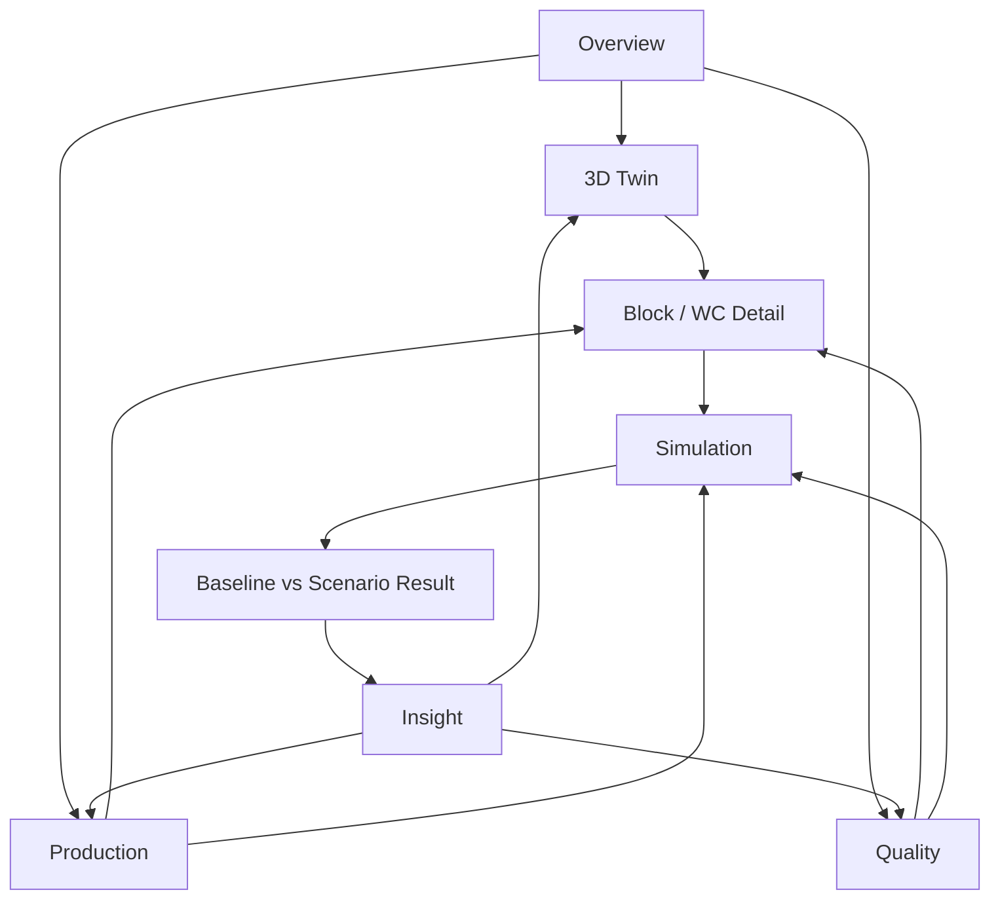

### 4.1 공유 문맥

| Context | 값 | 페이지 간 유지 | 표시 위치 |
|---|---|---|---|
| Vessel | `LNGC-EDU-01` | 항상 | Header |
| Selection | `entityId`, optional `objectId/taskId` | 관련 페이지 이동 시 | Header breadcrumb + highlight |
| Time | `scenarioId`, `snapshotId`, `day` | Twin/Production/Quality | Header + timeline |
| Mode | PLANNED_PREVIEW / SCENARIO_PREVIEW / ACTUAL_REPLAY | 항상 | Header badge |
| Filter | stage/status/source classification | 같은 페이지 session | filter bar |
| Comparison | baseline/scenario snapshot IDs | Simulation/Insight | comparison header |

URL은 선택과 비교를 복원할 수 있어야 한다. 권장 route 의미는 `/twin?entity=B04&day=27&mode=planned`, `/production?task=E-B04`, `/quality?object=B04%2FSHELL`, `/simulation?scenario=SCN-B04-WELD-REWORK-3D`이다. 이는 구현 코드는 아니며 상태 공유 계약이다.

### 4.2 Material과 Resource 배치 결정

Material과 Resource는 별도 최상위 메뉴를 만들지 않는다.

- Overview: critical shortage·resource outage만 알림으로 표시한다.
- Production: `Schedule / Material / Resource` 보기 전환을 제공한다.
- Block Detail: 선택 Block의 readiness, blocking lot, active allocation을 제공한다.
- Simulation: 사건 유형이 Material Delay 또는 Crane Breakdown일 때 해당 입력만 단계적으로 노출한다.

---

## 5. Screen Hierarchy

| Page | Primary | Secondary | Tertiary |
|---|---|---|---|
| Overview | Delivery 상태, 전체 진척, 우선 리스크 | Critical path, material/quality hold | 데이터 근거, 상세 Task |
| 3D Twin | 선택 객체, Day, 생산단계 | 일정·품질·자재 상태 | 객체 geometry·근거 상세 |
| Production | Block/Task 진행과 forecast | Gantt, material readiness, resource constraint | 개별 기록·allocation |
| Quality | Blocking NCR/gate와 일정 영향 | NDT·rework·affected objects | 검사 보고서 메타데이터 |
| Simulation | Delivery delta와 시나리오 입력 | changed tasks, critical path, affected blocks | constraint·float·engine metadata |
| Insight | 우선순위 문제와 delivery risk | 원인 체인·response options | 모든 supporting records |

각 화면의 Primary 영역은 viewport 상단 또는 Mobile 첫 section에 위치한다. Tertiary 정보는 drawer, expandable row, methodology panel로 이동한다.

---

## 6. Overview Screen Specification

### 6.1 목적과 레이아웃

Primary question은 **“현재 계획과 선택 시나리오에서 인도를 위협하는 것은 무엇인가?”**다.

| Zone | 내용 | UI 요소 | 연결 데이터 |
|---|---|---|---|
| A. Context bar | Vessel, mode, Day, active scenario, data basis | chips + methodology link | time context, dataset metadata |
| B. Decision strip | Overall Progress, Delivery, late days, critical task count | 4개 이하 KPI card | ScheduleSnapshot, KPI model |
| C. Priority queue | 일정·품질·자재·자원 문제를 영향순 정렬 | ranked issue list | changed tasks, NCR, requirements, constraints |
| D. Vessel context | compact 3D preview와 block status | non-editing preview | ObjectTimelineState |
| E. Path summary | 대표 critical path, 경로 수, 합류점 | compact path + expand | criticalPaths, critical subgraph |
| F. Readiness summary | Production/Material/Quality 세 요약 | compact bars + text | progress/readiness/pass rate |

Desktop은 B를 상단 전폭, C를 왼쪽 60%, D를 오른쪽 40%, E/F를 하단에 둔다. 3D preview는 화면의 절반 이상을 차지하지 않는다. Mobile은 B → C → E → F → D 순서로 배치한다.

### 6.2 KPI 표현

- Overall Progress: 값, basis(`PLANNED PREVIEW` 또는 `MOCK`), data day를 함께 표시한다.
- Delivery: `Baseline Day 60`; scenario가 있으면 `Scenario Day 63 · +3 days`처럼 짝으로 표시한다.
- Schedule Status: `ON PLAN / AT RISK / LATE TO TARGET`과 원인 수를 표시한다.
- Quality: Open NCR과 blocking gate를 분리한다.
- Material: 평균 readiness만 표시하지 않고 critical hold 개수를 병기한다.

### 6.3 Primary actions

1. Priority issue 선택 → 관련 page의 entity/task/issue가 선택된 상태로 이동.
2. Vessel preview의 B04 선택 → 3D Twin B04 drawer를 연다.
3. Delivery 비교 선택 → Simulation Result로 이동.
4. Critical path expand → 경로 목록과 공통/변경 task를 확인한다.

### 6.4 상태와 금지사항

데이터가 없으면 `0 NCR`이 아니라 `Quality data unavailable`을 표시한다. 실제값이 없는 상황에서 “실시간”, “현재 조선소”, “운영 중”을 사용하지 않는다. 모든 카드가 동일한 높이와 시각 강조를 갖지 않도록 Delivery와 priority queue에만 가장 강한 위계를 준다.

---

## 7. 3D / 4D Twin Screen Specification

### 7.1 Desktop layout

| 영역 | 비율/위치 | 내용 |
|---|---|---|
| Context toolbar | 상단 48px | mode, day, scenario, layer, legend |
| 3D canvas | 중앙 가변 영역 | vessel, blocks, tanks, WC, selection |
| Detail drawer | 우측 360–420px | 선택 entity 요약과 연결 정보 |
| Timeline dock | 하단 104–128px | playback, slider, milestones, current day |
| View controls | canvas 우상단 | reset, front, side, top, isolate |
| Legend | canvas 좌하단 | stage fill + schedule/quality overlay |

Detail drawer가 열려도 canvas를 덮지 않고 폭을 재계산한다. Tablet에서는 drawer가 overlay, Mobile에서는 bottom sheet가 된다.

Camera는 pointer drag Orbit, wheel/pinch Zoom, `Shift+drag` Pan을 제공한다. Front/Side/Top preset과 Reset을 항상 보이는 control로 두고, 자유 camera bookmark와 cinematic path는 제외한다. keyboard 사용자는 object list와 preset view로 동일 핵심 정보를 탐색할 수 있다.

### 7.2 화면이 답해야 하는 질문

- 어느 Block·Tank·WC인가: ID와 name.
- 현재 생산 단계는 무엇인가: `productionStage`.
- 일정상 문제가 있는가: `scheduleStatus`, TF/FF, active constraint.
- 품질 문제가 있는가: `qualityStatus`, blocking NCR/gate.
- 자재가 준비되었는가: readiness와 critical hold.
- 임계경로에 포함되는가: 관련 critical task 수.
- 사건 발생 시 납기 영향은 무엇인가: 활성 scenario 또는 `Create scenario` action.

### 7.3 Layer controls

기본은 Blocks만 선택 가능하다. `Tanks`, `Wind Challenger`, `Quality issues`, `Critical tasks`는 overlay toggle이다. 탱크 cutaway나 vessel transparency는 preset으로 제공하고 자유로운 material 편집은 제공하지 않는다.

### 7.4 Data binding

`ThreeObjectMetadata.objectId`로 raycast 결과를 받고 `PhysicalObject.entityId`를 조회한다. drawer는 `BlockDetailReadModel`, timeline은 `ScheduleSnapshot`, 색·pose는 `ObjectTimelineState`를 사용한다. renderer가 progress나 criticality를 계산하지 않는다.

---

## 8. Block Interaction Specification

| Interaction | Trigger | Feedback | Data/action |
|---|---|---|---|
| Hover | pointer가 selectable mesh 위 | outline + tooltip | ID, stage, progress, schedule icon |
| Focus | keyboard object list 이동 | visible focus ring + 동일 tooltip | 다음/이전 entity |
| Select | click/Enter | persistent outline, drawer open, breadcrumb | selection context 갱신 |
| Isolate | drawer action | 다른 object를 저채도/투명 처리 | selected object 유지 |
| Open task | Schedule row 선택 | Gantt 관련 task highlight | taskId 추가 |
| Open issue | Quality badge 선택 | issue chain 표시 | NCR/inspection target 조회 |
| Create scenario | selected entity action | Simulation에 target 전달 | entityId/objectId/releaseTaskId |
| Clear | canvas 빈 곳/Escape | selection 제거 | time context 유지 |

### 8.1 Hover tooltip

한 줄 ID/명칭, stage label, progress value와 basis, 일정/품질 아이콘만 보여준다. NCR 상세·출처·자재 목록은 hover에 넣지 않는다. Touch에서는 hover를 사용하지 않는다.

### 8.2 Selected state

선택 객체는 3px equivalent 고대비 outline, `Selected B04` label, object list의 `aria-selected=true`로 구분한다. DELAYED나 QUALITY HOLD 표현을 selection 색이 덮지 않도록 outline을 이중 레이어로 구성한다.

### 8.3 Block Detail drawer

| Section | 핵심 필드 | Source |
|---|---|---|
| Header | B04, Cargo Block 4, lifecycle, source badge | Block |
| Status | stage, progress+basis, schedule/quality status | ObjectTimelineState |
| Schedule | active task, baseline/forecast, TF/FF, critical | CalculatedTaskState |
| Production | stage별 가중 진척, planned/measured 구분 | ProductionRecord |
| Material | readiness, critical hold, need-by day | Requirement/Lot |
| Quality | welding/NDT summary, NCR, gate, rework | Weld/Inspection/NCR/Gate |
| Resource | active allocation, outage/conflict | Resource/Allocation |

Header와 Status는 고정하고 나머지는 accordion이다. `View in Production`, `View in Quality`, `Run What-If`가 context-preserving link다.

---

## 9. Timeline UX Specification

### 9.1 컨트롤

필수 컨트롤은 Play/Pause, Previous/Next day, Slider, Current Day, Speed(1×/2×/4×), Reset이다. Step은 1 simulation day다. autoplay는 사용자가 시작했을 때만 실행하고 tab이 background가 되면 일시정지한다.

항상 다음 문구를 표시한다.

> SIMULATION TIMELINE · DAY 27 / 60 · EDUCATIONAL MODEL — NOT ACTUAL BUILD DURATION

### 9.2 Slider 동작

- drag 중에는 Day와 stage label을 즉시 갱신하고 무거운 detail query는 frame 종료 후 갱신한다.
- milestone은 QG, Erection, HULL_GATE, OUTFIT, WC_LIFT, DEL만 기본 표시한다.
- 활성 시나리오가 Day 60을 넘기면 slider 최대값을 scenario finish까지 확장하고 `Baseline finish Day 60` marker를 유지한다.
- Baseline/Scenario 비교 모드에서는 두 개의 thumb를 쓰지 않고 하나의 day에서 두 snapshot을 나란히 비교한다.
- Reset은 Day 0이 아니라 사용자가 페이지에 진입한 context day 또는 dataset default day로 돌아간다.

### 9.3 상태 변화 피드백

Day 변경 시 3D pose, fill/overlay, drawer 값, active task, Gantt cursor가 한 transaction처럼 함께 바뀐다. 변경된 Block 수를 `3 blocks changed state` live region으로 알리되 매 animation frame에는 읽지 않는다. reduced-motion에서는 pose interpolation 없이 최종 상태로 전환한다.

### 9.4 시각 인코딩

| 축 | 표현 | 예 |
|---|---|---|
| productionStage | fill color + stage abbreviation | FAB, ASM, ERECT |
| scheduleStatus | outline/icon | amber clock=DELAYED, magenta path=CRITICAL |
| qualityStatus | diagonal pattern + shield icon | red hatch=NCR_OPEN/HOLD |
| selection | white/cyan outer ring | Selected |
| provenance | drawer badge | MOCK, ASSUMPTION |

색이 겹칠 때 우선순위는 Selection ring > Quality pattern > Schedule outline > Stage fill이다.

---

## 10. Production Screen Specification

Primary question은 **“어떤 Block·Task가 계획에서 벗어났고 무엇이 작업을 막는가?”**다.

### 10.1 Layout

| Zone | 내용 | 기본 표시 |
|---|---|---|
| KPI strip | overall progress, forecast finish, critical tasks, critical holds | 4개 이하 |
| Control row | Day, baseline/scenario, Block/stage/status filter, search | sticky |
| Main view | Gantt와 Block table split view | Desktop 60/40 |
| Detail | selected task/block drawer | closed by default |
| Subview | Material / Resource | segmented view |

### 10.2 Gantt

- row hierarchy는 `Vessel package → Block → Task`다.
- baseline bar는 회색 윤곽, scenario bar는 채움, actual은 존재할 때만 실선으로 표시한다.
- vertical current-day cursor와 Baseline Delivery Day 60 marker를 구분한다.
- critical task는 색만 바꾸지 않고 path icon과 `Critical` label을 붙인다.
- TF는 bar 끝의 숫자 badge로 제공하고, 값이 없는 경우 `— / Unknown`을 쓴다.
- dependency edge는 선택된 task의 직접 선·후행만 기본 표시한다. 전체 edge 동시 노출은 피한다.
- scenario에서 이동한 bar는 원래 위치 ghost와 연결선을 보여준다.

### 10.3 Block table

고정 열은 Block, stage, progress+basis, active task, forecast finish, TF, material status, quality gate, critical 여부다. 열 정렬은 가능하지만 `entityId`는 항상 보인다. 행 선택은 3D Twin과 동일 selection context를 갱신한다.

### 10.4 Material과 Resource subview

Material 표는 lot 자체보다 consuming task를 중심으로 `need-by / available / readiness / constraint`를 보여준다. Resource 표는 task, resource type, allocation interval, outage, forecast shift를 보여준다. 평균 readiness나 utilization만으로 정상 여부를 단정하지 않는다.

### 10.5 Primary actions

- delayed task 선택 → predecessor, active constraint, downstream impact 확인.
- material hold 선택 → lot→requirement→task→Block 추적.
- resource outage 선택 → affected allocation과 시나리오 생성.
- row의 `View in Twin` → 현재 Day와 selection을 보존하여 이동.

---

## 11. Quality Screen Specification

Primary question은 **“어떤 품질 이슈가 어느 release와 후속 작업을 막는가?”**다.

### 11.1 Layout과 정보 위계

| Priority | 내용 | Visualization |
|---|---|---|
| Primary | blocking NCR, blocked gate, schedule impact | impact queue + quality chain |
| Secondary | NDT pass rate, open NCR, planned rework | compact KPI + issue table |
| Tertiary | weld/inspection metadata, report reference | drawer |

KPI는 `Open NCR`, `Blocking Gates`, `NDT pass rate (분모 포함)`, `Rework man-hours (basis 포함)` 네 개를 넘기지 않는다.

### 11.2 Quality chain

선택 issue를 다음 단계로 표현한다.

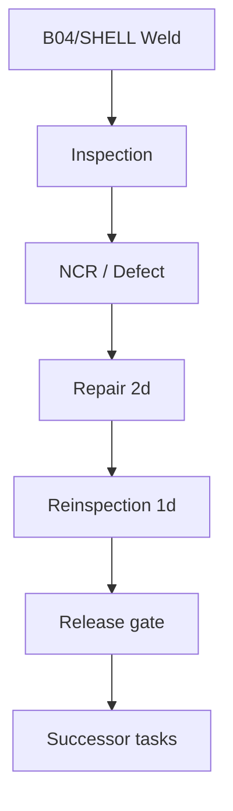

각 node는 상태, 기간, source badge를 보여주고 선택 시 관련 record drawer를 연다. `Duration increase`는 독립적인 임의 숫자가 아니라 generated repair/reinspection task에서 계산한다.

### 11.3 Issue table

열은 Issue ID, target object, type/severity, status, blocking gate, repair/reinspection, affected task, delivery impact available 여부다. NCR 수와 defect 수를 같다고 가정하지 않는다. `View schedule impact`는 기존 결과가 있으면 열고, 없으면 target이 채워진 Simulation 화면으로 이동한다.

### 11.4 B04 예시

`INSP-E-B04-01`을 선택하면 `B04/SHELL`, `E-B04`, gate, repair/reinspection chain을 동시에 강조한다. 이 예시는 `MOCK`이며 실제 조선소 NCR로 보이지 않게 화면 상단과 record에 배지를 표시한다.

---

## 12. Simulation Screen Specification

Primary question은 **“이 사건을 어떤 대상과 조건으로 적용하며, 입력이 계산 가능한가?”**다. 화면은 왼쪽 input workbench와 오른쪽 result preview로 구성한다. Run 전에는 preview가 baseline context와 예상 영향 scope를 보여주고, Run 후에는 결과 요약으로 전환한다.

### 12.1 Scenario creation flow

1. Scenario type 선택.
2. domain index로 유효 대상만 검색·선택.
3. type별 필수 parameter 입력.
4. 영향 범위 preview와 assumptions 확인.
5. validation 통과 후 Run.
6. 결과를 baseline과 비교.

### 12.2 유형별 입력

| Scenario type | Target selector | Required input | 자동 파생 | Guardrail |
|---|---|---|---|---|
| WEATHER_SHUTDOWN | task/resource scope | start/end day | calendar exception | 영향 scope 필수 |
| CRANE_BREAKDOWN | ERECTION_SLOT | outage start/duration | capacity 0 window | 실제 crane 사양처럼 표현 금지 |
| MATERIAL_DELAY | material lot | new available/release day | consuming tasks | non-consuming block 제외 |
| WELDING_REWORK | weld/object/release task | repair, reinspection duration | generated tasks/edges | 두 duration 모두 양수 |
| WIND_CHALLENGER_DELAY | WC_LIFT 또는 WC package | delay/new duration | WC downstream tasks | actuation type 불필요 |

### 12.3 입력 컴포넌트

- Scenario Type cards: 이름, 짧은 원인 설명, 필요한 입력 수.
- Target combobox: ID, name, current stage, 유효성 label; 자유 텍스트 ID 입력 금지.
- Day/Duration input: simulation day 단위와 허용범위 표시.
- Affected scope preview: 직접 대상과 index로 찾은 소비/후속 task 수.
- Assumption panel: 모든 MOCK/ASSUMPTION 값을 Run 전에 확인.
- Run button: validation이 완료될 때만 활성화.

### 12.4 B04 preset

교육용 preset `B04 Welding Rework +3 Days`는 다음 값으로 표시한다.

| Field | Value | Basis |
|---|---|---|
| Target | B04 / B04/SHELL | ASSUMPTION identity |
| Release task | E-B04 | PROMPT 02 baseline |
| Repair | 2 days | MOCK |
| Reinspection | 1 day | MOCK |
| Baseline delivery | Day 60 | ASSUMPTION baseline |
| Expected scenario delivery | 계산 전 숨김 | engine output only |

Run 이전에는 `+3 delivery days`라고 미리 단정하지 않는다. 결과는 Simulation Engine 응답으로만 표시한다.

---

## 13. Simulation Result Specification

### 13.1 결과 위계

| Priority | 내용 | 표현 |
|---|---|---|
| Primary | Delivery `Day 60 → Day 63`, `+3 days` | comparison hero |
| Secondary | changed critical path, affected blocks/tasks, lost float | comparison panels |
| Tertiary | generated tasks, constraint IDs, engine/dataset version | expandable audit table |

### 13.2 Baseline vs Scenario header

동일 단위·동일 위치로 나란히 비교한다.

| Metric | Baseline | Scenario | Delta |
|---|---:|---:|---:|
| Delivery | Day 60 | Day 63 | +3 days |
| B04 release chain | E-B04 finish | repair 2d + reinspection 1d | +3 days |
| Critical path count | calculated | calculated | entered/left 표시 |
| Late against target | 0 | 3 days | +3 days |

### 13.3 Result tabs

1. **Impact Summary**: delivery, affected entities, strongest constraint.
2. **Propagation**: event부터 DEL까지 원인 chain.
3. **Critical Paths**: before/after 대표 경로와 critical subgraph.
4. **Schedule Diff**: changed tasks만 보여주는 Gantt/table.
5. **Assumptions & Audit**: input, generated tasks, warnings, versions, input hash.

### 13.4 Result actions

- `Inspect B04 in Twin`: Scenario Preview, Day 27, B04 선택으로 이동.
- `View changed tasks`: Production Gantt에 changedTaskIds filter 적용.
- `Open in Insight`: resultId와 comparison context 전달.
- `Edit scenario`: 결과를 유지한 채 입력 workbench로 돌아감.
- `Reset`: baseline view로 전환하며 scenario 정의를 삭제하지 않음.

Save/Share scenario는 영속 backend가 없는 MVP에서는 local preset/session 수준으로만 표기하거나 제외한다.

---

## 14. Critical Path Visualization

### 14.1 기본 표현

compact summary는 `Representative path 1 of N`, 완료일, 공통 합류점을 보여준다. 경로는 Block명이 아니라 `taskId + task name`으로 표시하고 entity chip을 보조로 둔다.

### 14.2 Before/After 비교

| 상태 | 시각 표현 | 의미 |
|---|---|---|
| 공통 critical task | 진한 중립색 | 두 snapshot 모두 critical |
| entered critical | magenta + `Entered` | scenario에서 새로 TF=0 |
| left critical | 청회색 + `Left` | scenario에서 임계 해제 |
| generated task | 점선 테두리 + event icon | baseline에 없음 |
| convergence | diamond marker | 복수 path 합류 |

경로가 많으면 모든 조합을 한 행에 늘어놓지 않는다. critical subgraph의 접힌 그룹과 상위 대표 경로를 제공하며 `Show all representative paths`에서 확장한다. SAT/GAS 병렬 분기는 별도 branch로 표현한다.

### 14.3 연결 상호작용

task 선택은 Gantt row, 3D entity, detail drawer를 함께 강조한다. 해당 task에 3D object가 없으면 `No direct 3D object`를 표시하고 논리 task임을 유지한다. 예: HULL_GATE.

---

## 15. Delay Propagation Visualization

### 15.1 원인 중심 그래프

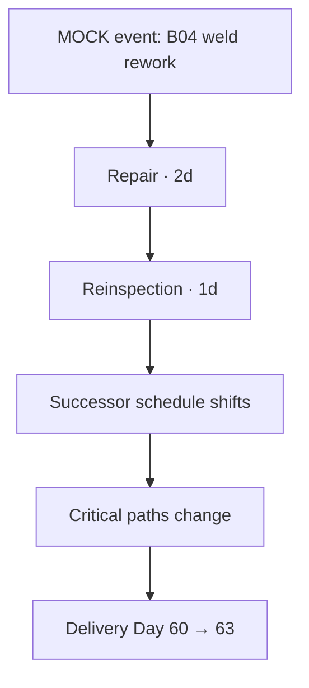

Node는 `Cause / Constraint / Changed Task / Milestone / Delivery` 다섯 종류만 사용한다. edge label은 `FS0`, `resource unavailable`, `gate blocked`처럼 실제 전파 원인을 표시한다.

### 15.2 단계별 설명

1. 사건: 어떤 입력이 바뀌었는가.
2. 직접 영향: 어떤 constraint 또는 generated task가 생겼는가.
3. 전파: 어떤 task의 start/finish가 실제로 변했는가.
4. Float: 어느 경로가 완충하고 어느 경로가 critical해졌는가.
5. 결과: scenario finish와 Day 60 target 대비 late days.

단순 downstream 전체를 affected로 칠하지 않는다. `changedTaskIds`에 있는 task만 변화로 표시하고, 변경 없이 지나간 연결 node는 설명 경로에서 낮은 강조로 둔다.

---

## 16. Insight Screen Specification

Primary question은 **“어떤 문제를 왜 우선 검토해야 하며, 어떤 대응안을 시뮬레이션해 볼 수 있는가?”**다. AI chatbot이나 근거 없는 자연어 권고 화면이 아니다.

### 16.1 Layout

| Zone | 내용 | 규칙 |
|---|---|---|
| Decision header | delivery risk, active comparison, confidence/basis | result snapshot 명시 |
| Ranked findings | impact 기준 상위 3–5건 | 중복 issue 병합 |
| Cause/effect pane | 선택 finding의 propagation | source nodes 클릭 가능 |
| Response options | simulation-based alternatives | 최적/권고라고 단정 금지 |
| Evidence drawer | source records, assumptions, engine info | provenance 완전 공개 |

### 16.2 Insight card 계약

각 card는 `Problem`, `Observed/Simulated Evidence`, `Affected Tasks`, `Critical Path Change`, `Delivery Impact`, `Response Options`, `Provenance`를 가진다. 제목만으로 결론을 만들지 않는다.

예:

- Problem: B04 welding rework.
- Evidence: MOCK event, repair 2d, reinspection 1d.
- Impact: downstream task dates changed; scenario delivery Day 63.
- Criticality: generated chain appears on representative critical paths.
- Response options: welding resource availability 변경, repair duration 변경, erection sequence 대안 시나리오 생성.
- Limitation: option은 현장 최적해가 아니라 prototype comparison input이다.

### 16.3 행동

`Inspect evidence`, `Open affected tasks`, `Compare alternative` 세 action만 둔다. Compare alternative는 기존 시나리오를 복사한 draft input을 만들며 원본 결과를 바꾸지 않는다.

---

## 17. Data Provenance UI

### 17.1 배지

| Source type | Badge | 사용 예 | 설명 접근 |
|---|---|---|---|
| VERIFIED | 파란 outline + check | 174,000 m³ | source title/as-of tooltip |
| DERIVED | 보라 outline + formula | TF, progress, delivery delta | 산식·engine version |
| ASSUMPTION | amber outline + triangle | 9 Simulation Blocks, Day 0–60 | assumption note |
| MOCK | 회색/분홍 outline + flask | B04 rework event | mock purpose |
| UNKNOWN availability | 점선 + question | actuation type | 왜 미확정인지 |

배지 색만으로 구분하지 않고 항상 텍스트를 표시한다. compact table에서 badge를 숨겨야 할 경우 column header에 source filter를 두고 row accessible name에 포함한다.

### 17.2 표시 위치

- KPI: 값 옆 compact badge와 basis.
- Detail drawer: section 단위 summary, field-level이 다르면 각 필드에 표시.
- Scenario form: input별 source type.
- Result: 입력은 MOCK/ASSUMPTION, 결과는 DERIVED로 구분.
- Methodology panel: source reference, derivation rule, as-of, dataset/engine version.

`UNKNOWN`은 `0`, `N/A`, 빈칸으로 대체하지 않는다. `Unknown`과 `Not applicable`은 별도 label이다.

---

## 18. User Flow

### Flow 01 — 현재 생산상태 확인

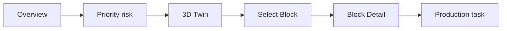

Acceptance: Overview 진입 후 2회 선택 이내에 B04의 stage, schedule, quality, material을 확인한다.

### Flow 02 — 품질 문제와 일정 영향

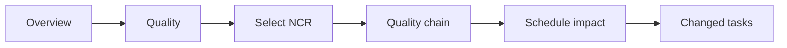

Acceptance: NCR에서 blocking gate, repair/reinspection, 영향 task를 잃지 않고 이동한다.

### Flow 03 — Material Delay

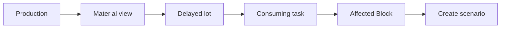

Acceptance: lot과 무관한 Block은 affected로 표시하지 않는다.

### Flow 04 — What-If Simulation

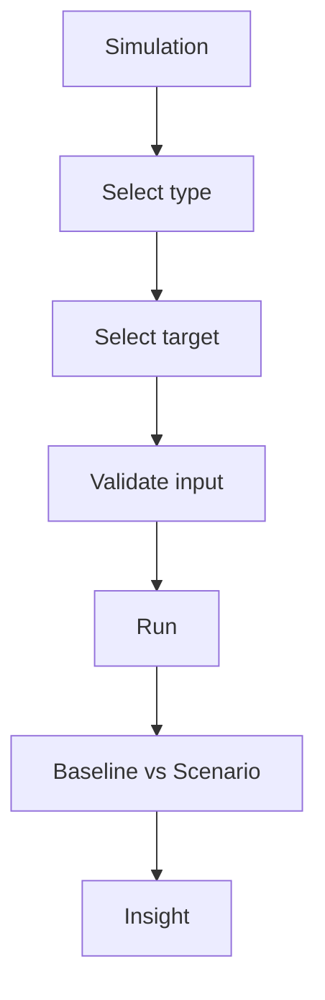

Acceptance: input error는 Run 전에 field와 summary에서 확인하고, 결과는 delivery delta만이 아니라 changed task와 path를 포함한다.

### Flow 05 — Wind Challenger 설치 지연

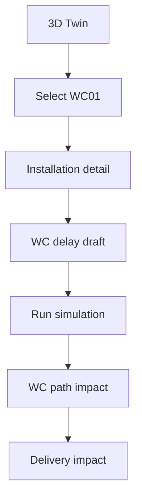

Acceptance: `WC_LIFT`와 후속 `WC_COM/COM/시험` 경로를 사용하며 미확인 hydraulic 정보를 요구하지 않는다.

### Flow 06 — B04 결과 역추적

Simulation Result의 `+3 days` → Propagation → `RI-E-B04-SCN-B04-01` → `B04/SHELL` → Quality record → 3D B04 순으로 이동할 수 있어야 한다. 모든 이동에서 scenarioId와 Day를 유지한다.

---

## 19. Page-by-Page Screen Specification Table

| Page | User Question | Main KPI | Main Visualization | Primary Action | Linked Data | Default State |
|---|---|---|---|---|---|---|
| Overview | 지금 어떤 위험을 먼저 봐야 하나? | Progress, Delivery, late days | decision strip + priority queue | risk 열기 | Vessel, KPI, Snapshot, constraints | Baseline Day 60 summary |
| 3D Twin | 어디에서 무엇이 진행되는가? | selected stage/status | 3D + timeline + drawer | entity 선택 | Object, Entity, Timeline state | Blocks layer, planned preview |
| Production | 생산은 계획대로인가? | progress, forecast, TF | Gantt + block table | task 추적 | Task, Dependency, Production, Material, Resource | Baseline/scenario filter 유지 |
| Quality | 어떤 품질 issue가 일정을 막는가? | blocking NCR/gates | quality chain + issue table | impact 열기 | Weld, Inspection, NCR, Gate, Task | blocking first |
| Simulation | 사건이 인도에 어떤 영향을 주는가? | delivery delta | input workbench + comparison | Run simulation | Scenario, Event, Snapshot, Result | Empty draft or context target |
| Insight | 무엇을 왜 검토해야 하나? | delivery risk, critical changes | ranked findings + cause/effect | evidence 탐색 | Result + all referenced records | latest selected result |

### 19.1 페이지 연결 계약

모든 deep link는 최소 `entityId/taskId/issueId`, `scenarioId`, `day`, `mode` 중 필요한 값을 전달한다. 대상이 삭제·retired되었으면 silent fallback 대신 `This reference is no longer active`와 replacement link를 표시한다.

---

## 20. Visual Design System

### 20.1 방향

Engineering workstation의 명료함을 목표로 한다. 중립적인 짙은 배경, 선명한 데이터 표면, 제한된 accent를 사용한다. Glassmorphism, neon glow, 과도한 gradient, 장식성 animation은 쓰지 않는다.

### 20.2 Color system

#### UI colors

| Token | HEX | 용도 |
|---|---|---|
| Background | `#0B1220` | 앱 배경 |
| Surface 1 | `#121C2C` | card/drawer |
| Surface 2 | `#19263A` | hover/selected row |
| Border | `#33445E` | 경계선 |
| Text Primary | `#F1F5F9` | 주요 텍스트 |
| Text Secondary | `#B8C4D6` | 보조 텍스트 |
| Accent | `#36A3FF` | link/primary action |
| Focus | `#F7C948` | keyboard focus |

#### 생산단계 fill colors

| Production stage | HEX | 보조 표현 |
|---|---|---|
| NOT_STARTED | `#718096` | hollow circle + NS |
| FABRICATION | `#3B82C4` | FAB label |
| SUB/BLOCK/GRAND_ASSEMBLY | `#2F8DE4` | SUB/BA/GA 개별 label |
| INSPECTION | `#8B6FD6` | inspection icon + INSP |
| STAGING | `#43A6B8` | location pin + STG |
| ERECTION | `#1976C9` | lift icon + ERECT |
| ERECTED/INTEGRATION | `#248B74` | joint icon + ER/INT |
| OUTFITTING | `#B7791F` | tool icon + OUTFIT |
| COMPLETED | `#2F9D67` | check + COMPLETE |

#### 일정·품질 overlay colors

| 상태축 | 의미 | HEX | 보조 표현 |
|---|---|---|---|
| Schedule | Delayed | `#F5A623` | outline + clock + DELAYED |
| Schedule | Critical | `#D85CE5` | outline + path + CRITICAL |
| Quality | Hold/NCR open | `#E25555` | diagonal hatch + shield + HOLD |
| Availability | Unknown | `#9AA6B2` | dotted outline + UNKNOWN |

White text와 배경 조합은 WCAG AA를 목표로 검증한다. 상태색은 작은 본문 글자색으로 직접 쓰기보다 badge 배경·테두리·아이콘에 사용한다.

### 20.3 Typography와 spacing

- UI font: `Inter` 또는 시스템 sans-serif; 한글 fallback `Pretendard`, `Noto Sans KR`.
- 숫자·ID: tabular numerals가 있는 monospace 보조 font.
- 기본 본문 14–16px, table 13–14px, KPI 24–32px, 최소 touch label 14px.
- spacing scale: 4, 8, 12, 16, 24, 32px.
- border radius: control 6px, card 8px, drawer 10px. pill은 badge에만 사용.

### 20.4 Component language

| Element | 규칙 |
|---|---|
| Card | 제목·값·basis·action의 4단 구조; 한 카드 한 질문 |
| Table | sticky ID column, sortable header, row focus, density toggle 없음(MVP) |
| Badge | text 필수; status/source를 모양으로도 구분 |
| Button | Primary는 화면당 하나의 주요 action; destructive 없음 |
| Icon | outline style 통일, 단독 icon에는 tooltip/aria-label |
| Chart | axis·unit·basis 표시, 3D 장식 차트 금지 |
| Drawer | context detail, URL 복원 가능, Escape로 닫기 |
| Modal | 확인이 꼭 필요한 blocking action에만 사용 |
| Tooltip | 짧은 정의; 상세 근거는 panel로 이동 |

### 20.5 Data visualization rules

막대는 진척/비율, Gantt는 시간, table은 정확한 비교, node-link는 원인/의존관계에만 사용한다. donut·gauge를 반복하지 않는다. 전체 진행은 단일 horizontal bar와 수치가 가장 명확하다.

---

## 21. Component Architecture

실제 구현 시 component는 domain 계산을 포함하지 않고 application read model을 표현한다.

```text
components/
├── layout/
│   ├── AppShell
│   ├── GlobalNav
│   ├── ContextHeader
│   └── PageFrame
├── shared/
│   ├── KpiCard
│   ├── StatusBadge
│   ├── ProvenanceBadge
│   ├── EntityLink
│   ├── DataState
│   └── EvidenceDrawer
├── overview/
│   ├── DecisionStrip
│   ├── PriorityQueue
│   ├── VesselPreview
│   └── CriticalPathSummary
├── twin/
│   ├── VesselViewer
│   ├── LayerControls
│   ├── ViewControls
│   ├── TimelineDock
│   ├── StatusLegend
│   └── EntityDetailDrawer
├── production/
│   ├── ProductionSummary
│   ├── ScheduleGantt
│   ├── BlockTable
│   ├── MaterialSubview
│   └── ResourceSubview
├── quality/
│   ├── QualitySummary
│   ├── QualityChain
│   ├── IssueTable
│   └── IssueDetailDrawer
├── simulation/
│   ├── ScenarioWorkbench
│   ├── TargetSelector
│   ├── AssumptionReview
│   ├── ResultComparison
│   ├── PropagationGraph
│   ├── CriticalPathComparison
│   └── ScheduleDiff
└── insight/
    ├── DecisionHeader
    ├── FindingList
    ├── FindingDetail
    └── ResponseOptionList
```

### 21.1 Container 책임

| Container | 받는 read model | 발생 event |
|---|---|---|
| OverviewPage | OverviewVM | selectIssue, selectEntity |
| TwinPage | TwinSceneVM, TimelineVM, DetailVM | selectObject, setDay, setLayer |
| ProductionPage | ProductionVM, GanttVM | selectTask, setFilter |
| QualityPage | QualityVM | selectIssue, openImpact |
| SimulationPage | ScenarioEditorVM, SimulationResultVM | updateEvent, validate, run |
| InsightPage | InsightVM | selectFinding, createAlternative |

공통 `SelectionContext`, `TimeContext`, `ComparisonContext`를 페이지가 소비하되, domain 원본을 component local state에 복제하지 않는다.

---

## 22. UI State Model

### 22.1 공통 데이터 상태

| State | 사용자 표현 | 허용 action |
|---|---|---|
| Loading | skeleton + 구체적 label | navigation/취소 |
| Loaded | 콘텐츠 | 전체 |
| Empty | 원인과 다음 단계 | filter reset 또는 create scenario |
| Partial | 사용 가능한 section + warning | evidence 확인 |
| Error | 오류 범위·재시도·진단 ID | retry/back |
| Stale | 이전 결과와 dataset mismatch | rerun 또는 baseline 전환 |

Skeleton에 임의의 숫자를 표시하지 않는다. 3D가 실패해도 Production/Quality table은 독립적으로 사용할 수 있어야 한다.

### 22.2 3D Viewer state

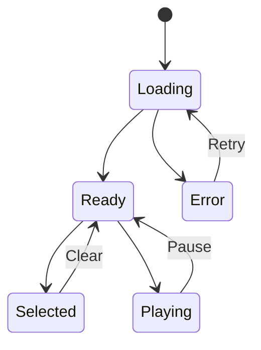

`Selected`는 데이터 load 완료와 독립적이다. detail query가 실패해도 선택 outline과 ID는 유지하고 해당 section만 error를 표시한다.

### 22.3 Simulation state

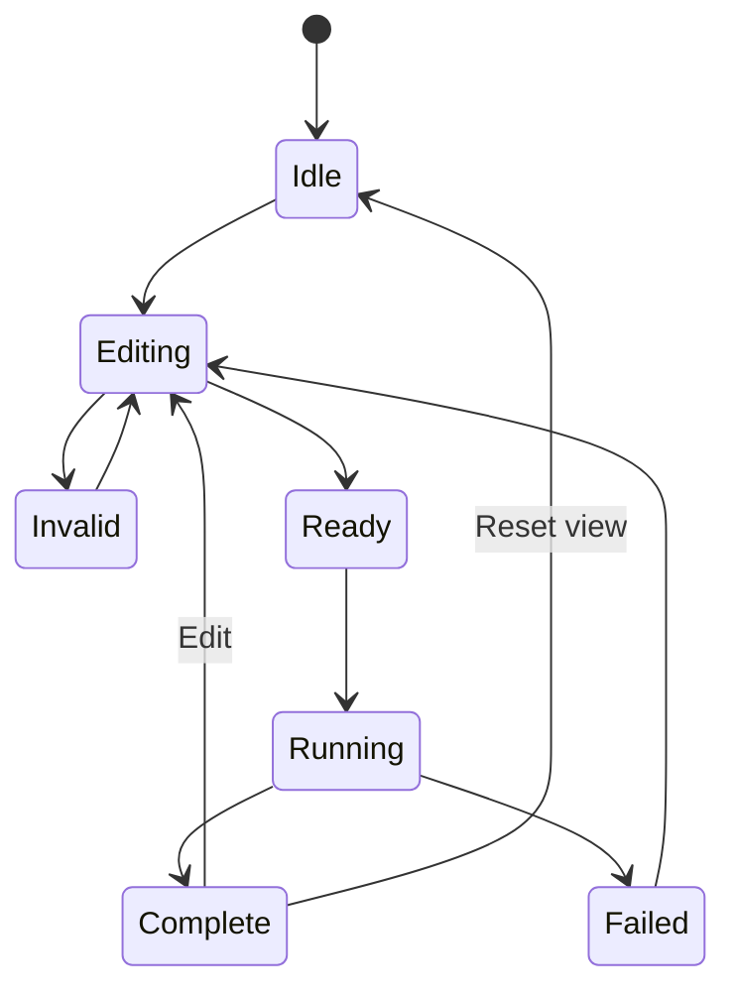

Running 중에는 입력을 잠그되 cancel을 제공한다. 이전 결과가 있으면 흐리게 유지하면서 `Running new scenario`를 표시한다. 실패 시 baseline은 그대로 사용 가능해야 한다.

### 22.4 오류 문구 원칙

- `Unknown objectId B04/SHELL`처럼 해결 가능한 identifier를 포함한다.
- validation error와 engine failure를 구분한다.
- `Something went wrong`만 단독으로 쓰지 않는다.
- partial reference failure는 전체 앱을 중단하지 않고 관련 section에 표시한다.

---

## 23. Responsive Strategy

| Breakpoint class | Navigation | 3D Twin | Tables/Gantt | Simulation |
|---|---|---|---|---|
| Desktop ≥1280 | expanded left rail | canvas + right drawer + bottom timeline | split view | two-column workbench/result |
| Compact 1024–1279 | icon rail | overlay drawer | tabbed Gantt/table | 40/60 columns |
| Tablet 768–1023 | collapsible rail | full canvas + modal sheet | one view at a time | vertical input→result |
| Mobile <768 | bottom nav + More | reduced viewer + bottom sheet | card rows; Gantt horizontal scroll | wizard then result |

### 23.1 Mobile 3D

Mobile에서는 orbit/zoom, preset views, entity search만 유지한다. pan과 복잡한 layer 조합은 숨긴다. 3D 렌더링 성능이 부족하면 정적 vessel overview + selectable object list로 대체하며 생산 데이터 접근성을 유지한다.

Mobile bottom navigation의 고정 항목은 Overview, Twin, Simulation, Insight이며 Production과 Quality는 `More`에 둔다. 활성 deep link가 Production/Quality이면 `More`도 selected 상태를 전달한다.

Timeline은 하단 sheet 위에 sticky compact bar로 `Play/Pause`, `Day`, slider만 제공한다. speed와 milestone list는 overflow menu로 이동한다.

### 23.2 Responsive information priority

Delivery impact, selected entity ID, current day, status는 어떤 크기에서도 숨기지 않는다. 근거 상세, 전체 경로, resource allocation은 접힌 section으로 이동한다.

---

## 24. Accessibility

| 영역 | 요구사항 |
|---|---|
| Contrast | 본문·control WCAG 2.2 AA 목표; 상태색 단독 사용 금지 |
| Keyboard | nav, filters, object list, timeline, drawer, graph node 모두 Tab/Arrow/Enter/Escape 지원 |
| 3D alternative | 동일 entity를 선택할 수 있는 searchable object list 제공 |
| Focus | 2px 이상 고대비 ring, canvas 진입/이탈 명확화 |
| ARIA | icon button label, selected/expanded/busy/live 상태 제공 |
| Motion | `prefers-reduced-motion`에서 autoplay·pose 보간·graph animation 제거 |
| Typography | 최소 본문 14px, 200% zoom에서 정보 손실 금지 |
| Charts | title, summary, table alternative, 축·단위 제공 |
| Timeline | slider role, min/max/now/text; keyboard 1일 step |
| Error | focus를 첫 오류로 이동, 오류 summary와 field 연결 |

Screen reader summary 예: `B04, Erected, 85 percent planned preview, schedule critical, quality clear, material ready.` 수치 basis가 없으면 percent를 읽지 않는다.

---

## 25. Final UI Architecture Diagram

### 25.1 페이지 아키텍처

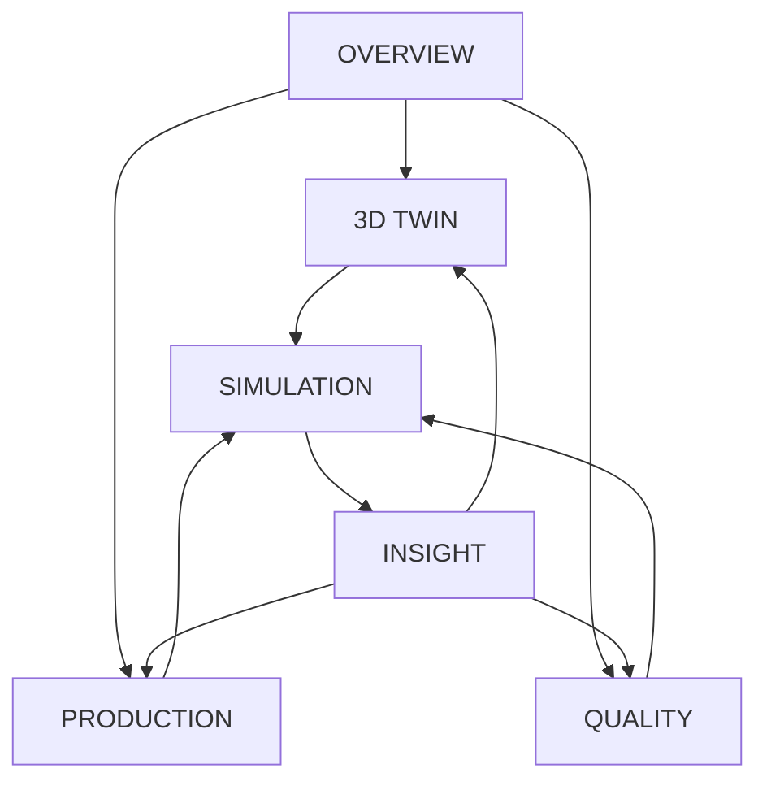

### 25.2 사용자 요청과 결과 흐름

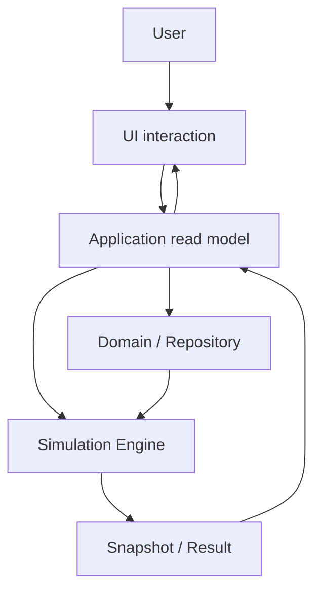

### 25.3 3D 선택 흐름

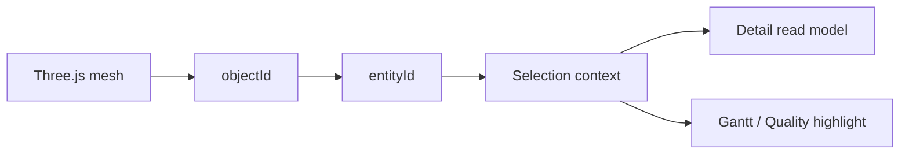

---

## 26. MVP Scope

### 26.1 반드시 구현

- 여섯 개 Global Navigation page.
- Overview decision strip, priority queue, compact 3D preview.
- 3D Twin의 Block/WC 선택, camera presets, layer, timeline, detail drawer.
- Day 0–60 baseline과 scenario finish까지의 4D preview.
- Production Gantt·Block table·Material/Resource subview.
- Quality issue table과 issue→repair→gate→schedule chain.
- 다섯 Scenario type의 validated input.
- Baseline vs Scenario, delay propagation, critical path before/after.
- Insight finding과 evidence/response option 연결.
- provenance badge와 Methodology/Evidence drawer.
- Loading/Empty/Error/Partial 및 keyboard/object-list 대안.

### 26.2 명시적 제외

- 실제 ERP/MES/PLM/IoT/Weather API.
- database, authentication, multi-user workflow, 승인·전자서명.
- real-time streaming, actual yard alerts, mobile push.
- AI prediction, chatbot, 자동 최적화, 범용 APS/resource leveling.
- 실제 조선소 block ID·공정·장비 사양이라는 표현.
- 확인되지 않은 Wind Challenger hydraulic 구현.

### 26.3 PROMPT 05 구현 우선순위

1. AppShell, shared context, provenance badge.
2. validated JSON repository와 read model.
3. Overview 정보 구조.
4. Twin selection/timeline/detail 연결.
5. Production·Quality 교차 탐색.
6. Simulation input/result/propagation.
7. Insight와 responsive/accessibility polish.

시각적 완성도보다 ID·selection·snapshot 일관성을 먼저 acceptance 기준으로 삼는다.

---

## 27. UI Validation Checklist

| # | 검증 질문 | 판정 | 명세 근거 |
|---:|---|---|---|
| 1 | 사용자가 첫 화면에서 전체 생산상태를 이해할 수 있는가? | YES | Overview decision strip + priority queue |
| 2 | 3D 모델과 생산 데이터가 연결되어 있는가? | YES | objectId→entityId→read model |
| 3 | Block 클릭 시 Production/Quality/Schedule을 볼 수 있는가? | YES | Block Detail drawer와 context links |
| 4 | Timeline을 움직이면 3D 상태가 변화하는가? | YES | snapshot/day transaction과 pose/status binding |
| 5 | Simulation Day가 실제 건조기간으로 오해되지 않는가? | YES | timeline 고정 disclaimer와 ASSUMPTION badge |
| 6 | Production과 Quality가 서로 연결되는가? | YES | quality chain과 affected task link |
| 7 | Material Delay가 Schedule과 연결되는가? | YES | lot→requirement→consuming task flow |
| 8 | Quality Rework가 Schedule과 연결되는가? | YES | repair/reinspection generated tasks |
| 9 | What-If Scenario를 쉽게 입력할 수 있는가? | YES | type별 progressive form과 target combobox |
| 10 | Baseline과 Scenario를 명확히 비교할 수 있는가? | YES | 같은 위치·단위의 comparison header |
| 11 | Delay Propagation 원인을 이해할 수 있는가? | YES | cause/constraint/task/milestone/delivery graph |
| 12 | Critical Path 변화를 볼 수 있는가? | YES | before/after, entered/left/generated 표현 |
| 13 | 최종 Delivery Impact를 한눈에 볼 수 있는가? | YES | result hero `Day 60 → 63 · +3 days` |
| 14 | Wind Challenger Installation이 같은 Simulation 구조에 연결되는가? | YES | WC target→WC_LIFT→후속 경로 flow |
| 15 | Verified/Assumption/Mock Data를 구분할 수 있는가? | YES | text badge와 evidence drawer |
| 16 | 불필요한 Dashboard 요소가 없는가? | YES | KPI 4개 제한, Material/Resource contextual 배치 |
| 17 | 3D가 생산관리 의사결정에 사용되는가? | YES | selection이 detail/Gantt/quality/simulation을 갱신 |
| 18 | 개발자가 이 문서만 보고 화면 구현을 시작할 수 있는가? | YES | layout, component, state, data binding, flows 포함 |

### 27.1 구현 전 Acceptance Gate

| Gate | Pass condition |
|---|---|
| Cross-page selection | B04가 Twin, Production, Quality에서 같은 `entityId`로 유지 |
| Time consistency | 같은 snapshot/day의 3D, drawer, Gantt 값이 동일 |
| Scenario correctness | B04 rework preset 결과가 Day 60→63, +3일 |
| Provenance | 모든 KPI·scenario input·derived result의 basis 확인 가능 |
| Accessibility | mouse 없이 핵심 5개 flow 완료 가능 |
| Failure isolation | 3D 실패 시 표 기반 Production/Quality 탐색 가능 |
| Responsive | 320px 폭에서 Delivery, selected entity, Day, status 접근 가능 |

PROMPT 05 구현은 이 Gate를 자동화 가능한 acceptance test와 Storybook 상태 fixture로 전환한 뒤 시작한다. 화면이 데이터 계약과 다르게 보이는 경우 UI에서 임의 보정하지 않고 read model 또는 상위 schema issue로 되돌려 해결한다.
