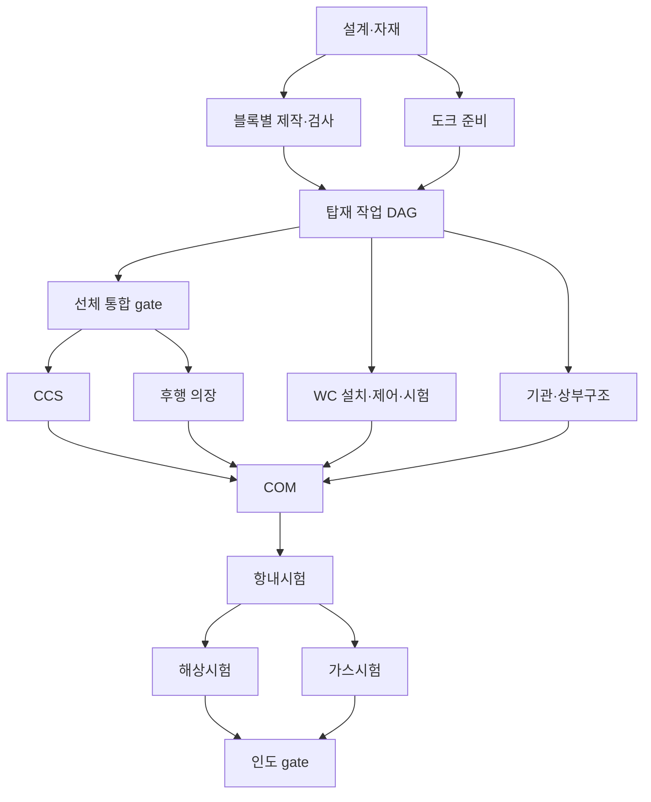

# 174K Membrane LNGC + 2× Wind Challenger
# Final Modeling Reference — PROMPT 02

문서 ID: LNGC-MR-02 · 버전: 2.0 · 검증 기준일: 2026-09-18

입력: PROMPT 01 연구보고서 `LNGC_Wind_Challenger_Modeling_Reference_KO.md` v1.0의 최신 저장본 및 PROMPT 02 지침.

**확정 범위는 교육용 Production Digital Twin의 모델링 계약이다.** 실제 선박의 미공개 제원·선형·생산계획을 확정한 문서가 아니다. 공개 사실은 실제 기준선 정보로, 형상·공정·데이터 설계 선택은 Project Modeling Assumption으로 각각 관리한다. 이번 산출물에는 Three.js, HTML, CSS, JavaScript, 실행 프로그램 또는 완성 3D 모델이 없다.

표기: V=[VERIFIED], D=[DERIVED], A=[ASSUMPTION], M=[MOCK DATA]. V는 반드시 ‘기준선 / 제품군 / 일반 기술 / 타 조선소 사례’ 범위를 동반한다. Unknown / Not Publicly Verified는 값의 확인 상태이며, 다섯 번째 증거 분류가 아니다. 미확인 실제값에는 V/D/A/M을 강제로 붙이지 않고, 별도 모델값에 A를 부여한다. S번호는 14.4의 출처표를 참조한다.

## 1. Reference Vessel Final Specification

### 1.1 기준선 확정

프로젝트 모델 ID는 **LNGC-EDU-01**이다. 참조 실선은 **FUJIN SAILOR**이며, 실선의 digital replica가 아닌 공개자료 기반 교육용 모델로 명명한다. MOL의 2026-09-10 영문·일문 발표에서 주요 제원을 교차 확인했다. 두 언어 발표는 같은 기관의 자료이므로 독립적인 두 기관 검증으로 표현하지 않는다. [S01](https://www.mol.co.jp/en/pr/2026/26044.html), [S20](https://www.mol.co.jp/pr/2026/26045.html)

| Item | Final Value | Classification | Source | Modeling Use |
|---|---|---|---|---|
| Vessel Type | LNG Carrier | V·기준선 | S01 | 선종 이름 |
| Cargo Capacity | 174,000m³ | V·기준선 | S01 | 표시 용적; mesh 부피와 분리 |
| Cargo Containment | Membrane type | V·기준선 | S01 | 선체 지지형 containment |
| 세부 containment 기술 | Unknown / Not Publicly Verified | 실제값 미확인 | S01은 계열 미명시 | Generic membrane 레이어 채택(A) |
| LOA | 294.9m | V·2026 발표 | S01·S20 | 모델 전체 길이 L |
| Breadth | 46.4m | V·2026 발표 | S01·S20 | 최대 폭 B; 상세 datum은 미확인 |
| Depth | Unknown / Not Publicly Verified | 실제값 미확인 | 공개 제원표에 없음 | displayHullHeight=26.5m(A), 실제 Depth 아님 |
| Draft | Unknown / Not Publicly Verified | 실제값 미확인 | 공개 제원표에 없음 | displayWaterlineY=11.5m(A), 표시 기준선 |
| Main Engine / Propulsion | ME-GA, 저압 LNG 이중연료 주기관 | V·기준선의 엔진 계열 | S01·S20 | 대표 기관 객체 |
| 기관 상세모델·대수·출력·축계 | Unknown / Not Publicly Verified | 실제값 미확인 | 상세도 미확보 | 단일 ‘추진 계통 envelope’; 실장 수량 표시 안 함 |
| Accommodation Location | 정확한 실선 위치: Unknown / Not Publicly Verified | 실제 좌표 미확인 | GA 미확보 | 후방 u=0.82–0.93 배치(A) |
| Engine Room Location | 정확한 실선 경계: Unknown / Not Publicly Verified | 실제 좌표 미확인 | machinery GA 미확보 | B08 내부 envelope(A) |
| Cargo Area | 정확한 실선 경계: Unknown / Not Publicly Verified | 실제 좌표 미확인 | GA 미확보 | u=0.18–0.80(A) |
| Cargo Tank Arrangement | 실선 수량·경계: Unknown / Not Publicly Verified | 실제값 미확인 | 특정선 탱크도 미확보 | T01–T04, 선수→선미 4개(A) |
| Wind Challenger Number | 2 units | V·기준선 | S01 | WC01·WC02 |
| Wind Challenger Location | 실제 프레임·좌표: Unknown / Not Publicly Verified | 실제 좌표 미확인 | 설치도 미확보 | B02의 2개 anchor(A) |
| Wind Challenger General Dimensions | 최대 높이49m, 폭 약15m, 3-tier, FRP | V·2024 공개 설계값 | S02 | 외형 참고; 준공 datum·세부치수와 구분 |
| 수납높이·단별 길이·stroke | Unknown / Not Publicly Verified | 실제값 미확인 | 공급도 미확보 | §4의 가상 기구학(A) |
| Major Deck Features | 폐쇄형 브리지·선수 lookout 설계 | V·공개 계획 | S02·S04 | 독립 식별 요소; 좌표는 A |
| Cargo domes·manifold·배관 상세 | Unknown / Not Publicly Verified | 실제 배치·수량 미확인 | 해당선 도면 미확보 | §2·3의 대표물(A) |
| Air Lubrication / Shaft Generator | 장착 발표 | V·기준선 | S01 | 데이터 중심, 대표 표식 선택 |
| DWT·GT·설계속력 | Unknown / Not Publicly Verified | 실제값 미확인 | 이번 근거 미확보 | null; 임의 환산 금지 |
| 인도 상태 | 2026-09-10 발표상 9월 말 예정 | V·발표 시점 | S01 | 조사일 현재 완료로 표시하지 않음 |

2024년의 LOA 약286m·폭 약46m는 초기 발표 이력으로만 보관한다. 최신 기본 스케일에는 사용하지 않는다. 상세 제원 변경 이유는 미확인이다. [S02](https://www.mol.co.jp/en/pr/2024/24104.html)

### 1.2 사실과 모델값의 분리 원칙

실제값 actualVesselSpec와 모델값 modelingParameters를 분리한다. 예를 들어 actualVesselSpec.depth는 null, modelingParameters.displayHullHeight는 26.5m이다. 사용자 화면에 후자를 ‘실선 형깊이’로 표시하지 않는다. null은 0과 다르다. 미확인 장비의 수량을 편의상 1로 저장하지 않으며, envelope 1개는 장비 1대를 뜻하지 않는다.

## 2. Hull Modeling Specification

### 2.1 형상 수준·좌표계

형상 명칭은 **Industry-informed simplified hull geometry**로 확정한다. Lines Plan·CAD를 보유한 것처럼 실제 수선면·선형 계수·구상선수·프로펠러 배치를 재현하지 않는다.

| 규칙 | 확정값 | 분류 |
|---|---|---|
| 단위 | m; 날짜는 별도의 simulation day | A |
| 좌표계 | 오른손 좌표계, +X 선수, +Y 상방, +Z 우현 | A |
| 원점 | 모델 선미 극점의 중심선·baseline 교점 | A; 실제 AP와 다름 |
| 극점 | 선미 X=0, 선수 X=L=294.9 | V 길이 + A 기준점 |
| 중심선 | Z=0 | A |
| 보조 위치 u | 선수에서 선미 방향 거리/L, X=L(1−u) | A 정의, D 변환 |
| 기본 선체 높이 H | 26.5 | A 표시값 |
| 표시 수선 | Y=11.5 | A; 실제 흘수·재하상태 아님 |
| 전체 길이/폭 비 | 294.9/46.4≈6.3556 | D |
| 대칭 | 기본 선체만 Z=0에 좌우 대칭 | A; 의장·WC 방위각 대칭 강제 안 함 |
| 모델 방향 | 선수를 바라볼 때 우현이 +Z | A |
| 치수 반올림 | 저장 계산은 L과 u로 수행, 화면은 0.001m 이하 과도한 정밀도 표시 생략 | A |

### 2.2 재현 가능한 단순 선형 규칙

아래 station 값은 **전부 A**이다. 실제 lines offsets가 아니다. h(u)는 해당 단면의 최대 반폭이며, 표의 계수를 B/2에 곱한다. 인접 station 사이에는 선형 보간을 기본으로 하고, 미관용 smoothing은 envelope를 넘지 않아야 한다.

| u | 0.00 | 0.04 | 0.10 | 0.18 | 0.80 | 0.93 | 1.00 |
|---|---:|---:|---:|---:|---:|---:|---:|
| h(u)/(B/2) | 0.00 | 0.45 | 0.88 | 1.00 | 1.00 | 0.80 | 0.45 |

중앙부 단면은 Y=0의 평저, 완만한 bilge, Y=H까지 올라가는 선측, 상단 deck edge로 구성한다. 기본 bilge radius는 min(2.5m, 0.25h)인 시각적 가정으로 하고, 선수 h=0에서는 단면을 한 점으로 닫는다. 선미는 유한 폭의 transom으로 닫는다. 선저의 실제 수직 상승·선미 유동·축계 홈은 복원하지 않는다. 기본 버전에는 bulbous bow를 추가하지 않는다. 향후 근거가 확보되면 전체 LOA envelope를 유지하며 교체한다.

선체 외피를 먼저 하나의 연속된 정의로 설정한 뒤 §5 경계로 분할한다. 9개 독립 상자를 붙이는 방식은 사용하지 않는다. 접합부 좌표를 공유하고, 분리 보기용 임시 절단면은 시각화 레이어로 둔다. 내부에 중복된 외판이나 전체 선체 복제 mesh를 겹치지 않는다.

### 2.3 갑판·상부구조·공간 envelope

아래 배치·크기·수량은 **A**이며 실제 장비도에서 추출한 값이 아니다.

| 객체 | 배치 규칙 | 모델링 규칙 |
|---|---|---|
| Main deck | 선체 상단 Y=26.5 | 선체 단면에서 연속 생성 |
| Forecastle platform | B01의 후방 일부, u=0.04–0.10 | 기본 갑판보다 2m 높은 간단한 플랫폼; 선체 폭 안쪽 |
| Cargo weather cover | T01–T04 각각의 상부 | 탱크 외곽보다 여유를 둔 경사 어깨·상부 면; 최고 Y=32 |
| Accommodation | u=0.82–0.93, Z=±17, Y=26.5–44.5 | 단차 있는 3단 체적; 후방 형상에 맞춰 하단 지지부 축소 |
| Bridge | accommodation 상부 전면 | 창 띠·폐쇄형 윤곽; 실제 시야 각도 보증 없음 |
| Funnel | u≈0.90, Y=44.5 위 | 대표 배기 구조, 내부 duct 생략 |
| Engine room zone | B08, Y=3–24, Z=±14 | 절개 시 표시하는 공간; 실제 격벽 위치 아님 |
| Lookout station | u≈0.16, Z=0, Y=26.5 위 | 작은 관측실 대표 형상 |
| Cargo manifold | u≈0.50, 양현 갑판 | 대표 접속부 두 그룹; 실선 수량·정확한 좌표 미확인 |
| Deck piping | 화물구역 중심선 부근 | liquid/vapour 두 대표 경로; 탱크·manifold로 분기 |
| Mooring/deck equipment | 선수·선미 작업 공간 | 윈치·앵커의 대표물; WC 회전 표시 영역과 겹치지 않게 배치 |

Accommodation 하단은 국부 선체 폭에 맞춘다. 상부 돌출부는 공간 간섭 여부를 별도 점검한다. weather cover는 HULL 블록별로 잘라 소유시키고, cargo dome은 탱크 인터페이스 객체로 따로 관리한다. 이 구분으로 블록 진행률과 탱크 설비 진행률을 중복 집계하지 않는다.

### 2.4 3D 범위 A/B/C 확정

MUST MODEL은 객체 존재와 선택 가능성을 요구하며 세부 CAD 수준을 뜻하지 않는다. 아래 전부 프로젝트 범위 선택(A)이다.

| 요소 | 수준 | 반드시 남길 의미 / 생략 범위 |
|---|---|---|
| Hull | A MUST MODEL | 9개 구역의 연속 외형·개별 선택 |
| Bow / Stern | A MUST MODEL | 길이방향 테이퍼·선수/선미 식별; 실제 선형 정밀도 제외 |
| Main Deck | A MUST MODEL | 선체 상부와 작업영역 |
| Accommodation | A MUST MODEL | 후방 상부구조·브리지; 객실 내부 제외 |
| Engine Room | B SIMPLIFIED MODEL | 절개 공간·추진 계통 envelope |
| Cargo Tanks | A MUST MODEL | 4개 논리탱크·선체 내부 관계 |
| Cargo Domes | B SIMPLIFIED MODEL | 탱크별 대표 상부 접속부; 실제 수량/치수 주장 없음 |
| Piping | B SIMPLIFIED MODEL | 주요 liquid/vapour 경로; 모든 spool 생략 |
| Deck Equipment | B SIMPLIFIED MODEL | 대표 앵커·윈치·manifold |
| Outfitting | B SIMPLIFIED MODEL | 주요 계통·연결 위치; 작은 부품은 C |
| Crane / Lifting objects | C DATA ONLY | 작업 슬롯·예약·능력 입력; 실제 크레인/리깅 3D 제외 |
| Wind Challenger | A MUST MODEL | 2기·3단·방위각·신축 |
| WC Foundation | A MUST MODEL | 기초와 선체 지지 관계 |
| Hydraulic | C DATA ONLY, 조건부 | 실제 구동방식 미확인; 기본 hydraulic mesh 없음 |
| Electrical / Control | B SIMPLIFIED MODEL | 대표 cabinet·연결 표식; 회로·I/O는 C |
| Sensors | B SIMPLIFIED MODEL | 대표 풍향풍속 센서; 정확한 장착 위치는 A |
| 개별 용접·NDT 위치 | C 기본, 선택 시 B 표식 | 전체 weld mesh 없이 검사 위치를 overlay |

## 3. Cargo Tank Modeling Specification

### 3.1 Actual industrial structure

멤브레인 화물창은 얇은 방벽·단열계가 선체 내부 구조에 지지되는 형식이다. GTT는 LNG 약 −163°C와 inner hull 지지 원리를 설명한다. NO96의 Invar 방벽과 Mark III의 주름진 stainless steel 방벽은 서로 다른 기술이다. 기준선의 구체적 계열을 확인하지 못했으므로 특정 기술의 재료·표면 패턴을 기본값으로 고정하지 않는다. [V·일반 기술: S07](https://www.gtt.fr/technologies), [S08](https://www.gtt.fr/activities/gtt-energy/technologies-expertise/membranes/no96), [S09](https://www.gtt.fr/activities/gtt-energy/technologies-expertise/membranes/markiii)

### 3.2 Digital Twin simplified representation

4개의 챔퍼 프리즘 체적을 사용하며 탱크 수·경계·치수는 **A**이다. 개별 실선 용적은 null로 둔다. 174,000m³는 선박 메타데이터이며 아래 mesh의 계산 부피를 보정해 이 수치와 억지로 일치시키지 않는다.

| Tank ID | u 범위 | 표시 최대폭 | 표시 Y 범위 | 관련 구조 블록 |
|---|---|---:|---|---|
| T01 | 0.190–0.310 | 34m | 3–30m | B03 |
| T02 | 0.335–0.485 | 38m | 3–30m | B04·B05 |
| T03 | 0.505–0.635 | 38m | 3–30m | B05·B06 |
| T04 | 0.655–0.785 | 38m | 3–30m | B07 |

단면 상·하 모서리는 2m 챔퍼로 시작한다(A). T01의 전방부는 단순 테이퍼로 좁힐 수 있으나 표의 최대폭을 넘지 않는다. 탱크 간 간격은 구조·cofferdam을 설명할 공간으로 사용하며 실제 cofferdam 치수라고 표시하지 않는다. 선측 여유, 하부 여유, 상부 cover를 확보하고 탱크를 갑판 위 독립 구체로 만들지 않는다.

레이어의 중심→선체 방향 순서는 CARGO_VOLUME, PRIMARY_BARRIER, PRIMARY_INSULATION, SECONDARY_BARRIER, SECONDARY_INSULATION, INNER_HULL_SUPPORT이다. 앞의 다섯 객체는 Txx 소유이며 inner hull은 HULL 소유다. 방벽은 표면으로 표현한다. 표시용 단열 envelope 총 두께는 0.8m(A) 이내에서 두 층으로 나누고, 확대 단면에서는 화면상 간격을 벌릴 수 있다. 이 값은 GTT 실제 단열 두께가 아니다. 기본 재질에는 NO96/Mark III를 구분하는 확정 패턴을 입히지 않는다.

inner hull의 표시 지지면은 외측 단열 envelope와 맞닿도록 생성한 뒤 Bxx 경계에서 분할한다(A). 선체 외판과 이 지지면 사이가 이중선체 공간이다. 단열계와 지지면 사이에 설명되지 않은 빈틈을 두지 않는다. 분해 보기에서만 레이어를 벌리고, 원래의 접촉 위치를 복원할 수 있게 한다. 이런 지지면을 실제 승인 선체 격벽 형상으로 해석하지 않는다.

| 부모 | 자식 | 역할 |
|---|---|---|
| CARGO_TANK | T01, T02, T03, T04 | 독립 선택·탱크별 정보 |
| Txx | CARGO_VOLUME | 논리 체적; 건조 화면의 빈 공간 참조 |
| Txx | PRIMARY_BARRIER / PRIMARY_INSULATION | 1차 계통 설명 |
| Txx | SECONDARY_BARRIER / SECONDARY_INSULATION | 2차 계통 설명 |
| Txx | CARGO_DOME | 상부 접속부 대표물, 1개/tank는 A |
| Txx | PUMP_ENVELOPE | 선택적 대표물; 실제 펌프 대수 아님 |

시공 표현은 inner hull release 후 레이어가 설치되는 개념이다. 완성 탱크를 크레인으로 통째로 삽입하는 표현은 금지한다. CCS를 탱크별로 분리할 준비는 하되 기준 일정에서는 하나의 CCS 패키지가 네 탱크에 연결된다. 설치 세부순서는 승인된 공급사 절차를 대신하지 않는다. 건조 중 기술지원·gas trial의 존재는 GTT 자료로 확인했다. [S10](https://www.gtt.fr/fr/ensuring-safety-and-performance-lngcs-gtt-support-during-construction)

## 4. Wind Challenger Modeling Specification

### 4.1 제품 확인과 적용 제한

Wind Challenger는 자동 신축·각도 제어식 hard sail이다. MOL은 wing-shaped hard sail이라고 설명하므로 일반 wing 계열이라는 물리적 특징 자체를 부정하지 않는다. 본 모델에서는 **제품 고유의 3단 신축 구조를 가진 Wind Challenger**로 식별하고 타사의 임의 wing sail로 대체하지 않는다. 회전 원통의 Magnus 효과를 사용하는 Rotor Sail과 구분한다. [S05](https://www.mol-service.com/en/services/energy-saving-technologies/wind-challenger), [S06](https://www.norsepower.com/product/)

| 항목 | 확인 결과 | 최종 모델 결정 |
|---|---|---|
| Units | 2기 V·기준선 | WC01, WC02 |
| Height / Width / Stages | 49m 최대·약15m·3단 V·2024 설계 | 표시 envelope의 참조값 |
| Material | FRP V·2024 설계; GFRP 표면재 V·제품군 | 비금속 돛 재질, 금속 지지부 분리 |
| Actual mounting coordinates | Not Publicly Verified | 아래 anchor A |
| Foundation / reinforcement dimensions | Not Publicly Verified | 대표 기초 A |
| Actuation | 제품 설명에 유압 장치와 전동화 계획이 모두 존재 | 실제선 hydraulic/electric 결정 보류 |
| Electrical / Control | 자동제어·풍향풍속 감지 V·제품군 | 대표 요소 B; 실제 사양 미확인 |

높이49m의 측정 datum과 준공 시 유지 여부는 미확인이다. 아래 local geometry에서 49m를 사용하는 결정은 **A**이며, 수면 위 air draft 또는 실제 돛 유효면적 계산으로 전용하지 않는다. [공개 설계사양 S02](https://www.mol.co.jp/en/pr/2024/24104.html)

### 4.2 Anchor와 형상 규칙

아래 수치 전체는 **A**이다. 실제 설치도를 복원한 것이 아니다.

| 객체 | X | Y | Z | 기준 |
|---|---:|---:|---:|---|
| WC01 / FOUNDATION_01 | 0.87L=256.563 | 26.5 | −11 | 좌현 전방 갑판 |
| WC02 / FOUNDATION_02 | 0.87L=256.563 | 26.5 | +11 | 우현 전방 갑판 |
| 각 ROTATION_FRAME | 부모와 동일 | 부모보다 +3.5 | 부모와 동일 | 가상 pedestal 상부 |

기초는 5m×5m footprint, 높이3.5m의 단순 tapered pedestal로 표시한다. 기초와 갑판의 연결은 선체 보강 표식으로 표현하며 보강 plate 두께·볼트·용접규격을 만들지 않는다. 최대 돛 폭15m가 양현 공간에 들어오는지는 단순 envelope로 확인하되 실제 구조·운용 적합성 검증으로 부르지 않는다.

돛은 폭이 넓고 얕게 휜 경질 패널로 만든다. 원통·풍차·지속 고속회전은 허용하지 않는다. 단별 폭은 base15m, middle14.5m, top14m, 단별 높이는 모두18m로 하는 가상 외형을 채택한다. 얕은 곡률 및 두께 envelope는 1.5m 이내(A), 실제 공력 단면·복합재 적층은 미정이다.

### 4.3 전개·수납의 결정적 표시 규칙

q는 0–1의 displayDeploymentRatio이다. rotation frame의 local Y를 기준으로 base 하단은0, middle 하단은15.5q, top 하단은31q로 정한다. 따라서 q=0에서18m, q=1에서49m의 표시 envelope가 된다. **18m 수납높이, 단별 길이·겹침·stroke는 모두 A이며 공급사 사양이 아니다.** 겹친 단계는 내부 shell로 처리해 표면 깜박임을 피한다.

방위각 θ는 +Y축 회전이다. θ=0에서 패널 폭 방향을 local Z로 두고, 제작 초기값은0이다. 전시용 회전 범위는 −90°~+90°(A)이며 실제 구동 한계로 표시하지 않는다. 자재 미입고·미설치 상태에는 q를 적용하지 않고 객체 존재/가시성으로 구분한다. q=0은 ‘설치된 장비가 수납됨’이지 ‘진척0%’가 아니다.

### 4.4 최종 소유 구조

| 부모 | 자식 | 생산 연결 |
|---|---|---|
| WIND_CHALLENGER | WC01 / WC02 | 장비별 선택 |
| WC01 | FOUNDATION_01, ROTATION_FRAME, DRIVE_01, ELECTRICAL_01, CONTROL_01, SENSOR_01 | §12의 각 작업 |
| WC02 | FOUNDATION_02, ROTATION_FRAME, DRIVE_02, ELECTRICAL_02, CONTROL_02, SENSOR_02 | §12의 각 작업 |
| 각 ROTATION_FRAME | STAGE_BASE / STAGE_MID / STAGE_TOP | 공급·설치·표시 기구학 |
| 각 DRIVE | HYDRAULIC_OPTION | 조건부 논리 항목, 기본 3D 없음 |

기초는 WC의 자식으로 한 번만 존재하고 hostBlockId=B02로 연결한다. deck reinforcement는 B02 소유다. HYDRAULIC_OPTION은 unknown 상태이며 완료가 필요한 필수 hydraulic 작업을 자동 생성하지 않는다. 구동방식이 확정되면 DRIVE 작업의 세부 속성을 채운다.

## 5. Block Division Final Specification

### 5.1 9개 Project Simulation Block 확정

9개 모두 **Project Simulation Block(A)**이다. 실제 한화오션의 공식 block ID·한 번에 인양하는 단위·중량 단위가 아니다. 실제 block plan을 확보하면 각 Bxx에 여러 yardBlockId를 매핑한다. 일반 블록·총조립·staging·도크 탑재 개념은 Oshima 사례로 확인했지만 현장의 분할·중량·순서를 전사하지 않았다. [S11](https://jp.osy.co.jp/shipbuilding/building-process/), [S12](https://jp.osy.co.jp/shipbuilding/shipyard/)

아래 Predecessor/Successor는 **탑재 공유 슬롯의 기준 순서**다. 구조상 선행은 별도 표로 정한다.

| Block ID | Ship Zone (u) | Main Role | Related Tank | Predecessor | Successor | Modeling Level |
|---|---|---|---|---|---|---|
| B01 | 선수 0–0.10 | 선수·forepeak·선수갑판 | 없음 | E-B02 | HULL_GATE | A MUST, 단순 외피 |
| B02 | 전방 0.10–0.18 | WC 지지·전방 갑판 | T01 인접, 소유 안 함 | E-B09 | E-B01 | A MUST, 기초 host |
| B03 | 화물 전방 0.18–0.32 | T01 주변 inner hull | T01 | E-B06 | E-B07 | A MUST, 절개 |
| B04 | 화물 전중방 0.32–0.40 | T02 전방 구조 | T02 | E-B05 | E-B06 | A MUST, 품질 시나리오 |
| B05 | 중앙 0.40–0.52 | 중앙 기준·접합 구역 | T02·T03 | DOCK_READY·QG-B05 | E-B04 | A MUST, 기준 탑재 |
| B06 | 화물 중후방 0.52–0.64 | T03 후방 구조 | T03 | E-B04 | E-B03 | A MUST, 절개 |
| B07 | 화물 후방 0.64–0.80 | T04·기관실 전방 경계 | T04 | E-B03 | E-B08 | A MUST, 의장 연결 |
| B08 | 기관부 0.80–0.93 | 기관실·상부구조 지지 | 없음 | E-B07 | E-B09 | A MUST, 장비 연계 |
| B09 | 선미 0.93–1.00 | 선미·조타 공간 | 없음 | E-B08 | E-B02 | A MUST, 외피 |

Successor 열은 주요 슬롯 후행만 나타낸다. E-B02는 WC 설치, E-B08은 MACH/ACC에도 연결된다. 전체 edge 목록은 §7에 정의한다. 단순 균등 9등분 대신 탱크·기관·WAPS·품질 의사결정 구역을 구분한 분할이다.

### 5.2 Block geometry와 pivot

다음 위치는 A 경계에서 계산한 **D(A 기반)**이다. block root는 (Xc,0,0), final rotation은0, scale은1이다. dimensions는 길이·높이·폭 순이며 이 절에서는 길이만 고정 수치로 제시한다. 높이·폭은 §2의 해당 구역 geometry bounding box에서 산출한다.

| ID | X min–max (m) | Xc (m) | Length (m) |
|---|---|---:|---:|
| B01 | 265.410–294.900 | 280.155 | 29.490 |
| B02 | 241.818–265.410 | 253.614 | 23.592 |
| B03 | 200.532–241.818 | 221.175 | 41.286 |
| B04 | 176.940–200.532 | 188.736 | 23.592 |
| B05 | 141.552–176.940 | 159.246 | 35.388 |
| B06 | 106.164–141.552 | 123.858 | 35.388 |
| B07 | 58.980–106.164 | 82.572 | 47.184 |
| B08 | 20.643–58.980 | 39.8115 | 38.337 |
| B09 | 0–20.643 | 10.3215 | 20.643 |

검산: 길이 합=294.900m, 경계는 연속이고 틈·중복이 없다. 경계에 위치한 공통 접합 weld는 양쪽 blockIds를 갖지만 물량 집계에서 한 번만 계산한다. tank boundary와 block boundary는 독립적이다.

## 6. Block Construction Sequence

### 6.1 단계 정의

아래 단계·기간·순서는 **A**이다. 모든 블록의 초기 제작을 병렬로 둔 것은 교육용 가정이다.

| Phase | 개념 | 기준 기간 | Object 표시 |
|---|---|---|---|
| FABRICATION | 부재 절단·가공 | 6–8 | assembly 위치의 단순 placeholder |
| SUB_ASSEMBLY | 소조립 | 8–11 | assembly 위치에서 블록 ghost |
| BLOCK_ASSEMBLY | 구조 블록 조립·용접 | 11–14 | assembly 위치의 구역 형상 |
| GRAND_ASSEMBLY | 선행의장·도장·총조립 패키지 | 14–18 | assembly 위치 |
| INSPECTION | 탑재 전 최종 release | 18–20 | 검사 표식; FAIL은 별도 품질 상태 |
| STAGING | 준비 완료 후 탑재 대기 | 20–각 E 시작 | staging 위치 |
| ERECTION | 이동·정렬·접합·검사 집약 | 블록별 2일 | staging→final |
| ERECTED | 해당 구역 탑재 완료 | E 종료 후 | final 위치 |
| INTEGRATION | 선체 통합 접합 검사 | 38–40 | final 위치 |
| OUTFITTING | 구역간 의장 연결·검사 | 40–50 | final 위치 |
| COMPLETED | 해당 블록 범위 완료·gate 충족 | 기준 Day50 이후 | final 위치; 선박 인도와 다름 |

선행의장과 후행의장은 서로 다른 작업 범위다. INTEGRATION은 이 문서에서 선체 접합 통합을 뜻하며 vessel commissioning은 별도의 COM 작업이다. 실제 조립 도중 용접·검사는 반복되며 INSPECTION은 마지막 release만 대표한다.

### 6.2 구조·자원 의존 분리

| Erection task | 구조상 반드시 준비될 대상 | 공유 슬롯상 직전 작업 |
|---|---|---|
| E-B05 | DOCK_READY | 없음 |
| E-B04 | E-B05 | E-B05 |
| E-B06 | E-B05 | E-B04 |
| E-B03 | E-B04 | E-B06 |
| E-B07 | E-B06 | E-B03 |
| E-B08 | E-B07 | E-B07 |
| E-B09 | E-B08 | E-B08 |
| E-B02 | E-B03 | E-B09 |
| E-B01 | E-B02 | E-B02 |

각 작업은 자신의 QG-Bxx도 요구한다. 동일한 선행 task에 구조·자원 이유가 동시에 있으면 edge를 중복 집계하지 않고 reasonTypes를 복수로 저장한다. 구조 인접성 자체는 무방향 공간 관계이며, 탑재 선행은 시나리오별 방향 있는 작업 관계다.

### 6.3 DAG 설계 원칙

taskId를 정점, 선행→후행을 edge로 하는 DAG를 사용한다. 기준 버전은 FS, lag=0으로 통일한다. 제작 9개 분기와 DOCK_READY가 첫 탑재에서 합류하고, 탑재 후 CCS·의장·WC·기관 작업이 분기한 뒤 COM에서 다시 합류한다. 어떤 후행도 자신 또는 상위 선행을 역참조하지 않는다.

## 7. 4D Timeline

### 7.1 계산 계약

Day 0–60은 **Project Simulation Assumption**이다. 실제 건조기간이나 균등 압축비가 아니다. 구간은 [Start, Finish)이고 Duration=Finish−Start이다. Finish와 다음 Start가 같으면 다음 상태를 적용한다. 기준 일정은 무휴 연속 시간, 단일 공유 탑재 슬롯, 지연·자원변경 없음으로 둔다.

정의: ES=max(선행 EF), EF=ES+duration. 역산 LF=min(후행 LS), LS=LF−duration. Total Float(TF)=LS−ES. Free Float(FF)=min(후행 ES)−EF. terminal DEL의 기준 LF=60이다. 아래 모든 기간은 A, 계산된 날짜·float는 D(A 기반)이다. 실제 생산실적은 한 건도 포함하지 않는다. 일정·자원·진척 갱신 개념은 GAO Schedule Assessment Guide를 보조 근거로 삼되 이 네트워크는 자체 교육용 설계다. [S21](https://www.gao.gov/products/gao-16-89g)

### 7.2 공통 제작 패턴과 블록별 float

각 b∈B01…B09에 아래 5개 task를 **각각 생성**하는 명세다. 요약행을 별도 일정 task로 중복 생성하지 않는다.

| Task pattern | Start | Finish | Duration | Predecessor | Successor | TF / FF |
|---|---:|---:|---:|---|---|---|
| FAB-b | 6 | 8 | 2 | MAT | SUB-b | Δb / 0 |
| SUB-b | 8 | 11 | 3 | FAB-b | BA-b | Δb / 0 |
| BA-b | 11 | 14 | 3 | SUB-b | ASM-b | Δb / 0 |
| ASM-b | 14 | 18 | 4 | BA-b | QG-b | Δb / 0 |
| QG-b | 18 | 20 | 2 | ASM-b | E-b | Δb / Δb |

| b | Δb | Staging Start–Finish | Erection Start–Finish |
|---|---:|---|---|
| B05 | 0 | 20–20（대기 없음） | 20–22 |
| B04 | 2 | 20–22 | 22–24 |
| B06 | 4 | 20–24 | 24–26 |
| B03 | 6 | 20–26 | 26–28 |
| B07 | 8 | 20–28 | 28–30 |
| B08 | 10 | 20–30 | 30–32 |
| B09 | 12 | 20–32 | 32–34 |
| B02 | 14 | 20–34 | 34–36 |
| B01 | 16 | 20–36 | 36–38 |

**Staging은 고정 소요기간 task가 아니라 QG 완료와 E 시작의 차이로 계산하는 대기 상태다.** QG가 늦어지면 대기시간이 먼저 줄어든다. 이를 고정 duration으로 넣으면 흡수 가능한 지연까지 납기로 전파되는 오류가 생긴다. 운송에 별도 시간이 필요해지는 다음 버전에서는 TRANSPORT task를 추가하고 모든 float를 재계산한다.

### 7.3 탑재 task와 완전한 선행 목록

| Task | Start | Finish | Dur. | Predecessor（모두 FS0） | Successor | TF / FF |
|---|---:|---:|---:|---|---|---|
| E-B05 | 20 | 22 | 2 | QG-B05, DOCK_READY | E-B04, E-B06, HULL_GATE | 0 / 0 |
| E-B04 | 22 | 24 | 2 | QG-B04, E-B05 | E-B06, E-B03, HULL_GATE | 0 / 0 |
| E-B06 | 24 | 26 | 2 | QG-B06, E-B05, E-B04 | E-B03, E-B07, HULL_GATE | 0 / 0 |
| E-B03 | 26 | 28 | 2 | QG-B03, E-B04, E-B06 | E-B07, E-B02, HULL_GATE | 0 / 0 |
| E-B07 | 28 | 30 | 2 | QG-B07, E-B06, E-B03 | E-B08, HULL_GATE | 0 / 0 |
| E-B08 | 30 | 32 | 2 | QG-B08, E-B07 | E-B09, MACH, ACC, HULL_GATE | 0 / 0 |
| E-B09 | 32 | 34 | 2 | QG-B09, E-B08 | E-B02, HULL_GATE | 0 / 0 |
| E-B02 | 34 | 36 | 2 | QG-B02, E-B03, E-B09 | E-B01, WC_FND_INSTALL, HULL_GATE | 0 / 0 |
| E-B01 | 36 | 38 | 2 | QG-B01, E-B02 | HULL_GATE | 0 / 0 |

### 7.4 나머지 작업의 기준 일정

WC_*는 두 장비를 함께 관리하는 패키지 task다. WC01/02에 각각 동일 기간 task를 복제하지 않는다. 개별 장비 분리 시 자원 및 병렬 가정을 새로 정의한다.

| Task | Start | Finish | Dur. | Predecessor | Successor | TF / FF |
|---|---:|---:|---:|---|---|---|
| ENG | 0 | 3 | 3 | 없음 | MAT, LONGLEAD | 0 / 0 |
| MAT | 3 | 6 | 3 | ENG | FAB-각b, DOCK_READY, WC_FND_FAB | 0 / 0 |
| LONGLEAD | 3 | 18 | 15 | ENG | WC_FND_INSTALL, MACH, ACC, OUTFIT, CCS | 20 / 14 |
| DOCK_READY | 6 | 20 | 14 | MAT | E-B05 | 0 / 0 |
| WC_FND_FAB | 6 | 16 | 10 | MAT | WC_FND_QG | 20 / 0 |
| WC_FND_QG | 16 | 18 | 2 | WC_FND_FAB | WC_FND_INSTALL | 20 / 18 |
| HULL_GATE | 38 | 40 | 2 | 모든 E-b | CCS, OUTFIT | 0 / 0 |
| CCS | 40 | 52 | 12 | HULL_GATE, LONGLEAD | COM | 0 / 0 |
| WC_FND_INSTALL | 36 | 38 | 2 | E-B02, WC_FND_QG, LONGLEAD | WC_LIFT | 2 / 0 |
| WC_LIFT | 38 | 42 | 4 | WC_FND_INSTALL | WC_DRIVE | 2 / 0 |
| WC_DRIVE | 42 | 44 | 2 | WC_LIFT | WC_ELECTRICAL | 2 / 0 |
| WC_ELECTRICAL | 44 | 46 | 2 | WC_DRIVE | WC_CONTROL | 2 / 0 |
| WC_CONTROL | 46 | 48 | 2 | WC_ELECTRICAL | WC_TEST | 2 / 0 |
| WC_TEST | 48 | 50 | 2 | WC_CONTROL | COM | 2 / 2 |
| MACH | 32 | 42 | 10 | E-B08, LONGLEAD | COM | 10 / 10 |
| ACC | 32 | 44 | 12 | E-B08, LONGLEAD | COM | 8 / 8 |
| OUTFIT | 40 | 50 | 10 | HULL_GATE, LONGLEAD | COM | 2 / 2 |
| COM | 52 | 55 | 3 | CCS, WC_TEST, MACH, ACC, OUTFIT | HAT | 0 / 0 |
| HAT | 55 | 57 | 2 | COM | SAT, GAS | 0 / 0 |
| SAT | 57 | 59 | 2 | HAT | DEL | 0 / 0 |
| GAS | 57 | 59 | 2 | HAT | DEL | 0 / 0 |
| DEL | 59 | 60 | 1 | SAT, GAS | 없음 | 0 / 0 |

MAT에는 기본 선행의장 자재를 포함한다. LONGLEAD는 주기관·WC·CCS 등 주요 구매품을 통합한 가상 패키지다. 전체 HULL_GATE 후 CCS 착수는 보수적인 간소화이며, GAS/SAT 병행은 교육용 선택으로 실제 시험절차를 뜻하지 않는다. WC 설치 작업 슬롯은 선체 ERECTION 슬롯과 별도로 두며 실제 간섭·능력 검증은 포함하지 않는다. 기관 반입 접근은 MACH 완료까지 확보된 것으로 가정한다.

### 7.5 Critical Path 검산

시작부터 B05 release까지 두 임계 분기가 있다: ENG–MAT–FAB-B05–SUB-B05–BA-B05–ASM-B05–QG-B05, 그리고 ENG–MAT–DOCK_READY. 둘 다 Day20에 완료된다. 이후 9개 탑재→HULL_GATE→CCS→COM→HAT까지 공통이며 SAT와 GAS가 각각 임계 분기를 이룬다. DEL 종료는 Day60이다.

TF는 작업 속성이다. 같은 B04 안에서 QG-B04의 TF=2와 E-B04의 TF=0이 동시에 존재한다. block.float는 조회 범위에 따른 요약값으로만 제공하고 원래 task별 float를 보존한다. 자원 edge를 포함한 이 결과는 고정된 자원 순서 아래의 CPM이며 자동 자원 최적화 결과가 아니다.

### 7.6 What-If 수용 기준

입력은 M, 결과는 D(M·A 기반)이다. 나머지 작업·자원 순서는 고정하고 추가 gate를 모든 관련 후행에 반영한다.

| 시나리오 | 변경 | 완료 Day | 임계/여유의 의미 |
|---|---|---:|---|
| BASELINE | 변경 없음 | 60 | CCS 경로 임계 |
| Q-B04-3D | QG-B04 종료20→23 | 61 | 대기2일 흡수, 탑재1일 지연 |
| E-B04-3D | E-B04 후 repair2일+재검사1일 | 63 | E-B06 및 구조/통합 후행 모두 release 지연 |
| WC-LIFT-1D | WC_LIFT 기간4→5 | 60 | WC 여유2일 중1일 사용 |
| WC-LIFT-3D | WC_LIFT 기간4→7 | 61 | WC_TEST 종료53, COM 시작53 |
| WC-AND-OUTFIT | WC +3일, OUTFIT +4일 | 62 | COM=max(CCS52, WC53, OUTFIT54, 기타)=54 |

두 지연을 단순 합산하지 않는다. 목표 납기 Day60은 변경하지 않고 earliestForecastFinish와 targetFinish를 별도 보관한다. 재계산 완료일 기준 float와 고정 목표일 기준 float도 분리해 늦은 프로젝트의 음수 여유를 숨기지 않는다.

## 8. Three.js Object Hierarchy

### 8.1 Scene 소유권

아래는 A인 논리 명세이며 코드가 아니다. 같은 물리 형상은 하나의 소유 그룹에만 존재한다.

| 부모 | 자식 | 의미 |
|---|---|---|
| SCENE | VESSEL, YARD_REFERENCE, VISUAL_OVERLAY | 선박·가상 제작장·상태 표식 분리 |
| VESSEL / LNGC-EDU-01 | HULL, CARGO_TANK, ACCOMMODATION, PROPULSION, OUTFITTING, WIND_CHALLENGER | 주요 물리 시스템 |
| HULL | B01…B09 | 독립 선택 가능한 9개 root |
| 각 Bxx | SHELL, DECK, INNER_HULL_SEGMENTS, COVER_SEGMENTS, REINFORCEMENT | 해당 구역만 소유; 없는 종류는 생략 |
| CARGO_TANK | T01…T04 | §3의 탱크 구조 |
| ACCOMMODATION | SUPERSTRUCTURE, BRIDGE, FUNNEL | 별도 공정 ACC |
| PROPULSION | ENGINE_ROOM_ZONE, PROPULSION_ENVELOPE | 정확한 주기관/축 대수 미정 |
| OUTFITTING | MANIFOLD_PORT/STBD, PIPE_SEGMENTS, DECK_EQUIPMENT, LOOKOUT | 대표 의장 |
| WIND_CHALLENGER | WC01, WC02 | §4.4 구조 |
| YARD_REFERENCE | ASSEMBLY_ANCHORS, STAGING_ANCHORS | 가상 위치; 실제 조선소 layout 아님 |
| VISUAL_OVERLAY | SELECTION, QUALITY_MARKERS, CRITICAL_OUTLINE, LABELS | 물량 없는 표시 전용 |

각 자식의 안정적 objectId는 부모 접두어를 포함한다. 예: B04/SHELL, T02/PRIMARY_BARRIER, WC01/STAGE_BASE. B04와 T02는 서로 parent-child가 아니며 관계 테이블로 연결한다. 같은 T02를 B04와 B05 양쪽에 복제하지 않는다.

### 8.2 데이터 관계와 cardinality

| 관계 | cardinality | 정합성 규칙 |
|---|---|---|
| Vessel→PhysicalObject | 1:N | objectId는 dataset 내 유일 |
| Object→SimulationBlock | N:M | Tank·pipe는 복수 block 허용 |
| Task↔Object | N:M, TaskObjectLink | 하나의 task를 객체 수만큼 복제하지 않음 |
| Task→Dependency→Task | N:M DAG | 순환·없는 ID 금지 |
| Inspection→Object/Weld | N:M link | 두 블록 접합부 검사 보존 |
| NCR→RepairTask | 1:N 또는 연결표 | 보수·재검사 추적 |
| Resource↔Task | N:M Allocation | 시간 구간·capacity 소비량 포함 |
| Scenario→TaskOverride | 1:N | baseline·실적을 덮어쓰지 않음 |
| Snapshot→상태/계산 결과 | 1:N | dataDate·scenarioId·calculationVersion 필수 |

3D Object↔objectId↔TaskObjectLink↔Task↔QualityGate↔Scenario 연결이 가능하다. 예를 들어 B04 선택→E-B04→접합 weld/NCR→repair task→후속 E-B06→CCS→DEL을 추적한다. scene graph의 parent가 일정 predecessor를 뜻하지 않는다.

## 9. Block Data Schema

전체 필드 설계는 A이다. 값의 사실 여부는 각 레코드의 evidence로 따로 관리한다. 아래는 언어 중립적 명세이며 JSON·DB·프로그램 구현은 다음 단계 범위다.

| Field | Type / Unit | 필수·기본값 | 정의·제약 |
|---|---|---|---|
| id | string | 필수 B01…B09 | datasetId와 결합한 안정적 키 |
| name | string | 필수 | 구역명, 실제 yard block명과 구분 |
| blockKind | enum | PROJECT_SIMULATION_BLOCK | 실제 인양 단위로 사용 금지 |
| vesselId | reference | LNGC-EDU-01 | 부모 선박 |
| yardBlockIds | reference array | [] | 실제 매핑 미확보 상태 |
| relatedTankIds | reference array | §5 표 | 0개·복수 허용 |
| position | vector3, m | 계산값 | 현재 scene 위치; 입력 원본 아님 |
| finalPosition | vector3, m | (Xc,0,0) | 기준 geometry anchor |
| assemblyPosition | vector3, m | §13 규칙 | 교육용 제작 위치 |
| stagingPosition | vector3, m | §13 규칙 | 교육용 대기 위치 |
| dimensions | lengthX, heightY, widthZ, m | geometry에서 산출 | 선체 일부의 AABB, 실제 block size 아님 |
| geometryRevision | string | MR02-2.0 | 형상 변경 추적 |
| status | enum | NOT_STARTED | NOT_STARTED / IN_PROGRESS / COMPLETED |
| productionStage | enum | §6 단계 | 시점별 파생 상태 |
| progress | decimal %, nullable | actual 모드 null 허용 | 실제 측정 없음을0과 구분 |
| progressBasis | enum | 명시 필수 | PLANNED_PREVIEW / MOCK / MEASURED |
| plannedStart | number, sim day | 6 | 기준 블록 제작 시작 |
| plannedFinish | number, sim day | 50 | 블록 구조·의장 범위 완료; 탑재 종료와 다름 |
| actualStart / actualFinish | timestamp, nullable | null | 실제/가상 실적의 dataKind 표시 필수 |
| forecastFinish | number 또는 timestamp | 시간 도메인 명시 | scenario 결과 |
| erectionStart / erectionFinish | number, sim day | §7 | 탑재 일정 별도 |
| predecessor / successor | taskId array | 계산·조회용 | E-b의 모든 직접 edge; 별도 쓰기 금지 |
| structuralPredecessor | taskId array | §6.2 | 구조 조건 subset |
| taskIds | reference array | 해당 작업들 | block scope만 집계 |
| qualityGateIds | reference array | 해당 gate | 실제 합격 없이 자동 release 금지 |
| materialRefs / resourceRefs | reference array | [] 허용 | 상세 엔터티로 연결 |
| qualityFlags / scheduleFlags | enum arrays | [] | 완료·지연·부적합을 단일 status로 합치지 않음 |
| scenarioId / snapshotId | reference | 필수 | 조회 결과 재현 |
| evidenceClass / evidenceScope | enum/string | 필수 | A 블록 설계와 M 실적 구분 |

plannedStart/Finish는 자체 FAB…E 및 공유 HULL_GATE·OUTFIT의 해당 범위를 포함한다. CCS·MACH·ACC·WC는 독립 시스템이므로 B02의 구조 완료가 WC 시운전 완료를 뜻하지 않고, B08 완료가 기관 성능시험 완료를 뜻하지 않는다.

블록 진척은 작업별 가중치로 조회한다. 교육용 기본 가중치는 FAB10%, SUB15%, BA20%, ASM15%, QG5%, E20%, HULL_GATE5%, OUTFIT10%로 합계100%(A)이다. 공유 task는 각 block의 표시 진척에 쓰일 수 있지만 vessel 총진척에서는 taskId 단위로 한 번만 집계한다. 실측에서는 승인 물량/공수 기반 가중치로 교체한다.

## 10. Production Data Schema

### 10.1 최소 엔터티

| Entity | 최소 필드 | 역할 |
|---|---|---|
| Schedule / Task | taskId, name, start, finish, duration, actualStart, actualFinish, remainingDuration, ES/EF/LS/LF, TF/FF | 계획·실적·예측 분리 |
| Dependency | predecessorTaskId, successorTaskId, type, lag, reasonTypes | 기준 FS0, 구조/자원/품질/관리 이유 |
| Production | taskId, progress, progressBasis, measuredQuantity, totalQuantity, unit, productionStage | 경과시간과 실제 진척 구분 |
| Material | requirementId, taskId, materialId, requiredQty, availableQty, unit, inspectionHold, shortage, deliveryStatus | 핵심 자재 release |
| Quality summary | objectId, weldProgress, ndtSummary, defectCount, ncrOpenCount, reworkManHours, gateStatus | 상세 품질 레코드에서 계산 |
| Resource | resourceId, type, capacity, capacityUnit, calendarId | crane slot·manpower·equipment |
| ResourceAllocation | taskId, resourceId, start, finish, demand | 중복예약 검사 |
| TaskObjectLink | taskId, objectId, role, scope, allocationWeight | 단일 작업의 복수 객체 연결 |
| Scenario | scenarioId, baselineId, overrides, reason, createdAt | 시나리오 변경값만 보관 |
| Snapshot | snapshotId, dataDate, scenarioId, calculationVersion | 과거 상태·계산 재현 |

duration의 ‘계획 소요시간’과 actual elapsed duration, remainingDuration은 구분한다. 실제 timestamp와 simulation day를 같은 열에서 무표식으로 섞지 않는다. 시간 도메인은 SIMULATION_DAY 또는 UTC_TIMESTAMP 중 하나를 dataset별로 고정한다. 실측 날짜를 도입하려면 별도 달력·shift 규칙을 확정한다.

### 10.2 산업 개념의 근거와 프로젝트 한계

| 데이터군 | 산업에서의 개념 확인 | 프로젝트가 정한 부분 |
|---|---|---|
| 블록·공정·일정계획 | Oshima의 생산설계·일정·제작 공정 S11·S12 | B01–B09, WBS명, 60일 기간 |
| 설계/생산/검사 데이터 연결 | 삼성중공업의 3D 생산도면 발표 S18 | 현재 필드명·ID·관계 구조 |
| 계획·진척 갱신·자원·임계경로 | GAO의 일정 관리 지침 S21 | 본 baseline, calendar, 가중치 |
| 용접·검사·보수 | IACS Rec.47 S13 | NCR enum·gate·가상 공수 |
| 크레인·운송·staging | Oshima 공장 소개 S12 | 공유 슬롯1개; 실제 capacity/중량 없음 |
| 자재 가용성과 후속 작업 | 생산계획상 필요한 조건으로 도출(D) | readiness 산식·critical item 조건(A) |

산업 개념이 확인되었다는 사실은 ‘한화오션이 이 이름의 필드를 사용한다’는 증거가 아니다. 실제 ERP/MES/QMS 연결은 미확보 상태다.

### 10.3 값의 판정 규칙

Material readiness는 서로 다른 단위의 수량을 더해 계산하지 않는다. 각 requirement의 충족률을 구한 뒤 명시한 가중치로 집계한다. critical item shortage 또는 inspectionHold가 있으면 비율과 관계없이 관련 gate는 차단된다(A). deliveryStatus는 NOT_ORDERED / ORDERED / IN_TRANSIT / RECEIVED / RELEASED / HOLD로 둔다(A).

NDT 상태는 단일 검사결과와 구역 집계상태를 구분한다. 구역의 ‘합격’은 필요한 검사 scope가 모두 충족된 경우에만 가능하다. welding progress 100%는 NDT 완료100%를 뜻하지 않는다. manpower는 인원/shift, rework는 mh, duration은 day를 사용하므로 자동 등치하지 않는다.

자원 기본값은 ERECTION_SLOT capacity=1이다(A). 실제 crane capacity(t)는 null이다. WC 작업은 별도 슬롯을 사용한다(A). 자원 순서를 변경한 scenario는 dependency의 RESOURCE_ORDER edge를 바꾸고 구조·품질 edge는 유지한다. 조정 없이 두 작업을 같은 capacity1 자원에 겹치게 배치하면 schedule validation은 실패한다.

## 11. Quality Data Schema

### 11.1 품질 개체와 최소 요약

검사·보수의 일반 개념은 IACS 자료로 확인되지만, 이 문서가 선급의 실제 합격 기준을 정의하지 않는다. 확인한 S13은 Rev.10(2021)이므로 현재 계약 적용판·검사 비율·허용 수치는 별도 승인자료가 필요하다. CCS 품질절차는 해당 기술 공급자 절차와 구분한다. [S13](https://iacs.s3.af-south-1.amazonaws.com/wp-content/uploads/2022/05/20095919/rec47rev10.pdf)

| 최소 요약 필드 | 형식 | 원천·규칙 |
|---|---|---|
| weldingProgress | 0–100%, nullable | 완료 승인 용접량/계획량; 기준 단위 저장 |
| ndtStatus | NOT_REQUIRED / NOT_STARTED / PLANNED / IN_PROGRESS / PASS / FAIL / HOLD | NOT_REQUIRED에는 사유 필수 |
| defectCount | nonnegative integer | 중복 제거된 defectId 수 |
| ncrCount | open / closed / total | open과 total을 혼용하지 않음 |
| reworkManHours | planned / actual, mh | 보수 task 집계, 실제 미확보면 null |
| inspectionStatus | PENDING / IN_PROGRESS / ACCEPTED / REJECTED / HOLD | 필요한 검사 scope와 함께 표시 |
| qualityGateStatus | NOT_READY / BLOCKED / RELEASED | 승인 근거·책임·시각을 보관 |

| 상세 Entity | 최소 필드 |
|---|---|
| WeldJoint | weldId, objectIds, blockIds, locationRef, drawingRevision, procedureRef |
| Inspection | inspectionId, targetRefs, method, requiredScope, completedScope, result, reportRef, performedAt |
| Defect | defectId, inspectionId, type, location, severity, acceptanceCriteriaRef |
| NCR | ncrId, targetRefs, openedAt, disposition, owner, status, blockingGateIds |
| RepairTask | taskId, ncrIds, duration, planned/actualManHours, resourceRefs |
| ReInspection | inspectionId, previousInspectionId, repairTaskId, result |
| QualityGate | gateId, requiredInspectionIds, blockingNcrIds, releaseDecision, releasedBy, releasedAt |

### 11.2 B04 시나리오의 인과 연결

다음은 **M** 예시다. B04/B05 접합부 W-B04-B05-001 → I-001 불합격 → NCR-004 → RW-004(2일) → RI-004(1일) → RELEASE-E-B04. RW-004의 계획48mh는 별도 자원 가정이며, 48mh=2일이라는 일반 환산규칙을 만들지 않는다.

E-B04가 Day24에 물리 작업을 마쳤더라도 release가 Day27이면 E-B06은 Day27 이후 시작한다. E-B03의 구조 선행과 HULL_GATE 역시 E-B04의 품질 release를 참조한다. 기존 E-B04→후행 edge에 repair 경로를 우회할 수 있는 조건을 남기지 않는다. 기준 일정에서는 E-B04 종료 자체가 release를 포함하고, 품질 scenario에서만 별도 gate로 분리한다.

repair 후에는 원래 검사 이력을 덮어쓰지 않는다. 결함 수와 NCR 수는 일치할 필요가 없다. NCR이 있다는 이유만으로 모든 선박 작업을 정지시키지 않으며 blockingGateIds에 명시된 후속만 차단한다. 품질 문제가 추가로 발견되면 별도 사건·task로 기록해 감사 이력을 유지한다.

## 12. Wind Challenger Production Structure

### 12.1 작업과 객체의 확정 매핑

모든 세부 공정·기간·자원은 **A**이다. 제품의 작동 원리가 확인되었다는 사실로 실제 조선소 작업순서까지 V로 분류하지 않는다.

| 작업/범위 | 연결 객체 | 선행조건 | 완료 정의 |
|---|---|---|---|
| Foundation fabrication | FOUNDATION_01/02 | MAT | WC_FND_FAB·WC_FND_QG 완료 |
| Deck reinforcement | B02/REINFORCEMENT | B02 제작 공정 | BA-B02·ASM-B02·QG-B02에 포함 |
| Foundation installation | FOUNDATION_01/02 + B02 host | E-B02, WC_FND_QG, LONGLEAD | WC_FND_INSTALL release |
| Wind Challenger installation | WC01/02의 회전부·돛 | WC_FND_INSTALL | WC_LIFT 완료 |
| Mechanical / drive connection | DRIVE_01/02 | WC_LIFT | WC_DRIVE 완료 |
| Hydraulic installation | HYDRAULIC_OPTION | 구동사양 확정 필요 | 기본 baseline에서 독립 필수 task 없음 |
| Electrical installation | ELECTRICAL_01/02 | WC_DRIVE | WC_ELECTRICAL 완료 |
| Control / sensor integration | CONTROL_01/02, SENSOR_01/02 | WC_ELECTRICAL | WC_CONTROL 완료 |
| WC commissioning | 두 WC·기초·구동·전기·제어 | WC_CONTROL | WC_TEST release |
| Vessel integration | 전체 시스템 | WC_TEST 등 | COM·HAT·SAT |

Deck reinforcement는 B02 구조 작업에 포함된 범위이므로 동일 공수의 새 task를 추가하지 않는다. Foundation 제작과 deck reinforcement는 서로의 종료를 기다리는 단일 직렬 공정으로 강제하지 않고, 설치 gate에서 두 결과가 합류한다. 실제 유압방식이 확인되면 WC_DRIVE를 hydraulic 연결/시험으로 세분화할 수 있지만 전체 일정은 다시 계산해야 한다.

### 12.2 지연 시나리오의 연결 범위

WC_LIFT 지연 → WC_DRIVE → WC_ELECTRICAL → WC_CONTROL → WC_TEST → COM → HAT → SAT/GAS → DEL. 기준 WC 경로 여유는2일이다. 장비 수급 지연이면 LONGLEAD 전체를 무조건 늦추지 말고 WC 전용 자재 requirement 또는 장비 납품 task를 분리한다. 그렇지 않으면 주기관·CCS까지 잘못 동시에 지연시키게 된다.

기준 버전의 LONGLEAD 통합은 단순 교육용 baseline이다. ‘WC만 납품 지연’ 기능을 추가하는 다음 버전에서는 ENG→WC_DELIVERY와 ENG→OTHER_LONGLEAD를 분리하고 각 소비 task에 연결한다. 반면 이번 WC_LIFT 소요기간 변화 시나리오는 현재 네트워크로 바로 표현 가능하다.

## 13. 3D Visualization Rules

### 13.1 Time model과 state

timeline t는 특정 scenario의 특정 snapshot을 조회한다. 기본 PLANNED_PREVIEW는 승인된 가상 baseline을 재생하는 모드이며 실제 실적 화면이 아니다. ACTUAL_REPLAY는 관측된 이벤트만 사용하고, 미수집 시점은 UNKNOWN으로 남긴다. 계획 날짜가 지났다는 이유로 실제 완료·검사합격을 만들지 않는다.

productionStage는 §6 단계, status는 시작/진행/완료의 요약, qualityStatus·scheduleFlags는 별도다. 블록 전체 COMPLETED는 own FAB~E 및 연결 HULL_GATE·OUTFIT 범위 완료와 해당 quality gate release를 요구한다. baseline preview에서의 gate 합격은 가정임을 표시한다.

| 조회 시각 t | B03의 baseline stage | 공간 | 의미 |
|---|---|---|---|
| 5 | NOT_STARTED | 최종 위치 ghost 또는 숨김 | 아직 제작 전 |
| 10 | SUB_ASSEMBLY | assemblyPosition | 소조립 중 |
| 18 | INSPECTION | assemblyPosition | 최종 release 검사 시작 |
| 20 | STAGING | stagingPosition | QG 완료, E 시작26까지 대기 |
| 27 | ERECTION | 이동을 마친 finalPosition | 접합/검사 중 |
| 28 | ERECTED | finalPosition | 탑재 완료, 블록 전체 완료 아님 |
| 38 | INTEGRATION | finalPosition | HULL_GATE 진행 |
| 40 | OUTFITTING | finalPosition | 구역간 의장 |
| 50 | COMPLETED | finalPosition | 블록 범위 완료 |
| 60 | COMPLETED | finalPosition | 별도 선박 인도 milestone도 완료 |

### 13.2 위치와 이동

모든 위치는 **A**이며 실제 야드 layout이 아니다. Xc는 §5의 block pivot이다.

| Anchor | 위치 규칙 |
|---|---|
| finalPosition | (Xc, 0, 0) |
| assemblyPosition | (L/2+1.2(Xc−L/2), 0, 140) |
| stagingPosition | (L/2+1.2(Xc−L/2), 0, 70) |

X방향 간격을 확대해 이웃 구역이 제작장 표시에서 맞닿지 않게 하고, 두 가상 lane을 분리한다. ERECTION 구간의 처음25%에서 staging→final로 부드럽게 보간하고 나머지75%는 최종 위치에서 접합을 표시한다(A). 공중 궤적·리깅·크레인 구조는 만들지 않는다. 이 이동은 인양 엔지니어링 시뮬레이션이 아니다.

역방향 slider 이동에서도 같은 t에서 같은 pose가 나오도록 상태를 시간에서 직접 결정한다. 애니메이션을 앞에서부터 재생해야만 상태가 맞는 누적 로직에 의존하지 않는다. scenario마다 별도 E 시작·종료를 사용하며 기존60일 범위를 초과하면 slider 끝을 forecast finish까지 확장한다. 기준 Day60 표식은 유지한다.

Tank·Accommodation·WC는 HULL 자식이 아니므로 host의 이동에 자동 동반되지 않는다. 각 시스템의 설치 task가 시작되기 전에는 예정 위치 ghost, 설치 시작 이후에는 별도의 anchor/state 규칙을 따른다. 탱크는 CCS 시작 때부터 final 위치에서 레이어 설치를 표시하고 운송 이동을 하지 않는다. WC foundation/돛도 각 작업에 맞춰 별도로 나타난다.

### 13.3 색상·범례·접근성

색상값은 A인 UI 명세이며 이번에 UI를 구현하지 않는다.

| 의미 | 시각 표현 | 항상 동반할 텍스트/표식 |
|---|---|---|
| NOT_STARTED | 회색, 옅은 ghost | ‘미착수’ |
| IN_PROGRESS | 파랑 | 공정명·진척 기준 |
| COMPLETED | 초록 | ‘범위 완료’ |
| Delayed | 황색 외곽 표식 | ‘계획 대비 +n일’ |
| Quality issue | 적색 검사 핀/배지 | ‘NCR n건 / HOLD’ |
| Critical | 진한 이중 외곽선 | ‘TF=0 / 임계’ |
| Selected | 밝은 선택 윤곽 | 선택 객체명 |
| Data unknown | 회색 사선 패턴 | ‘실적 미수집’ |

지연·품질 문제가 있다고 본체의 공정색을 매번 바꾸지 않는다. 색맹·저시력·흑백 환경에서도 텍스트, 아이콘, 선 패턴으로 구분 가능해야 한다. 키보드로 객체 목록을 선택하고 같은 상세정보를 열 수 있도록 다음 단계 UI 요구사항에 전달한다. block 클릭 시 ID, status, progress와 basis, welding, NDT의 검사범위, NCR open/total, rework planned/actual mh, material hold/shortage, baseline/forecast, TF/FF, critical task, source/assumption 표기를 보여 준다.

### 13.4 진척·가시성·선택 규칙

계획 미리보기에서 각 task의 표시 진척은 구간 내 선형 변화(A)를 사용할 수 있다. 실제 진척에는 이 규칙을 적용하지 않는다. partial progress를 선체 높이의 실제 시공량으로 오해하게 만드는 수직 채움 대신 해당 블록의 색·투명도·수치 표식을 사용한다.

독립 선택 대상은 B01–B09, T01–T04, WC01/02, FOUNDATION_01/02, Accommodation, EngineRoom zone, 대표 manifold·pipe segment다. 지시선·outline·ghost는 물리 object로 집계하지 않는다. tank 절개·선체 숨김 상태에서도 objectId는 바뀌지 않는다. annotation은 클릭을 가로채지 않거나 원래 target objectId로 전달한다.

## 14. Data Classification

### 14.1 PROMPT 01 감사 결과

‘확실성 높음’은 출처의 해당 사실에 대한 확실성이지 모델이 실제 선박과 일치한다는 뜻이 아니다. A의 ‘결정 완료’는 프로젝트 내 확정도이고 실선 사실 확실성은 해당 없음이다. 반복된 동일 주장은 하나의 감사행으로 묶었다.

| 감사 대상 | 기존 분류 → 최종 분류 | 근거·출처 | 확실성 | 3D 사용 판정 |
|---|---|---|---|---|
| LNGC·174,000m³·membrane | V→V 기준선 | S01·S20 재확인 | 높음 | 사용 가능 |
| FUJIN SAILOR·Hanwha Ocean | V→V 기준선 | S01·S20 | 높음 | 메타데이터 |
| LOA294.9·B46.4 | V→V 2026 발표 | S01·S20 | 높음, datum 세부 미확인 | 전체 스케일 |
| 초기286·46 | V→V 과거 발표 | S02 | 높음·역사값 | 기본 형상에서 제외 |
| ME-GA | V→V 엔진계열 | S01 | 높음 | 대표 추진 envelope |
| 기관 상세·축계 수량 | 미확인→미확인 | S01 상세 없음 | 낮음 | 특정 실장 수량 제외 |
| 저압가스·파일럿유·환기 개념 | V→V 제품군 | S15 | 제품군 높음 | 일반 설명만 |
| Depth26.5·Draft11.5 | A→A 모델값만 | 실선 근거 없음 | 프로젝트 결정 | 실제 제원 필드와 분리 |
| DWT·GT·속력 | 미확인→미확인 | 확보 출처 없음 | 낮음 | 값 표시 제외 |
| 2026년9월 말 인도 | V→V 발표상 예정 | S01 | 발표 내용 높음 | 인도 완료 전환 금지 |
| ALS·Shaft generator | V→V 장착 발표 | S01 | 높음 | 데이터·선택적 표식 |
| 후방 accommodation/ER 범위 | A→A | GA 미확보 | 결정 완료 | §2의 근사 배치 |
| 선수·선미·평저·bilge 근사 | A→A | lines 미확보 | 결정 완료 | station 규칙으로 제한 |
| 구상선수 | A 후보→기본 모델 제외 | 형상 근거 부족 | 실제 형상 미정 | 추가 근거 후 교체 |
| 4개 탱크 | A→A | S14는 타138K 사례 | 결정 완료, 실선 미확인 | T01–T04 사용 |
| tank geometry·경계 | A→A | 해당선 GA 없음 | 결정 완료 | 챔퍼 프리즘 |
| inner hull 지지 원리 | V→V 일반 기술 | S07·S09 | 높음 | 레이어·구조 관계 |
| LNG 약−163°C | V→V 일반 기술 | S07·S16 | 높음 | 설명 메타데이터 |
| NO96 Invar0.7mm | V→V 일반 기술 | S08 | 높음 | 기술 비교만; 기본 미적용 |
| Mark III304L1.2mm | V→V 일반 기술 | S09 | 높음 | 기술 비교만; 기본 미적용 |
| 기준선 CCS 계열·BOR | 미확인→미확인 | S01 계열 미명시 | 낮음 | generic 표시 |
| cargo dome·pump·manifold | A→A | S14는 일반 비교 | 결정 완료 | 대표물, 실제 수량 주장 없음 |
| BOG·재액화 개념 | V→V 일반 기술 | S16·S17 | 높음 | 기능 설명; 특정선 장착 미확정 |
| 모든 주요 시스템 A/B/C | A→A | 목적상 선택 | 결정 완료 | §2.4로 통일 |
| WC2기 | V→V 기준선 | S01·S02 | 높음 | 독립2객체 |
| WC49m·15m·3단·FRP | V→V 2024 설계 | S02 | 높음·발표범위 한정 | 표기한 참조값만 |
| GFRP·자동제어 | V→V 제품군 | S05 | 높음 | 일반 재질/작동 개념 |
| WC 정확한 위치·수납길이 | 미확인/A→미확인+A 분리 | 설치도 없음 | 실제 낮음, 모델 결정 | §4 숫자는 A |
| WC hydraulic 확정 여부 | 미확인→미확인 | S05 유압·전동화 모두 언급 | 실선 미확정 | 기본 hydraulic mesh 제외 |
| WC 기반 하중 전달 | D→D 공학적 관계 | S03·S04 및 구조 논리 | 관계 높음, 수치 미정 | 연결만; 보강치수 A |
| WC 세부 생산 WBS | A→A | 공급공정 미공개 | 결정 완료 | §12 교육용 작업 |
| AiP | V→V 개념승인 | S03 재확인 | 높음 | 최종 설계승인 주장 제외 |
| lookout·폐쇄형 bridge | V→V 공개 설계 | S02·S04 | 높음·설계범위 | 좌표는 A |
| Norsepower 이미지 진위 | 미확인→미확인 | 사용자 PNG 출처 미상 | 낮음 | 공식 외형 근거에서 제외 |
| WC와 rotor 구분 | V→V 제품원리 | S05·S06 | 높음 | 원통회전 모델 제외 |
| 선체 블록·총조립·staging | V→V 타 조선소 사례 | S11·S12 | 일반 개념 높음 | 실제 한화계획으로 사용 금지 |
| 9개 구역·ID·경계 | A→A | 프로젝트 설계 | 결정 완료 | §5 확정 |
| 블록 중량·인양능력 | 미확인→미확인 | 실제 BOM/계획 없음 | 낮음 | crane data null |
| 생산 공정 전체 선후관계 | D/A→A 실행명세 | 일반 근거+자체 간소화 | 프로젝트 결정 | 기술 원리만 D로 보존 |
| containment 시공 흐름 | D→D 개념, A 일정 | S07·S10 | 개념 높음, 상세 미정 | 완성탱크 인양 표현 금지 |
| Day0–60·단일 슬롯 | A→A | 프로젝트 간소화 | 결정 완료 | 실제기간과 분리 |
| 이전 task 기간·float | A/D→A/D 재정리 | §7 전후방 계산 | 지정 네트워크 내 확정 | 상세 task별 저장 |
| staging 의미 | A 서술→A 계산 상태 | QG와 E 사이 차이 | 결정 완료 | 고정 지연 task로 만들지 않음 |
| B04+3일·48mh | M→M | 가상 scenario | 실제 근거 없음 | 명시적 테스트 사례 |
| Day61/63 결과 | D→D(M·A 기반) | §7.6 재검산 | 지정 조건 내 확정 | 시나리오 결과만 |
| 용접·NDT·보수 일반 | V→V 일반 문서 | S13 | 확인판 범위 높음 | 허용치/비율 미확정 |
| NCR·gate 데이터 구조 | A→A | 프로젝트 설계 | 결정 완료 | 검사·일정 연결 |
| 생산 필드·가중치·ID | A→A | S11·S18·S21은 개념 근거 | 결정 완료 | 실제 MES schema 주장 금지 |
| scene hierarchy·task 매핑 | A→A | 물리 소유/생산 분리 설계 | 결정 완료 | §8 관계 계약 |

### 14.2 이전 문서 전체 범위의 검토 추적

| PROMPT 01 장 | 검토 결과 | 최종 반영 |
|---|---|---|
| 1 Summary / 2 Vessel | 사실 유지, 미확인과 모델값 분리 강화 | §1·14.1 |
| 3 LNGC 3D | 정성 배치를 재현 가능한 규칙으로 변경 | §2·13 |
| 4 Containment | 기술 계열 미확정 유지, 층 소유권·탱크 경계 추가 | §3 |
| 5 Wind Challenger | 제품군/실선 분리, 수납 기구학에 A 명시 | §4 |
| 6 Shipbuilding Process | 일반 산업 근거와 실행 WBS 구분 | §6·7 |
| 7 Block Division / 8 Sequence | 9구역 유지, 구조/자원 edge 분리 | §5·6 |
| 9 Timeline | 60일 유지, 모든 task TF/FF·staging 규칙 추가 | §7 |
| 10 Quality | 최소요약·개별검사·gate 분리 | §11 |
| 11 Production | timestamp/simulation day·실적/예측 분리 | §9·10 |
| 12 Hierarchy | 다대다·유일 소유권·scene/data 분리 | §8 |
| 13 Classification | 감사표·범위·확실성 추가 | §14.1 |
| 14 Sources | 공식 핵심자료 재확인, 일문 제원·GAO 추가 | §14.4 |
| 15 Uncertainties | 실제정보 공백과 구현 가능 범위 구분 | §16 |

### 14.3 모델값에도 출처 추적 적용

모든 주요 parameter에는 value, unit, evidenceClass, evidenceScope, sourceIds, sourceDate, checkedAt, assumptionId, formula, availability를 연결한다. 예를 들어 Xc는 D이지만 upstreamEvidenceClass=A임을 기록한다. 계산했다는 이유로 실제자료의 정확도를 얻는 것은 아니다. 확실성은 HIGH/MEDIUM/LOW 또는 NOT_APPLICABLE_PROJECT_CHOICE로 둔다(A).

### 14.4 출처표

열람 기준일은2026-09-18. P01에서 사용한 근거를 보존하고 이번 단계의 핵심 재검증 자료와 추가 자료를 표시했다. 날짜 미표기는 발행일을 확인하지 못했다는 뜻이다. 모든 항목은 공식 기관·공급사·조선소의 1차 자료다. 단, 제품 설명의 주장 범위를 실선의 상세 사양으로 확장하지 않는다.

| ID | 기관·자료 | 날짜/판 | 사용 범위·검토 | URL |
|---|---|---|---|---|
| S01 | MOL FUJIN SAILOR 발표 | 2026-09-10 | 실선 주요 제원 재확인 | [원문](https://www.mol.co.jp/en/pr/2026/26044.html) |
| S02 | MOL–Chevron WC LNGC 계획 | 2024-09-13 | 초기 사양·돛 치수 재확인 | [원문](https://www.mol.co.jp/en/pr/2024/24104.html) |
| S03 | ClassNK AiP | 2024-08-02 | 개념승인 범위 재확인; 접근 가능한 공식 URL 갱신 | [원문](https://www.classnk.or.jp/hp/en/hp_news.aspx?id=11882&type=press_release) |
| S04 | MOL 2-WC LNGC case | 날짜 미표기 | 탱크 영향·시야·lookout 설계 | [원문](https://www.mol-service.com/en/case/wind-challenger-1st-lng-carrier) |
| S05 | MOL Wind Challenger 제품 | 날짜 미표기 | 신축·재질·유압/전동화 설명 재확인 | [원문](https://www.mol-service.com/en/services/energy-saving-technologies/wind-challenger) |
| S06 | Norsepower Rotor Sail | 날짜 미표기 | 제품 원리 구분, P01 근거 | [원문](https://www.norsepower.com/product/) |
| S07 | GTT Technologies | 날짜 미표기 | inner hull 지지·온도 재확인 | [원문](https://www.gtt.fr/technologies) |
| S08 | GTT NO96 | 날짜 미표기 | 방벽 재료·두께 재확인 | [원문](https://www.gtt.fr/activities/gtt-energy/technologies-expertise/membranes/no96) |
| S09 | GTT Mark III | 날짜 미표기 | 방벽·단열 구조 재확인 | [원문](https://www.gtt.fr/activities/gtt-energy/technologies-expertise/membranes/markiii) |
| S10 | GTT 건조 지원 | 날짜 미표기 | 시공지원·gas trial, P01 근거 | [원문](https://www.gtt.fr/fr/ensuring-safety-and-performance-lngcs-gtt-support-during-construction) |
| S11 | Oshima Building Process | 날짜 미표기 | 생산설계·일정·공정, P01 근거 | [원문](https://jp.osy.co.jp/shipbuilding/building-process/) |
| S12 | Oshima Shipyard | 날짜 미표기 | 블록·staging·크레인 재확인 | [원문](https://jp.osy.co.jp/shipbuilding/shipyard/) |
| S13 | IACS Recommendation47 | Rev.10, 2021 | 일반 품질·보수, P01 근거; 현행 적용판 아님 | [PDF](https://iacs.s3.af-south-1.amazonaws.com/wp-content/uploads/2022/05/20095919/rec47rev10.pdf) |
| S14 | Wärtsilä 138K LNG cargo equipment | 날짜 미표기 | 타선 탱크/펌프 예, P01 근거 | [원문](https://www.wartsila.com/encyclopedia/term/cargo-handling-equipment-of-a-typical-138-000m3-lng-tanker) |
| S15 | Everllence ME-GA guide | 2025-07-30 | 엔진계열 개념, P01 근거 | [PDF](https://man-es.com/applications/projectguides/2stroke/content/199145820.pdf) |
| S16 | Wärtsilä BOG | 날짜 미표기 | 기화·압력관리, P01 근거 | [원문](https://www.wartsila.com/encyclopedia/term/boil-off-gas-%28bog%29) |
| S17 | Wärtsilä BOG recovery | 날짜 미표기 | 재액화 개념, P01 근거 | [원문](https://www.wartsila.com/encyclopedia/term/boil-off-gas-%28bog%29-recovery-system-bog-reliquefaction-plant) |
| S18 | 삼성중공업 3D 생산도면 | 2024-09-30 | 설계·생산·검사 연결 개념 재확인 | [원문](https://www.samsungshi.com/En/Notice_news_view.aspx?no=98) |
| S19 | MOL AiP 발표 | 2024-08-02 | P01의 선주 측 교차근거 | [원문](https://www.mol.co.jp/en/pr/2024/24092.html) |
| S20 | MOL 일본어 FUJIN SAILOR 발표 | 2026-09-10 | 추가: 영문 제원과 일치 확인 | [원문](https://www.mol.co.jp/pr/2026/26045.html) |
| S21 | US GAO Schedule Assessment Guide | 2015-12-22 | 추가: 일정·임계경로·진척관리 개념 | [원문](https://www.gao.gov/products/gao-16-89g) |

## 15. Modeling Assumptions

### 15.1 확정 가정 레지스터

| Assumption ID | 결정 | 채택 이유 | 교체 조건 |
|---|---|---|---|
| A01 | 교육용 geometry, 실제 replica 아님 | 공개 도면 부족 | 승인 GA·CAD 확보 시 |
| A02 | +X선수/+Y상방/+Z우현, 선미 원점 | 일관된 변환·객체 배치 | 좌표계 변경 시 전체 변환 명세 |
| A03 | H26.5·표시 수선11.5 | 초기 렌더링 비례 | 실제 제원 확보 시 실제값 별도 반영 |
| A04 | §2 station·평저·bilge·transom | 모델러의 임의 재해석 최소화 | 선형자료 확보 |
| A05 | 4탱크 및 §3 경계 | 데이터·구역 설명 | 탱크 GA 확보 |
| A06 | generic membrane, 표시 단열0.8m | 기술 계열 혼입 방지·절개 가독성 | CCS 계열·도면 확보 |
| A07 | 전방 양현 WC anchors | 2기 식별·B02 생산연계 | 실제 설치도 확보 |
| A08 | 18m단3개·15.5/31 stroke 규칙 | 결정적인 신축 표현 | 공급사 기구학 확보 |
| A09 | hydraulic 기본 생략, DRIVE 추상화 | 실선 구동방식 미확인 | 공급사 사양 확인 |
| A10 | 9개 비균등 Simulation Block | 화물·기관·WC·품질 연계 | 교육목적 변경 또는 실제 매핑 |
| A11 | 제작9분기 병렬, 탑재1슬롯 | 설명 가능한 DAG | 자원 달력·현장 계획 확보 |
| A12 | 60 simulation days, FS0 | deterministic What-If 기반 | 후속 일정 상세화 |
| A13 | staging은 잔여 대기 | float 흡수 보존 | transport task 도입 시 재계산 |
| A14 | HULL_GATE 후 통합CCS | 탱크별 시공 복잡도 제한 | tank별 release 도입 |
| A15 | 두 WC의 작업을 패키지로 집계 | 기본 일정 단순화 | 개별 장비 작업·자원 분리 |
| A16 | GAS/SAT 병렬, DEL1일 | 교육용 마감 네트워크 | 실제 시험계획 확보 |
| A17 | assembly Z140·staging Z70 | 단순 제작장 표시 | 실제 yard layout 확보 |
| A18 | 완료=블록 범위 완료, 실선 인도와 구분 | 과도한 진척 해석 방지 | 변경 없음, 범위 버전만 갱신 |
| A19 | §9 진척 가중치 | 계획 미리보기 설명 | 승인 공수·물량 기준 확보 |
| A20 | quality/schedule flag 분리·비색상 표식 | 상태 혼동·접근성 문제 방지 | UI 검증 후 조정 |

### 15.2 변경관리

새 실선 근거가 들어오면 기존 A 값을 V로 단순 재라벨하지 않는다. source·scope·datum을 확인해 actualVesselSpec를 채우고, modelingParameters와 geometryRevision을 별도 업데이트한다. block 경계·tank 관계·WC host가 바뀌면 TaskObjectLink와 품질 위치 참조를 함께 검토한다. task duration·dependency·resource가 바뀌면 모든 ES/EF/LS/LF/TF/FF와 시각화 상태를 재계산한다.

## 16. Unresolved Questions

### 16.1 남은 불확실성과 영향

| 항목 | 현재 상태 | 교육용 구현 처리 | 실제선 정밀화에 필요한 자료 |
|---|---|---|---|
| Depth·Draft·제원 datum | Not Publicly Verified | 실제값 null, 표시용 A 사용 | 승인 principal particulars |
| 정확한 외판 선형·bulb·선미 | Not Publicly Verified | §2 근사선형 | Lines Plan·CAD |
| 탱크 수·용적·기술계열 | Not Publicly Verified | 4개 generic logical tank | cargo GA·CCS spec |
| WC 위치·datum·수납치수 | Not Publicly Verified | §4 A geometry | 공급사 GA·installation drawing |
| WC 구동형식·유압·전기 상세 | Not Publicly Verified | DRIVE 추상화 | equipment list·회로·유압도 |
| 기초 보강·하중·장비중량 | Not Publicly Verified | 대표 기초·연결 | 구조도·하중표·lifting plan |
| 실제 블록 분할·크레인·staging | Not Publicly Verified | 9개 관리구역·가상 lane | production block plan·자원계획 |
| 실제 생산·자재·검사·NCR | 미제공 | 전부 M 또는 null | 익명화 ERP/MES/QMS 표본 |
| 승인 검사 비율·합격기준 | 미확정 | 상태와 gate만 모델링 | 계약 적용판·ITP·CCS 절차 |
| 시험 순서·LNG 공급·실제 인도 | 미확정 | 가상 GAS/SAT, 예정 상태 | trial plan·공식 인도 발표 |
| 첨부 PNG 원본·브랜드 혼입 | 출처 미확인 | 형상 확정근거에서 제외 | 공식 원본·제작자 설명 |

이 공백은 **교육용 모델의 구현을 막지 않는다.** 명시된 A 규칙으로 개발할 수 있다. 다만 실제선 디지털 복제, 강도·복원성·인양·성능 평가를 위한 충분조건은 아니다. 실제선 일치가 요구될 때 위 자료를 확보해야 한다.

### 16.2 Final Validation Checklist

PASS는 이 문서의 설계 명세가 충족됨을 뜻한다. 아직 코드·3D·UI를 만들지 않았으므로 구현 테스트 통과를 뜻하지 않는다.

| 구분 | 질문 | 판정 | 근거 |
|---|---|---|---|
| Reference | 174K LNGC reference가 명확한가? | PASS | §1, LNGC-EDU-01/FUJIN SAILOR |
| Reference | Membrane이라는 사실이 확인되었는가? | PASS | S01·S20 |
| Reference | WC2기가 구분되는가? | PASS | WC01·WC02 |
| Reference | WC / 일반 wing / rotor를 혼동하지 않았는가? | PASS | §4.1, 제품 고유 구조 명시 |
| 3D | Hull 기준이 있는가? | PASS | 좌표·station·비례·경계 §2 |
| 3D | Tank 기준이 있는가? | PASS, 실선 상세 미확인 | 4개 A 및 레이어 §3 |
| 3D | WC 기준이 있는가? | PASS, 실선 상세 미확인 | anchors·shape·stroke §4 |
| 3D | 주요 Object를 독립 선택할 수 있는가? | PASS·명세 | 유일 ID·소유 구조 §8 |
| Block | 8~10개 블록이 논리적인가? | PASS | 9개, 기관/화물/WC 구역 |
| Block | 공식 조선소 블록과 구분되는가? | PASS | blockKind=PROJECT_SIMULATION_BLOCK |
| Block | Production Data 연결이 가능한가? | PASS·관계 검증 | TaskObjectLink N:M |
| 4D | Timeline이 정의되었는가? | PASS | §7, Day0–60 |
| 4D | Block dependency가 정의되었는가? | PASS | 구조·자원·QG별 edge |
| 4D | Slider별 State가 결정되는가? | PASS·명세 | 반개구간·기준시점·예시 §13 |
| 4D | Staging→final 개념이 있는가? | PASS | anchor·보간·가변 대기 |
| Data | V/D/A/M이 구분되는가? | PASS | §14 감사표·§15 가정 |
| Data | 실제와 가상 수치가 분리되는가? | PASS | actual/null·M·progressBasis |
| Simulation | What-If 연결이 가능한가? | PASS·논리 검산 | §7.6·§11·§12 |
| Simulation | Dependency/Float/CP를 사용할 수 있는가? | PASS·명세/산술 | task별 TF/FF·복수 임계분기 |

### 16.3 문서 정합성 검산 결과

| 검산 | 결과 |
|---|---|
| 블록 경계 합계 | 294.9m, u=0…1 연속 |
| 탱크-블록 매핑 | T01→B03, T02→B04/B05, T03→B05/B06, T04→B07 |
| 객체 소유 중복 | 기초는WC, 보강재는B02, inner hull은HULL; 복제 없음 |
| 일정 endpoint | 기준 DEL EF=60 |
| staging 흡수 | QG-B04 +3일에서 탑재 +1일 |
| WC 지연 전파 | WC_LIFT +3일에서 DEL=61 |
| 동시 지연 | WC+3, OUTFIT+4에서 DEL=62, 단순합 아님 |
| 완료 정의 | ERECTED, block COMPLETED, vessel DEL 분리 |
| 비공개 실제값 | 실제 제원/사양 null 유지, A 파라미터 분리 |
| 구현 상태 | 코드·3D·UI 미작성; 개발 수용기준만 확정 |

**최종 상태: 교육용 모델링 기준 확정.** 다음 System Architecture 단계에서는 이 문서의 ID·소유권·시간 도메인·DAG·gate 규칙을 그대로 계약으로 사용한다. 실제선과의 일치 수준을 높이는 작업은 §16.1의 근거 확보 후 별도 revision으로 수행한다.
